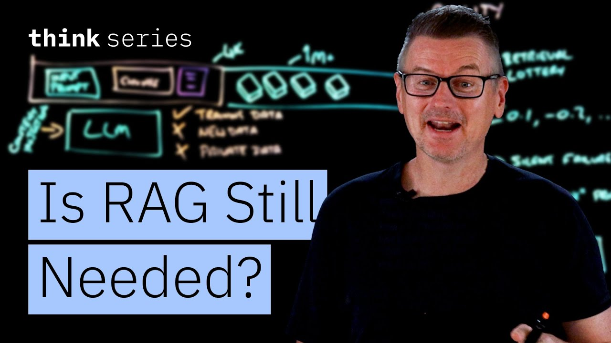

# Is RAG Still Needed? Choosing the Best Approach for LLMs

Ready to become a certified watsonx AI Assistant Engineer? Register now and use code IBMTechYT20 for 20% off of your exam → https://ibm.biz/BdpReK

Are massive context windows replacing RAG? Martin Keen breaks down RAG vs. long context in LLM workflows. Explore how vector databases, semantic search, and embedding models impact AI performance to help you choose the right solution for your applications.

## Table of Contents
* [00:00:00] LLMs Are Frozen in Time
* [00:00:43] How RAG Works
* [00:02:23] The Long Context Alternative
* [00:04:03] Why Long Context Can Replace RAG
* [00:07:35] Why RAG Still Has a Place
* [00:10:25] Choosing the Right Approach

## LLMs Are Frozen in Time [00:00:00]

**Martin Keen:** There's a fundamental truth about LLMs, large language models. They are frozen in time. They know everything about our world up until their training cutoff date and absolutely nothing about what happened 5 minutes ago. Nor do they know anything about your private data, your internal wikis, your proprietary codebase. [00:00:00 → 00:00:21]

And if we do want an LLM to know any of that stuff, well, we have to solve the problem of context injection. How do we get the right data into the model at the right time? And there have been two very different ways to handle this. [00:00:21 → 00:00:43]

## How RAG Works [00:00:43]

**Martin Keen:** Now, the first is really what we can think of as the engineering approach. It's RAG, retrieval augmented generation. [00:00:43 → 00:00:52]

So here we've got an LLM and we've also got an input prompt from the user. Now ahead of time we take some of the documents that we want to give to this LLM. So these are documents that could be PDFs or code files or entire books and we chunk them. We break them up into smaller chunks and we pass them through to an embedding model and the embedding model takes those chunks and it turns them into vectors and those vectors are then stored in a dedicated vector database. [00:00:52 → 00:01:38]

Now when a user asks a question, it performs a semantic search to retrieve the most relevant chunks and then inject them into the context window. So now the context window has the user prompt, but it also has all of these chunks that we have taken from the vector database and together this forms the context window. [00:01:38 → 00:02:10]

Now this works but it does rely on something. It relies on the hope that your retrieval logic actually found the right information in the vector database. [00:02:10 → 00:02:15]

## The Long Context Alternative [00:02:23]

**Martin Keen:** Now the second approach is really a bit more of a brute force approach and that one is called long context. Now this is really the model native solution because you skip the database here and you skip the embedding model. All you do is you take your documents and you just well you put them straight into the context window and then you let the model's attention mechanism actually do the heavy lifting of finding the answer. [00:02:23 → 00:02:50]

Now for a long time this kind of brute force method wasn't really much of an option because initially context windows were tiny. Early LLMs had context windows that could maybe store what like 4K of tokens. You couldn't fit a novel in there, let alone a corporate knowledge base. You basically had to use RAG. [00:02:50 → 00:03:21]

But today's models have much larger context windows. Some of them have, you know, a million tokens plus. And to put that into perspective, a million tokens is roughly 700,000 words. And you could fit the entire Lord of the Rings series into the prompt and still have room for The Hobbit. [00:03:14 → 00:03:36]

So, this massive jump in capacity forces us to ask a difficult question about our architecture. Because if we can simply command A, command C, command V, all of our documentation into the models context window, do we really need the overhead of embedding models and vector data stores? Is RAG becoming an unnecessary complexity layer? [00:03:36 → 00:04:03]

## Why Long Context Can Replace RAG [00:04:03]

**Martin Keen:** Well, if we accept that we can fit whatever data we need into the context window, then the argument for doing so basically boils down to one word, simplicity. And let me give you three reasons why stuffing the context window directly may indeed be the way to go. [00:04:03 → 00:04:20]

And reason number one is collapsing the infrastructure. A production RAG system. Well, it is quite heavy. You need a a chunking strategy which is like fixed size maybe or sliding window or recursive. You decide. You're going to need a embedding model to encode the data. You need a a vector database to store it. You're going to need a reranker to sort the results. You need to keep all the vectors in sync with your source data. It's basically a lot of moving parts, a lot of places for things to break. [00:04:20 → 00:05:01]

And long context offers what we might call well just simply the uh the no stack stack. You remove the database, you remove the embeddings, you remove the retrieval logic. The architecture simplifies down to getting the data and just well sending it to the model. So that's reason number one. [00:05:01 → 00:05:23]

Reason number two is the retrieval lottery. Now, RAG introduces a critical point of failure here, the retrieval step itself, because when a user asks a question, RAG looks at mathematical representations of the data, which are stored in vectors. And vectors are basically just like a really long series of numbers in an array. And it tries to find the closest match. That's semantic search. [00:05:15 → 00:05:43]

But semantic search is probabilistic and for all manner of reasons, the retrieval might fail to find the relevant document. And we actually have a name for this. It's called silent failure. The answer, well, it existed in the data, but the LLM never saw it because the retrieval step didn't return the right results. With long context, there is no retrieval step. The model gets to see everything. [00:05:43 → 00:06:15]

Now, reason number three — that is well, I think we're going to call this the whole book problem. A RAG is fundamentally designed to retrieve what exists. It relies on finding a semantic match between your query and a specific snippet of text in your database. But what if the answer lies in what's not in the database? [00:06:08 → 00:06:35]

So, so let's say you have a set of product requirements stored as a document and you've also got a set of release notes stored as a document and then we ask which security requirements were omitted from the final release. Now using RAG when you query for omitted security requirements the vector search looks for chunks discussing well security and requirements. It retrieves snippets from the requirements doc. It retrieves snippets from the release notes, but it cannot retrieve the gap between them. [00:06:35 → 00:07:09]

And because RAG only shows the model a few isolated snapshots, the model never sees the full picture required to spot the missing pieces. The model really needs both of these documents in full to perform the comparison, which is exactly what long context does by dumping the whole book, the full requirements doc and the full release notes into the context window. [00:07:09 → 00:07:35]

## Why RAG Still Has a Place [00:07:35]

**Martin Keen:** So, is RAG dead? Is the vector database destined for the museum of things we needed in 2024? Well, not quite because while long context wins on simplicity, RAG still has a place. And I got another three reasons to support that. [00:07:35 → 00:07:53]

So, reason number one is the rereading text. Now, long context creates a massive compute inefficiency. So, if we take a manual, let's say this is like a a 500 page manual, and we've got to turn this into tokens. Well, that's something like 250k of tokens. And we need to do that every time we make a user query and we put this document in the prompt. You're basically requiring the model to process that manual every time. [00:07:53 → 00:08:23]

Now, RAG also has to process that manual, but it only pays that processing cost once at indexing time. Now, prompt caching that can partially offset some of this for static data, but for dynamic data streams where content changes frequently, you are stuck paying the full tax on every request. [00:08:23 → 00:08:45]

Reason number two is the needle in the haystack problem. Now, there's a an intuitive assumption that if data is in the context window, the model's probably going to use it, but research suggests otherwise. Because as we start with a context window and then it grows and it continues to grow and now we're at like 500,000 tokens, well, the model's attention mechanism can get a bit diluted. [00:08:45 → 00:09:14]

If you ask a specific question about a single paragraph that's buried in, let's say, the middle of a 2,000 page document, well, the model often fails to retrieve it or it hallucinates details from the surrounding text. But with RAG, we're giving the model less noise. So by retrieving, say only the top five relevant chunks, RAG has removed the haystack and presents the model with just the needles. It forces the model to focus on the signal and not the noise. [00:09:14 → 00:09:49]

And then reason number three, well that is the infinite data set. Now a context window of millions of tokens sounds great but in the scheme of enterprise data that's really just a drop in the bucket. I mean an enterprise data lake that's probably measured in terabytes or or maybe even petabytes. So if you want an infinite data set that stores everything, you really do need to have a retrieval layer to filter information down to something that fits into the LLM context window. [00:09:49 → 00:10:25]

## Choosing the Right Approach [00:10:25]

**Martin Keen:** So where does this leave us? Well, if your problem involves a bounded data set and requires complex global reasoning like analyzing a specific legal contract or summarizing a book, I think long context is the way to go. It simplifies the stack and it improves the reasoning. [00:10:25 → 00:10:44]

But if you're navigating the infinite data set of enterprise knowledge, the vector database remains the only viable warehouse for your data. But how about you? Are you team long context, team RAG, maybe a bit of both? Let me know in the comments. [00:10:44 → 00:11:03]
