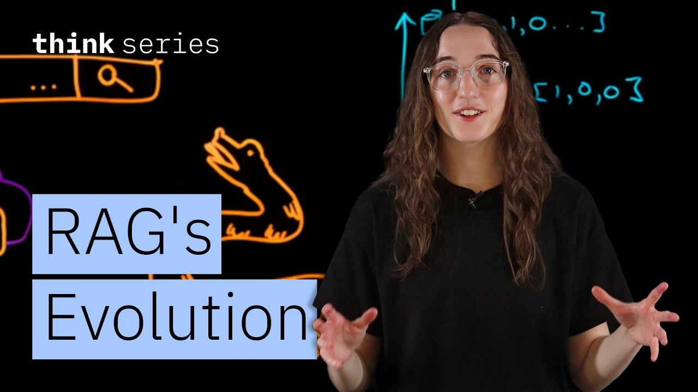

# RAG's Evolution: From Simple Retrieval to Agentic AI

Ready to become a certified watsonx AI Assistant Engineer? Register now and use code IBMTechYT20 for 20% off of your exam → https://ibm.biz/BdpZj7

Learn more about retrieval augmented generation (RAG) here → https://ibm.biz/BdpZZc

Sam Anthony explains RAG's evolution, from simple retrieval to adaptive systems powered by LLMs. Learn how semantic search, hybrid retrieval, and AI agents enable multi-step research, decision-making, and synthesis.

## Table of Contents
* [00:00:00] Introduction: The Problem with Search
* [00:00:28] The Era of Keyword Search
* [00:01:37] The Rise of Semantic Search
* [00:03:17] The Arrival of Large Language Models
* [00:04:26] Retrieval Augmented Generation (RAG)
* [00:05:53] Advanced RAG: Smarter but Still Static
* [00:06:41] Agentic RAG: Intelligence Meets Retrieval
* [00:08:20] Conclusion

## Introduction: The Problem with Search [00:00:00]

**Sam Anthony:** We've all had this experience. You search for something, you get thousands of results, and somehow, none of them are what you wanted. [00:00:00 → 00:00:07]

Well, what if I told you search engines don't actually understand your questions? At least, they didn't used to. [00:00:08 → 00:00:14]

From simple keyword search to present-day agentic RAG, information retrieval has seen an evolution, and search engines didn't get smarter overnight; they grew up one step at a time. [00:00:14 → 00:00:25]

Let's start from the beginning. [00:00:26 → 00:00:27]

## The Era of Keyword Search [00:00:28]

**Sam Anthony:** The earliest search systems were designed around the question of "Where does this word appear?" Documents were indexed using what's called inverted indices, aka a mapping of keywords to documents. When a user asks a question, the search system will look up these words and quickly return the matching documents. [00:00:28 → 00:00:55]

These documents may then be ranked using TF-IDF or BM25 to measure how important or frequent different terms were. This powerful keyword matching approach still powers a lot of the internet today, but there's a fundamental limitation: it doesn't understand language. [00:00:58 → 00:01:16]

It treats words as symbols, not meaning. Synonyms, ambiguity and any complex intents were essentially invisible. [00:01:16 → 00:01:24]

For example, is the search "help Python?" Related to coding, or did I just get a pet snake? It was on the user to be asking the right questions with the exact right words. [00:01:24 → 00:01:36]

## The Rise of Semantic Search [00:01:37]

**Sam Anthony:** The next major leap was semantic search. Instead of treating text as words, we began representing them as language. [00:01:37 → 00:01:45]

This is done using vectors or high dimensional number representations that can understand meaning. For example, coffee might be represented as 0 1 0 versus house might be represented as 1 0 0. [00:01:45 → 00:02:07]

These embeddings don't just come out of nowhere. They are learned by large neural networks trained on massive text corpora. By encountering words in context, over time these similar concepts will end up close together even if they use different words. [00:02:09 → 00:02:25]

If this is coffee, maybe espresso is represented here. Very close in concept to coffee, but not anywhere close to house. [00:02:25 → 00:02:34]

Semantic search turns your words into a kind of map. So the system knows espresso and coffee are pointing to a very similar place. It's essentially your friend who knows what you mean, even if you don't say it perfectly every time. [00:02:35 → 00:02:48]

This allowed search systems to understand intent. Even if the exact keywords were not used, you could still find relevant documents. [00:02:49 → 00:02:57]

And this didn't replace keyword search; it actually complemented it. Hybrid systems began to emerge, bridging the precision of keyword search with semantic recall. For the first time, instead of just matching text, search was able to approximate understanding. [00:02:59 → 00:03:16]

## The Arrival of Large Language Models [00:03:17]

**Sam Anthony:** Then, the world shifted. Large language models were born. [00:03:17 → 00:03:22]

These are models trained on a large corpora of text to learn patterns in the data. LLMs don't retrieve facts. When prompted, they will predict the most likely next token or words for an answer based on those patterns that they learned from the training data. [00:03:23 → 00:03:43]

The user asks a question to the LLM and it will return a text answer. These are super powerful and revolutionize the business world. However, they had a problem. [00:03:44 → 00:04:00]

LLMs only use specific knowledge they learned during a long and expensive training process. Realistically, that means any knowledge is locked to only the documents that that specific LLM was trained on before a certain point in time. LLMs don't know today's information, and certainly don't know your specific documents. [00:04:00 → 00:04:26]

## Retrieval Augmented Generation (RAG) [00:04:26]

**Sam Anthony:** So what's the solution? Well, it's actually search. Retrieval augmented generation, or RAG, was born. [00:04:26 → 00:04:33]

The idea is very simple. The user asks a question, the system does a search for relevant documents using an external knowledge base. This retrieval is used to augment the LLM's prompt and a final answer is generated. [00:04:34 → 00:04:59]

This gave LLMs a form of external memory. Now they could cite sources, adapt to new information and even operate in specialized domains without the costly retraining. [00:05:02 → 00:05:17]

These original RAG pipelines were very linear. Documents were embedded offline into these vector databases. They were retrieved once at query time and passed straight into the model. It was simple, but effective. [00:05:18 → 00:05:32]

This massive improvement significantly dropped hallucinations and enabled LLM adoption across a multitude of new domains. [00:05:32 → 00:05:40]

But traditional RAG is nowhere near perfect. It cannot adapt to new scenarios. And suddenly we are back at the problem of traditional search. The answer is only as good as the search itself. [00:05:41 → 00:05:54]

## Advanced RAG: Smarter but Still Static [00:05:53]

**Sam Anthony:** Within such a short period, countless advancements were made to RAG, developing the simple concept into a sophisticated power to be reckoned with. Instead of a single retrieval step, pipelines added rerankers to reorder results to be more relevant. User queries were rewritten or expanded upon to improve recall. Similar to before, hybrid retrieval became the norm, leveraging the precision of keyword search with semantic vector search. [00:05:55 → 00:06:28]

These systems were far more accurate, but still fundamentally static. The pipeline was predetermined and retrieval was smarter, but still not intelligent. [00:06:29 → 00:06:40]

## Agentic RAG: Intelligence Meets Retrieval [00:06:41]

**Sam Anthony:** Enter the next disruptor: agents. Agents are systems that use LLMs and tools to perform tasks autonomously. [00:06:41 → 00:06:50]

Suddenly we shifted from simple pipelines to complex decision-making systems. Agents have a variety of tools such as LLMs, memory, planning, critics, retrievers and many more. [00:06:51 → 00:07:13]

Agents had become autonomous decision-makers, planning and executing complex tasks. [00:07:15 → 00:07:21]

Now, instead of linear RAG retrieval, when the user asks a question, an AI agent will decide whether retrieval is needed, where to search, what questions should be asked, when enough information is obtained, and then generate a final answer. [00:07:22 → 00:07:41]

Agents can compare sources, validate claims, refine queries and iterate. It can invoke APIs, pull data from many knowledge bases and incorporate multimodal data. Retrieval is no longer fixed; it's a tool invoked as part of reasoning. [00:07:42 → 00:08:01]

This opens up a world of possibilities. Now, agentic RAG systems are capable of multistep research, cross-document synthesis and general adaptive behavior. The system doesn't just answer questions; it reasons and figures out how to answer them. [00:08:02 → 00:08:19]

## Conclusion [00:08:20]

**Sam Anthony:** From simple search to current agentic RAG, we have learned time and time again that the next big step isn't better answers; it's systems that know how to find them. And the hardest part of AI isn't generation; it's deciding what to look at. [00:08:20 → 00:08:36]
