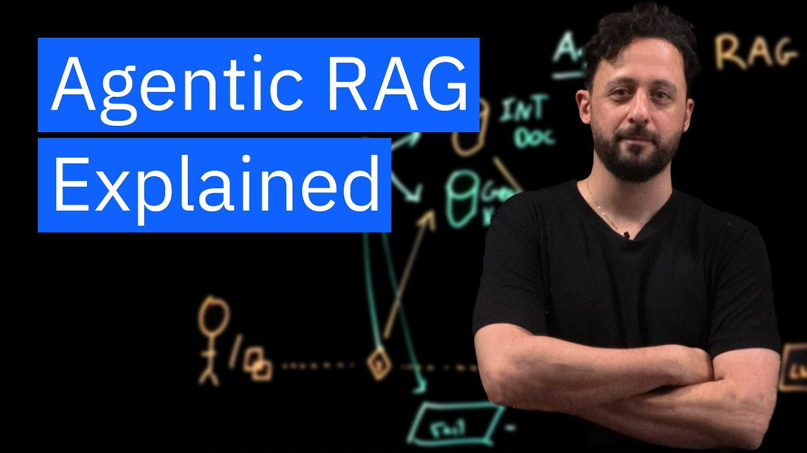

# What is Agentic RAG?

Discover the future of AI-driven conversations with Agentic RAG. This powerful pipeline enhances responses from large language models by incorporating relevant data retrieved from vector databases. Join David Levy as he discusses how Agentic RAG can create more responsive, accurate, and adaptable AI systems to better service fields like customer service, legal tech, and beyond.

## Table of Contents
* [00:00:00] RAG Refresher
* [00:00:31] The Traditional RAG Pipeline
* [00:01:30] Beyond Simple Response Generation
* [00:01:52] Introducing Agentic RAG
* [00:02:20] Multiple Data Sources
* [00:03:05] Intelligent Agent Routing
* [00:03:54] Handling Out-of-Scope Queries
* [00:04:32] Use Cases and Conclusion

## RAG Refresher [00:00:00]

**David Levy:** So we all know what retrieval augmented generation is. But let's just do a quick refresher. Retrieval augmented generation is a powerful and popular pipeline that enhances responses from a large language model. [00:00:00 → 00:00:13]

It does this by incorporating relevant data retrieved from a vector database, adding it as context to the prompt, and sending it to the LLM for generation. What this does is it allows the LLM to ground its response in concrete and accurate information, and that improves the quality and reliability of the response. [00:00:14 → 00:00:31]

## The Traditional RAG Pipeline [00:00:31]

**David Levy:** Let me quickly sketch it out. So let's say we have a user or an application, even. [00:00:31 → 00:00:40]

And they send a query. Now without retrieval augment the generation, this query is going to go and get itself interpolated into a prompt. [00:00:41 → 00:00:53]

And from there that's going to hit the LLM. And that's going to generate an output. [00:00:55 → 00:01:04]

To make this rag, we can add a vector database. So instead of just going directly and getting itself interpolated into the prompt, it's going to hit this vector db. [00:01:07 → 00:01:17]

And the response from that vector db is going to be used as context for the prompt. Now in this typical pipeline we call the LLM only once, and we use it solely to generate a response. [00:01:17 → 00:01:30]

## Beyond Simple Response Generation [00:01:30]

**David Levy:** But what if we could leverage the LLM not just for responses, but also for additional tasks like deciding which vector database to query if we have multiple databases, or even determining the type of response to give? [00:01:30 → 00:01:43]

Should an answer with text generate a chart or even provide a code snippet? And that would all be dependent on the context of that query. [00:01:43 → 00:01:51]

## Introducing Agentic RAG [00:01:52]

**David Levy:** So this is where the agenetic RAG pipeline comes into play. In agenetic RAG, we use the LLM as an agent and the LLM goes beyond just generating a response. [00:01:52 → 00:02:05]

It takes on an active role and can make decisions that will improve both the relevance and accuracy of the retrieved data. [00:02:05 → 00:02:12]

Now, let's explore how we can augment the initial process with an agent and a couple of different sources of data. [00:02:13 → 00:02:19]

## Multiple Data Sources [00:02:20]

**David Levy:** So instead of just one single source, let's add a second. And the first one can be, you know, internal documentation, Right? And the second one can be general industry knowledge. [00:02:20 → 00:02:37]

Now in the internal documentation we're going to have things like policies procedures and guidelines. And the general knowledge base will have things like industry standards, best practices and public resources. [00:02:39 → 00:02:50]

So how can we get the LLM to use the vector database that contains the data that would be most relevant to the query? Let's add that agent into this pipeline. [00:02:51 → 00:03:01]

## Intelligent Agent Routing [00:03:05]

**David Levy:** Now, this agent can intelligently decide which database to query based on the user's question, and the agent isn't making a random guess. It's leveraging the LLMs language, understanding capabilities to interpret the query and determine its context. [00:03:05 → 00:03:20]

So if an employee asks what's the company's policy on remote work during the holidays, it would route that to the internal documentation, and that response will be used as context for the prompt. [00:03:21 → 00:03:31]

But if the question is more general, like what are the industries standards for remote work in tech companies, the agent's going to route that to the general knowledge database, and that context is going to be used within that prompt powered by an LLM. [00:03:31 → 00:03:45]

And properly trained, the agent analyzes the query and based on the understanding of the content and the context, decides which database to use. [00:03:45 → 00:03:53]

## Handling Out-of-Scope Queries [00:03:54]

**David Levy:** But they're not always going to ask questions that are generally or genuinely relevant to any of this, any of the stuff that we have in our vector DB. So what if someone asks a question that is just totally out of left field? [00:03:54 → 00:04:05]

Like who won the World Series in 2015? What the agent can do at that point is it could route it to a failsafe. [00:04:05 → 00:04:13]

So because the agent is able to recognize the context of the query, it could recognize that it's not a part of the two databases that we have, could route it to the failsafe and return back. [00:04:15 → 00:04:28]

Sorry, I don't have the information in looking for. [00:04:29 → 00:04:32]

## Use Cases and Conclusion [00:04:32]

**David Levy:** This agentic RAG pipeline can be used in customer support systems and legal tech. For example, a lawyer can source answers to their questions from like their internal briefs and then in another query, just get stuff from public caseload databases. [00:04:32 → 00:04:46]

The agent can be utilized in a ton of ways. Agentic RAG is an evolution in how we enhance the RAG pipeline by moving beyond simple response generation to more intelligent decision making. [00:04:46 → 00:04:57]

By allowing an agent to choose the best data sources and potentially even incorporate external information like real timedata or third party services. We can create a pipeline that's more responsive, more accurate, and more adaptable. [00:04:58 → 00:05:13]

This approach opens up so many possibilities for applications in customer service, legal, tech, health care, virtually any field as IT technology continues to evolve. We will see AI systems that truly understand context and can deliver amazing values to the end user. [00:05:13 → 00:05:29]
