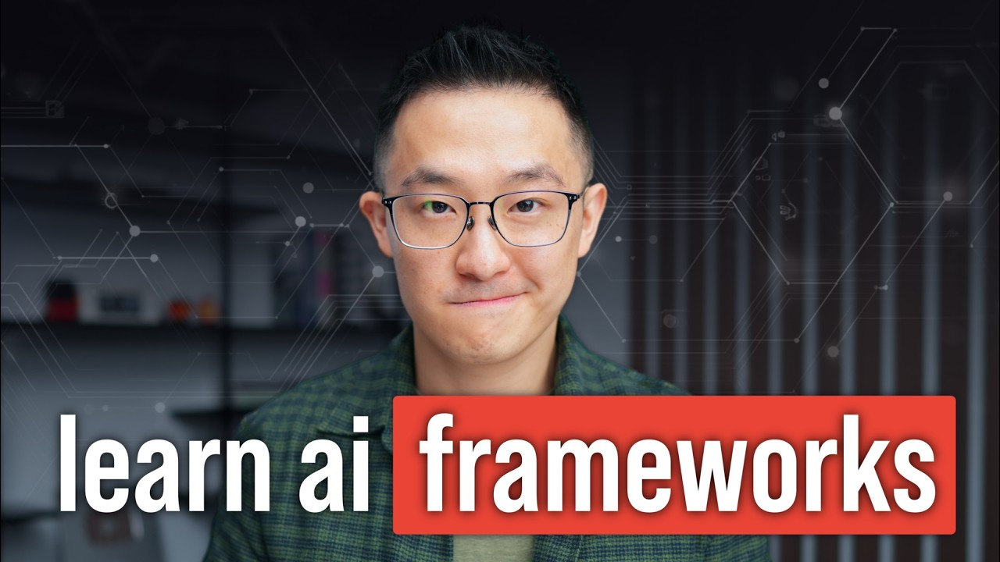

# 4 Skills I'm Learning that AI Can't Replace (backed by data)

Knowing how to "use AI" is now table stakes. This video covers 4 skills that will help you get ahead, each backed by research from Wharton, Harvard, BCG, and MIT. You'll learn a mental model for deciding when to delegate, collaborate, or go manual with AI; how to design workflows that compound as AI improves; why storytelling remains your strongest moat; and how to keep your critical thinking sharp instead of letting it atrophy.

## Table of Contents
* [00:00:00] 4 Skills AI Can't Replace
* [00:00:24] Skill #1: The Cockpit Rule
* [00:03:09] Google's AI Certificate
* [00:04:04] Skill #2: Build the Rails
* [00:06:04] Skill #3: The Storytelling Moat
* [00:09:04] Skill #4: Manual Override
* [00:10:58] So is AI making us dumber?

## 4 Skills AI Can't Replace [00:00:00]

**Jeff Su:** Saying you know how to use AI nowadays is kind of like putting proficient at Microsoft Word on your resume. It's no longer a differentiator, right? It's a baseline expectation, just like adding AI to your dating I mean um LinkedIn profile. [00:00:00 → 00:00:13]

And that means being good at chatbt is now the bare minimum. So in this video, we'll cover four skills you need to build on top of that to actually get ahead. Let's get started. [00:00:13 → 00:00:22]

## Skill #1: The Cockpit Rule [00:00:24]

**Jeff Su:** Beginning with the most important skill to develop, the cockpit rule. Put simply, this is a mental model for deciding when to delegate to AI, when to collaborate with it, and when to avoid it entirely. [00:00:22 → 00:00:32]

Think of it like a pilot in the cockpit. At cruising altitude, on a clear day, you engage autopilot and let the plane fly itself. During takeoff and landing, you and the systems work together because there are more variables. And in an emergency, where sensors fail, you take over full manual control. [00:00:32 → 00:00:48]

The exact same logic applies to AI. Autopilot mode is when you hand the task to AI with clear instructions and trust the output with minimal review. The AI handles everything on its own. Collaboration mode is where you and AI iterate together through multiple rounds until the output meets your standard. Neither you nor AI could have produced the result alone. Manual mode is when you do the work yourself because AI either can't do it well or the risk of getting it wrong is too high. [00:00:48 → 00:01:13]

Now, the real skill is knowing which mode to pick for any given task. And professor Ethan Mllik of Wharton has a useful framework for this called the agentic costbenefit framework. And it comes down to three factors. First, human baseline time. How long would this take you to do manually? Second, probability of success. How likely is AI to get it right? And third, AI process time. How long does it take to prompt, wait, and check the output? [00:01:13 → 00:01:36]

Diving right into an example. You have a messy spreadsheet that needs to be restructured and formatted for a presentation. Human baseline: 2 hours of tedious spreadsheet work. Probability of success high because AI is great at structured data manipulation. AI process time maybe 15 minutes to upload the data, write the prompt and spot check. Result: autopilot mode. 15 minutes is much shorter than 2 hours and you know this domain well enough to catch any major errors at a glance. [00:01:36 → 00:02:03]

Example two, when I was at Google preparing a client pitch, AI could handle the research and draft talking points, but it didn't know my client's risk tolerance or Google's priorities for that quarter. Human baseline about 10 hours to build the presentation. AI's probability of success on any single attempt medium because the AI needs my direction and domain expertise. AI process time per round maybe 45 minutes of prompting, checking sources, and fixing hallucinations. Result: collaboration mode. Even if I iterated five times and spent 4 hours total managing the AI, that's still less than half the manual baseline. [00:02:03 → 00:02:37]

Example three, your VP sends an angry Slack message questioning your team's approach on a project. Human baseline: 3 minutes since you already know the backstory and the politics. Probability of success low because AI doesn't know your boss's personality. AI process time 20 to 30 minutes since you'd have to explain all the context you already have in your head. Result: manual. [00:02:37 → 00:02:58]

So, as a rule of thumb, the best tasks to delegate to AI are those that take you a long time to do. The AI tool itself is very capable in that domain to increase probability of success and you can easily evaluate the output to decrease AI process time. [00:02:58 → 00:03:10]

## Google's AI Certificate [00:03:09]

**Jeff Su:** Now, regular viewers know I've taken quite a few AI courses on Corsera before. So, when I received early access to their latest Google AI professional certificate, I honestly expected more of the same, but I was pleasantly surprised by the labs feature. Basically, throughout the course, instead of just watching videos, there are these standalone lessons where you open up Gemini, follow along with a step-by-step video, and work with downloadable documents. So, sort of like a self-contained mini project. [00:03:10 → 00:03:35]

For example, this lab walked me through a product ideation process with Gemini. The video and written instructions stay within this page and we'll actually go through an end-to-end brainstorming exercise in another tab like running a costbenefit analysis and scheduling recurring reports. The certificate covers seven courses including brainstorming, research, writing for content creation, data analysis, and more. So, it pairs well with the skills we're talking about today. [00:03:35 → 00:03:57]

You can get 40% off 3 months of Corsera Plus right now. So, I'll leave a link to the description. Thank you Corsera for sponsoring this portion of the video. [00:03:57 → 00:04:03]

## Skill #2: Build the Rails [00:04:04]

**Jeff Su:** Next up, build the rails. Put simply, now that AI has become so capable, your competitive advantage is no longer doing the work. It's designing the process so AI can do it for you. Think of it like this. A bullet train needs a lot of heavy lifting up front to lay the tracks, right? But once those rails are in place, the train glides over them at over 300 km/h with almost no friction. [00:04:03 → 00:04:25]

For our American friends, that's around 200 hamburgers per unit of freedom. It's the same thing with AI. Designing a workflow is like laying the tracks. It's tedious at first, but once the system is in place, AI can just do its thing. [00:04:25 → 00:04:38]

Here's a simple example. I used to have a single prompt to polish the subject line and body content for my newsletters, and the output was fine. But when I created a separate prompt optimized just for the subject lines, my click-through rates went up. Andrew had a famous example where he found that using a single prompt to write code gave him a 48% success rate. But when he designed a workflow to write, run, and troubleshoot the code using the same AI model, that jumped to 95%. [00:04:38 → 00:05:02]

And in a study from Harvard and BCG, they tested 758 consultants and found the top performers fell into two groups. Centaurs, who divided tasks between themselves and AI with clear handoff points, and cyborgs who integrated AI into every step of their workflow. The third group, let's call them peons, used AI with no structured process and they performed 19 percentage points worse. Again, the variable wasn't the AI model, it was the process. [00:05:02 → 00:05:30]

So, how do we actually redesign our workflows to be AI first? I've talked about this in other videos, so I won't waste your time here, but in a nutshell, you want to first take a recurring deliverable you produce, like a weekly report, and break it into its component steps. Second, apply the costbenefit framework I mentioned earlier to each step — which steps are autopilot, which are collaboration, and which should stay manual. Third, prioritize redesigning the autopilot steps first since that's where you get the biggest return for the least amount of effort. [00:05:30 → 00:05:58]

Obviously, this is a very dense topic. I'm probably going to have to dedicate an entire lesson to it in my upcoming AI course. I'll leave a link to that weight list down below. [00:05:58 → 00:06:05]

## Skill #3: The Storytelling Moat [00:06:04]

**Jeff Su:** Go number three, the storytelling mode. So, first, let's check out this ad from Anthropic. [00:06:04 → 00:06:09]

**[Anthropic Ad]:** How do I communicate better with my mom? Find emotional connection with other older women on Golden Encounters, the mature dating site that connects sensitive cubs with roaring cougars. Would you like me to create your profile? [00:06:11 → 00:06:25]

**Jeff Su:** I'm not surprised that ad went semi viral because AI companies have been aggressively hiring head of content and storytellers because even they understand that AI as powerful as they are cannot generate meaning. [00:06:29 → 00:06:41]

I still remember this crazy meeting when I was still at Google where all the managers were asking for more budget and on paper our team had the weakest case by far, right? But my manager, instead of focusing on the data, she talked about how her project would benefit other countries and would become an Asia-wide case study, thereby making our big boss look good. And she ended up getting most of a budget. [00:06:41 → 00:07:04]

Now, am I saying I learned all my bullshiting skills from her? No, I'm naturally gifted. Uh, but that's not the point here. The point is, in the world of AI, information is a commodity. And so, the real skill is turning that information into something people actually care about. Put simply, if you can turn data into a story that moves people, you're safe. If you just pass along the data, you're replaceable. [00:07:04 → 00:07:23]

So, how do we actually get better at this? I'm still working on this myself, so I recommend checking out Philip Hum storytelling video and Vin Jang's content. He's an absolute monster at storytelling. That said, I've been practicing two frameworks since my management consulting days. [00:07:23 → 00:07:37]

First, the but therefore ABT framework developed by Randy Olsen. Here's how it works. Your manager asks, "Hey, how's the launch going?" Instead of listing facts, you answer, "We're on track and adoption is rising, but one client paused spending due to technical issues. Therefore, I'm preparing a follow-up call to troubleshoot his account." [00:07:37 → 00:07:57]

And sets the stage. Here's where we are. But introduces the conflict and makes people lean in because something's wrong. Something didn't go according to plan —

**[Joker clip]:** because it's all part of the plan. [00:08:04 → 00:08:07]

**Jeff Su:** Therefore, delivers the resolution and a clear next step. [00:08:07 → 00:08:10]

Second, the tried-and-true SCQA framework from Mackenzie, Bane, and BCG. Situation, here's where we are. Complication, here's the obstacle, aka conflict. Question, what do we need to answer to move forward? Answer: Here's a resolution. [00:08:10 → 00:08:24]

You've probably already noticed a common denominator across both frameworks. They introduce conflict, then resolve it. That's what makes people care. [00:08:24 → 00:08:31]

And to show you how big a difference this makes, here's the same story told both ways. Version one, Frodo volunteered to take the ring to Mordor, and he was joined by a fellowship. And after a long journey, he destroyed the ring. The end. [00:08:31 → 00:08:43]

Version two. Frodo was entrusted with a one ring, and he was the only one who could resist its corruption. But the journey nearly broke him. By the time he reached Mount Doom, the ring had won. Therefore, it was only through Gollum's obsession, not Frodo's strength, that the ring was accidentally destroyed. The hero failed at the finish line, and the quest was saved by the villain. Same story, completely different impact. [00:08:43 → 00:09:06]

## Skill #4: Manual Override [00:09:04]

**Jeff Su:** And that's a perfect segue into skill number four, manual override. This is about intentionally choosing not to use AI for certain tasks so that your critical thinking doesn't atrophy. Put simply, if you let AI write every email, outline every strategy, and summarize every meeting, you gradually lose the ability to synthesize information yourself. [00:09:04 → 00:09:22]

Think of it like this, a weightlifting belt helps you lift heavier, right? But if you wear it for every single rep, your stabilizer muscles, like your abs, weaken. After a year, you're only strong with a belt on. [00:09:22 → 00:09:34]

And the science backs this up. Researchers at McGill found physical changes in the brains of drivers who relied heavily on GPS that decreased their ability to navigate on their own. A Microsoft and Carnegie Melon study found that knowledge workers who over relied on AI gradually stopped doing key cognitive steps themselves like questioning assumptions, checking sources, and weighing trade-offs. As a result, they became less prepared for unexpected edge cases. [00:09:34 → 00:09:56]

And a study of 2760 decisions from radiologists found that those who used AI as a first opinion often anchored themselves onto the AI's answer and stopped looking for other signs. By contrast, those who formed their own opinion first and used AI as a second check maintained their accuracy. [00:09:56 → 00:10:16]

So, how do we protect our thinking while still benefiting from AI? There are two habits we can develop. Number one, and this is very simple, Professor Malik recommends think first, prompt second. For example, I'll still use AI to summarize reports. I'll leave a link to my essential prompts below, but I always write my own so what analysis first before asking AI for its take. Basically, for analytical tasks, spend a few minutes forming your own position before engaging AI. [00:10:16 → 00:10:41]

Second, interrogate the output. When AI gives you an answer, don't accept it right away and instead ask yourself, how would I verify this? What's the counterargument? For instance, I recently asked AI about refinancing my mortgage, and I challenged it with a series of whatifs since this kind of active debate forces my brain to engage rather than passively consume. [00:10:41 → 00:10:59]

## So is AI making us dumber? [00:10:58]

**Jeff Su:** Now, at this point, it's easy for skeptics to say, "See, I told you so. AI is making us all dumber," but that's just simply not true. Yes, an MIT study found students who use chatbt were less engaged, but those findings are about habits, not neurological brain damage. [00:10:59 → 00:11:13]

And for context, Plato worried that writing would erode wisdom, and people worried that cell phones would kill our ability to remember phone numbers. So, here's a nuance those clickbay articles will never tell you. AI will only hurt us if we allow it to change our habits. It's just like giving toler unlimited access to TV. The TV isn't the problem. It's the behavior. [00:11:13 → 00:11:35]

Back to the learning example, students using ChBT without guidance scored 17% worse on exams. Yes, but with structured guidance, a World Bank study found that 6 weeks of AI tutoring produced learning gains equivalent to 2 years of traditional schooling. [00:11:35 → 00:11:49]

Ethan Malik sums it up perfectly. There's plenty of work worth handing off to AI. We rarely mourn the math we do with calculators, but there's also a lot of work where our thinking is important. Your brain is safe. Your thinking, however, is up to you. [00:11:49 → 00:12:04]

If you enjoyed this, you might want to check out this video where I share my favorite AI tools. See you there. And in the meantime, have a great one. [00:12:04 → 00:12:12]
