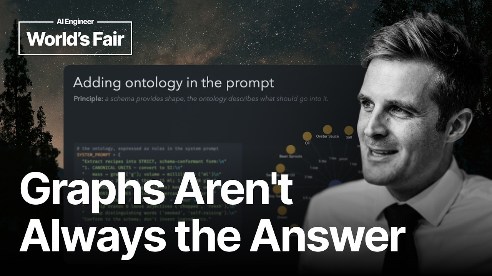

# A Practitioner's Guide to Graphs - Tim Ainge, Good Collective

A speed-run through the basics... what is a graph, extracting graphs from unstructured text, schema first and ontological improvements and then a slightly more detailed discussion of personalised page rank, shortest path and subgraph matching algorithms.

## Table of Contents
* [00:00:00] Introduction
* [00:02:14] Speed Run: What is a Graph?
* [00:02:44] Extracting Graphs from Unstructured Text
* [00:03:41] Schema-First Graph Extraction
* [00:04:34] Ontological Improvements
* [00:05:24] Entity Resolution with Embeddings
* [00:06:49] Graph Queries: Cypher vs SQL
* [00:07:40] Personalized PageRank
* [00:09:46] Shortest Path Algorithm
* [00:11:09] Subgraph Matching
* [00:12:58] Conclusion

## Introduction [00:00:00]

**Tim Ainge:** Hi, I'm Tim Angers from The Good Collective and welcome to AI Engineer's presentation, a practitioner's guide to graphs, how to make your AI applications smarter, cheaper, and more reliable. [00:00:00 → 00:00:14]

Graphs have always been a powerful foundation of computer science and they look beautiful. But sometimes they're genuinely not the right tool for the job. [00:00:14 → 00:00:24]

We've all felt the wonder of a mesmerizing data science graph or ogled the graph view of our Obsidian vault. It can be tempting to rush into something like GraphRAG or rebuilding our e-commerce shop with a graph database. [00:00:23 → 00:00:39]

But often we don't see the instant payoff we might have expected. In frustration, many journeys end here in the dust at the bottom of the valley of despair and disillusionment. [00:00:38 → 00:00:50]

What's on the other side of the valley and how do we get there? That's exactly the question that sparked the idea for this talk. [00:00:49 → 00:00:57]

Have I nailed all of the answers? Definitely not. But what I'm finding is that the more I learn about the fundamentals of graph data structures and algorithms, the more interesting opportunities seem to present themselves. [00:00:56 → 00:01:10]

Many of these graph native use cases or good fits for graphs are also a lovely complement to many of the search, pattern recognition, retrieval, or knowledge-based problems that are ripe for solving in the AI age. [00:01:09 → 00:01:24]

Now, just a quick disclaimer. This talk isn't going to go into GraphRAG or agent memory graphs. Not because I'm throwing shade on those patterns and products, but partly because there'll be many other talks covering each of those single topics. [00:01:23 → 00:01:37]

But more importantly, this talk is for AI builders and I'd like to focus on the underlying patterns, which may just help you come up with your next big graph-powered AI application. [00:01:37 → 00:01:47]

Today, we're going to speed run the basics of graphs. Then we'll walk through some tips and tricks for building better graphs to get better results. And then we'll look at graph native algorithms that leverage a graph and the benefits that they deliver. [00:01:47 → 00:02:01]

At each step of the way, we'll open with a principle, look at an easy example and some code, and then finally, we'll reference some real-world examples with real-world benefits. [00:02:01 → 00:02:14]

## Speed Run: What is a Graph? [00:02:14]

All right, let's speed run the basics. What's a graph? [00:02:14 → 00:02:19]

A graph is something that has nodes, also called vertices, and edges, which I sometimes call relationships, that connect the nodes together. That's it. That is the most basic definition of a graph. [00:02:18 → 00:02:31]

We can have different types of nodes and edges, which convey more meaning. Uh we can also put labels on edges and nodes and have properties. And of course, edges can have direction. [00:02:30 → 00:02:44]

## Extracting Graphs from Unstructured Text [00:02:44]

Now that we've speed run that, a really, really important part of getting good value out of graphs is how we build good graphs. [00:02:44 → 00:02:53]

Today, we're going to focus on extracting graphs from unstructured text, cuz that's a pretty common use case and a pretty popular one at the moment. [00:02:53 → 00:03:01]

So, in this example, we've defined a very basic data structure for our graph, a triple, that has a subject, a predicate, and an object, or a node that somehow relates to another node. [00:03:01 → 00:03:16]

And we say to our agent, "Hey, go and pull the key information out of this thing as subject, predicate, and object triples. You figure it out." [00:03:16 → 00:03:29]

And then we give it a wrap pancake recipe. It's done an all right job. We've got a graph. But, we wouldn't get very far with this graph. It's got some problems, so we'll talk through that next. [00:03:28 → 00:03:42]

## Schema-First Graph Extraction [00:03:41]

One of the key principles about building better graphs is giving the extractor a schema to fill. [00:03:41 → 00:03:48]

In this case, if we say, "Instead of using triples, use a recipe. And a recipe has ingredients, and ingredients have a quantity." [00:03:48 → 00:03:58]

If we give this to an agent with its structured outputs, what we get back is instantly way more meaningful than the graph we had before, and a lot tidier. [00:03:57 → 00:04:10]

So, the benefit here is that with consistent node and edge types, relationships become meaningful and something that we can interrogate or query. [00:04:10 → 00:04:19]

Let's take this a little bit further to say that a recipe has ingredients, but it also has steps, and each step is the application of a cooking technique. [00:04:19 → 00:04:30]

Now, we've got a graph with structure that's starting to look a bit interesting. [00:04:29 → 00:04:35]

## Ontological Improvements [00:04:34]

Now that we have a well-defined schema and a nicely structured graph, we need to add detail to our ontology. [00:04:34 → 00:04:43]

The ontology describes how to extract information into our graph, or precisely what to put into that structure. [00:04:43 → 00:04:51]

In our case, we want to provide instructions to our agent to standardize the formatting of ingredient names and to standardize units on the metric system to make matching and conversion easier. [00:04:50 → 00:05:05]

These extra instructions are just as important to the title model as the schema is. And boom, there we go. We've got lowercase ingredients and metric units. [00:05:04 → 00:05:17]

We know that the best prompt in the world isn't bulletproof, though. So, we'll look next at how to make sure we really do standardize our units. [00:05:16 → 00:05:24]

## Entity Resolution with Embeddings [00:05:24]

Here's an example where we have a couple of ingredients that probably shouldn't be represented by multiple nodes. [00:05:24 → 00:05:30]

We've got garlic cloves and minced garlic, cumin and cumin seeds, vegetable oil and oil. We've also got plain old garlic down there as well. [00:05:30 → 00:05:43]

So, in our first attempt at solving the potato, potato problem, we can see that by taking a naive approach to mapping these, we can eliminate the duplication, which unifies the nodes, but it also strengthens the relationships between the different recipes that have common ingredients. We'll explain why this is helpful later. [00:05:42 → 00:06:03]

The problem with this naive approach is that we've applied it retrospectively. And for this to work well, we'd have to know all of the ingredients ahead of time. [00:06:02 → 00:06:13]

Of course, these days, we have embedding models, which take the pain out of this sort of problem. And by using an embedding model here, we have not only more flexible matching, but we also have the ability to match on terms that we don't need to know in advance. [00:06:12 → 00:06:30]

This is a good example of where graph techniques and AI techniques working in hybrid give us the best result. [00:06:29 → 00:06:37]

## Graph Queries: Cypher vs SQL [00:06:49]

So, now that we have a well-structured graph, we have nicely curated information put into that graph, and we've done extra work to make sure that the nodes are matched or the entities are matched before we create new nodes. Let's start talking about what we can do with our graph. [00:06:37 → 00:06:53]

The very first thing we're going to do is just do a simple query to see which recipes contain the ingredient garlic. [00:06:53 → 00:07:01]

We've got the Cypher or graph database query on top, and the relational SQL query below just for comparison. [00:07:01 → 00:07:10]

Here we can see all the recipes that have garlic and their ingredients, which we print to the if they're fit on the slide. I think if you look at this example, you can see how out of hand the SQL query might get if we wanted to traverse 5, 10, 20 edges to find the nodes that we're looking for. [00:07:09 → 00:07:27]

In a graph query, not only is it a little bit easier and more natural to write, but traversing relationships like that is where the graph data structures start to inherently excel. [00:07:27 → 00:07:38]

## Personalized PageRank [00:07:40]

Stepping things up a notch, the next graph algorithm we've got is the personalized PageRank algorithm. [00:07:40 → 00:07:48]

This is a variant on vanilla PageRank, which was made famous by a certain Brin and Page back in 1998. [00:07:48 → 00:07:55]

It works by having a little dude run around the graph, and he marks each node as he passes. After a certain amount of hops around the graph, he'll teleport back to the starting node. And that's the bit that makes it personalized. It's personalized to our starting node. [00:07:55 → 00:08:13]

By repeating this process until he's completely worn out, some nodes will emerge with more marks on them than others. These are the nodes that have a stronger relationship with the starting node than those around them. [00:08:12 → 00:08:24]

A really common and popular reference point for personalized PageRank is the Pinterest Pixie paper. How's that for some alliteration? Um that showed how PPR could be used for Pinterest recommendations. [00:08:24 → 00:08:39]

But, an even more contemporary one is Hippo Rag, uh which uses some other cool graph techniques as well to link memories to questions and answers. In the presentation pack, you'll find links and references to different variants and how they can be used. [00:08:38 → 00:09:01]

So, it looked a bit obvious in that last example. But, algorithms like this really shine when we have dense clusters of nodes and relationships, and it isn't that easy to infer which ones are the most important. [00:09:01 → 00:09:15]

Another real-world example is taking a real-world US Supreme Court case and being able to find the authoritative landmark cases upon which it relies. [00:09:14 → 00:09:26]

In this example, Miranda v. Arizona is not cited in the Canvas v. Sheba case. It's purely through the relationships in the citation graph that we are able to find it. Not only to find it, but to be able to return a string of citations that show how it is related to this existing case through another. [00:09:25 → 00:09:46]

## Shortest Path Algorithm [00:09:46]

Shortest path algorithm is another good way to look at the relationships between two nodes in a graph. [00:09:46 → 00:09:52]

In this case where we know both nodes in advance and we don't understand the relationships, we can look at the most direct route between them. In this case, if we say the checkout code broke after we changed the basket constructor, but I have no idea why, we can traverse the edges between those two nodes in the code graph and return either the symbols or the text or a summary as context. [00:09:52 → 00:10:17]

In this case, the shortest path is highly useful, but we might want the K shortest paths or the shortest path that passes through a particular node or the cheapest path if the edges are weighted. So, there are multiple variants and they're all very useful at telling us what nodes and edges might help explain the relationship between two other nodes on the graph. [00:10:17 → 00:10:39]

One of the benefits of this, being able to retrieve a subgraph as context, is that we wouldn't have found these intermediate nodes by doing vector search or even by doing individual symbol and reference lookups and the process of figuring that out for ourselves would have been slow. [00:10:38 → 00:10:54]

In one particular evaluation where we used this technique on a .NET code base, we saw a 40% reduction in tool calls for code search where we used techniques like this to identify the context we needed to give the agent. [00:10:54 → 00:11:10]

## Subgraph Matching [00:11:09]

This is another eShop example. The one thing I like about this particular example is that instead of starting with a node or a set of nodes and navigating our way through the graph, we're querying entirely on relationships. [00:11:09 → 00:11:24]

We could specify a node type or a node ID in this query and it would still be a subgraph match. However, in In case, we're searching for code in a certain shape, not knowing anything specific about the code we're looking for or any symbols up front. [00:11:23 → 00:11:41]

We'll search for a decorator pattern in the eShop example, which is commonly used to enhance an existing class. So, what we're looking for is a class that wraps its target class or consumes methods from its target class, where both the wrapper and the target class implement the same interface. [00:11:41 → 00:12:01]

Boom. There we go. In our eShop code base, we found a catalog view model service and a cached version that calls the same class and implements the same API. [00:12:01 → 00:12:15]

If we knew we were looking for caching classes, we could have searched on that. But, if we're looking for a specific pattern or if we were looking for an anti-pattern or a particular type of security issue, a malicious transaction pattern, or legal arguments in a big corpus, sometimes it's really important to be able to look for the shape of something without knowing the specific instance or node details themselves. [00:12:14 → 00:12:41]

The benefits of subgraph matching, where you have the opportunity to use it, I think are are quite unique. It's not so much an optimization problem as like a big enabling algorithm. It's something that's just not easy to do uh with other tools. [00:12:41 → 00:12:58]

## Conclusion [00:12:58]

All right. So, we've covered a lot of ground. Thanks for bearing with me. [00:12:58 → 00:13:03]

We've looked at navigating paths, at ranking how important things are, and finding patterns. We've skipped over some of the traditional flow and cost and search algorithms that you might find often used in modeling dependencies or networks, and there's heaps of use cases of those, but I think probably a little bit more run-of-the-mill. [00:13:02 → 00:13:23]

In the presentation back, we'll also include some notes about some of the things that we couldn't get to today like prediction, similarity, and clustering. [00:13:23 → 00:13:32]

These are now edging into some of the graph rag, building dynamic graphs, or schema-less graph kind of territory that we deliberately didn't want to go into today, but it is also where things get super interesting as well. We'll have some references and some pointers in the presentation pack. [00:13:32 → 00:13:50]

Otherwise, you can go and explore some of those things on your own. [00:13:49 → 00:13:53]

So, I hope that some of these concepts will have given you some insight or inspired you and that you can take them and either use graph native algorithms or hybrid algorithms to help make smarter, cheaper, and more reliable AI applications. [00:13:53 → 00:14:07]

Thank you. [00:14:06 → 00:14:09]
