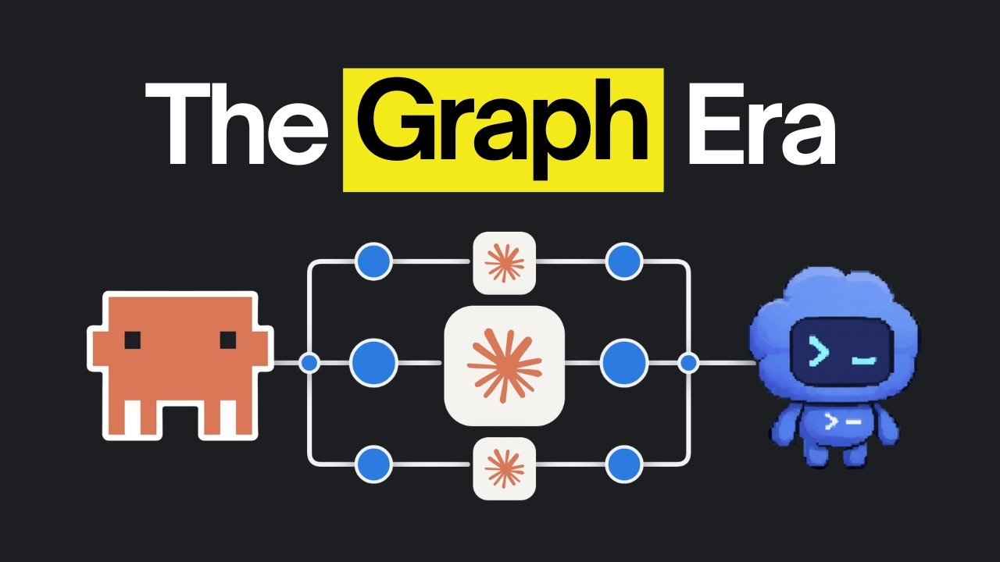

# Anthropic Just Fixed Graph Engineering's Greatest Flaw

Graph engineering, the upgrade to loop engineering for AI agents. Get started with SerpApi using 250 free credits: https://serpapi.com/?utm_source=youtube&utm_campaign=ailabs_july_2026

## Table of Contents
* [00:00:00] Introduction
* [00:00:51] What Is Loop Engineering?
* [00:01:36] Graph Engineering
* [00:02:22] Graph Components: Nodes, Edges, and Shapes
* [00:04:21] The Verification Problem
* [00:05:41] Building Your Own Verification: Skill Creator
* [00:06:32] Model Quality: Haiku vs Opus
* [00:07:43] Sponsor: SerpApi
* [00:08:34] Three Types of Verification Skills
* [00:09:26] Embedded Skills
* [00:10:24] Chrome Headless Shell
* [00:11:14] The Second Opinion Skill
* [00:12:18] Skill Chains and Orchestrators
* [00:13:37] Conclusion

## Introduction [00:00:00]

**Host:** There's a new term going around called graph engineering and everyone on X is talking about it. Before graphs, it was all loop engineering where you hand the agent a goal and it works toward it on its own. But with graphs, the work gets done faster and covers way more ground at once than a loop ever could. [00:00:00 → 00:00:15]

There's a huge problem with them though. One error in a small part of the graph disturbs the entire output that comes back and it's hard to track down because all you get at the end is the finished result. So Anthropic just released something that solves that exact problem and keeps your graphs working without failing. [00:00:15 → 00:00:31]

If you're new here, we're a software company and this is our channel AI labs where we show you how to optimize your business with AI and if you don't have your own, you can use these skills to get paid by optimizing it for someone else. And in this video, we're going to go over graph engineering for anyone who doesn't know it and give you the exact fix Anthropic suggested. [00:00:31 → 00:00:51]

## What Is Loop Engineering? [00:00:51]

**Host:** Before we explain graph engineering to you, you need to understand what loop engineering actually is. If you already know, you can skip this section. A loop is basically a working cycle you hand over to the agent. Instead of you prompting it through every single step yourself, you tell it the end goal it needs to reach and it gets there on its own adjusting as it goes. [00:00:51 → 00:01:09]

We've been using them heavily in our own workflows. We've already got a full video on loop engineering too where we went deeper into the different ways you can set them up. But loops are now turning into something called graphs. [00:01:09 → 00:01:20]

The problem with loops comes down to the way they're built. A loop does a piece of work then a verification step kicks in to see if it's actually the way it should be. Once it passes, the next step starts. Everything runs in a straight line. So every step sits there waiting on the step before it even when the two have nothing to do with each other. [00:01:20 → 00:01:36]

## Graph Engineering [00:01:36]

**Host:** Graph engineering fixes exactly that. Instead of running in a straight line, a graph splits the main task into smaller parts and each part gets its own agent. The first thing you get out of that is speed because several agents cover the work at once instead of one agent grinding through the whole thing. [00:01:36 → 00:01:52]

And splitting the work out like that brings the cost somewhat down too because you get to pick which model each one runs on. So, you stop burning your most expensive model on the parts that never needed that much intelligence in the first place. [00:01:52 → 00:02:04]

But, that's the cost per agent, not the cost overall. A graph burns way more tokens than a single agent ever will because you've got a whole set of them going at once instead of one. If you are using graphs, expect your limits to hit way sooner than you're used to. So, you can't really set this up with the $20 plans of Claude Code and Codex. [00:02:04 → 00:02:22]

## Graph Components: Nodes, Edges, and Shapes [00:02:22]

**Host:** Now, if you've been using Claude Code, this probably isn't entirely new to you because you've already seen a graph, which is the dynamic workflow. A dynamic workflow takes the task you hand over and fans it out across a set of sub agents, which is basically what a graph does. [00:02:22 → 00:02:35]

[snorts] [00:02:36]

Now, before we get into the shapes a graph can take, you need to know what actually makes one up. Every graph is built out of two things: nodes and edges. A node is basically a single job out of the bigger task you handed over, and it runs on its own. It is an agent that does a task in its own isolated context window and reports back. [00:02:36 → 00:02:55]

What ties all those separate jobs together is the edge. An edge controls how the data moves from one node to the next. So, one agent's output lands with the right agent at the right point. So, every node's got to be tied into the rest of the graph somehow. [00:02:55 → 00:03:07]

You can see that in a set of agents all reviewing the same piece of work. None of them ever wait on each other, but they all started from the same work, and every one of their reports feeds into the same place at the end. So, that's what a graph is made of. [00:03:07 → 00:03:19]

Now, here are the shapes those pieces get arranged into. The first one's a shape we've already shown you on this channel. And we got the name wrong at the time. We called it a loop because this was before graph engineering was even a thing. But, what we actually had was a graph that we were looping, and the shape of it was a diamond. One task at the top splits out into several sub agents running side by side. Then, they all narrow back down into a single agent that pulls everything they found into one answer. [00:03:19 → 00:03:44]

Then, there's the fan in at a barrier graph, and that's the shape you want when one thing has to be judged from several angles at once. The fan out part sends the same problem out to a set of agents, and each one looks at it through a different lens. Nothing moves forward until every one of those agents has reported back, and only then does it go and run their fixes. [00:03:44 → 00:04:01]

There are plenty of other shapes, too, but every one of these shapes rests on the same thing, and that's verification. If you don't set those checks up properly, every agent that comes after is just building on top of a mistake. But before we talk about verification, it would be great if you subscribe to the channel and hit the hype button. This small gesture of support goes a long way for us. [00:04:01 → 00:04:21]

## The Verification Problem [00:04:21]

**Host:** Once you're running a whole fleet of agents, things go wrong in ways they never do with a single one. The biggest problem is just the amount of work. They're all going at the same time, so a huge pile of it comes back at once, and that's really hard to review at the end. The other problem is that you can't see what happened. When something goes wrong, you've got no way of telling what caused it. [00:04:21 → 00:04:41]

Now, all agents verify whatever they write, whether you ask them to or not. If you're working with code, that just means the agent runs your tests and catches the errors that come back. But that only catches major errors. It still doesn't check how the code is written, and that's important because if Claude keeps writing it like this, it's going to cause problems in the future. [00:04:41 → 00:04:58]

There are a few built-in tools for this in Claude Code as well. The first is the verify skill, which takes the code from start to finish and confirms it actually behaves the way it's supposed to. The second is tool chaining, which is basically the agent running different tools to verify. Claude already knows to run the tools that check your work, so it reads the errors that come back and fixes them itself. [00:04:58 → 00:05:18]

It can work out your project's exact commands on its own, too. But writing them into your Claude.md file saves it the trouble of figuring them out every single time. And the third is a code review skill, which checks the code against a set of standards. Not every agent ships with one, but you can just ask your agent to build you one if yours doesn't. But the verification that actually works best is the one you set up yourself, instead of leaning entirely on the built-in stuff. [00:05:18 → 00:05:41]

## Building Your Own Verification: Skill Creator [00:05:41]

**Host:** So, the fastest way to build a skill that verifies your work is the skill creator plugin in Claude Code. You can also use this Claude code skill in Codex as well. You run the plug-in command, search for skill creator, and install it. From there, you've got two options. You can install it at the user scope, which means it's there no matter which folder you're working in, or you can install it just for the project you're working in right now. [00:05:41 → 00:06:03]

Since this is a skill you'll be using constantly, we went with the user scope. After that, you reload the plug-ins with the slash command, and skill creator's ready to be used. Now you tell it what you want built, and this is the part where you describe the kind of verification you're actually after. [00:06:03 → 00:06:19]

We mostly use a review skill for checking the finished work against what we asked for in the first place. And that matters way more in a graph, because each agent only ever sees its own piece. This is what gives it a way to check that piece against the original requirements. [00:06:19 → 00:06:32]

## Model Quality: Haiku vs Opus [00:06:32]

**Host:** But a skill is only ever as good as the model you run it on. When we were building the verification system for our community website's UI, we ran the reviewer on Haiku, because it's cheap and the job looked simple enough. It came back with a long list of issues. Going off the number of findings alone, it looked like it had done a great job. Then we ran the exact same on Opus, and it flagged way fewer things. [00:06:32 → 00:06:54]

That looked like the worst result, right up until we read the reasoning. A lot of what Haiku had reported was stuff we'd left there on purpose. So most of the findings it made were completely unnecessary. Opus had worked that out from the code around it, which Haiku had missed it completely. So the cheap review hadn't saved us anything, because now the review itself needed reviewing. [00:06:54 → 00:07:13]

Now put that inside a graph, where a whole set of nodes are all checking their own work with that same skill. You'd have agents burning time and tokens fixing things that were never broken. And because it's happening across separate agents all at once, you'd have no way of telling which one started it. [00:07:13 → 00:07:28]

So the model you pick doesn't just decide the quality of the review, it decides the quality of the whole graph. The node that does the judging is the one place where saving tokens costs you everything. The other thing you've got to decide is how and when that skill gets invoked. And that splits them into three kinds. [00:07:28 → 00:07:43]

## Sponsor: SerpApi [00:07:43]

**Host:** But before we go deep into the types, let's have a word by our sponsor. If you've ever pulled live data off the web, you know scraping is a genuine pain, where you end up fighting captures and rate limits, wrestling with proxies, and patching layouts that break the moment you ship. So, we reach for SerpApi, which solves all these problems, so you can focus on building. [00:07:43 → 00:08:00]

It's one API call, you send a request and get back a clean JSON object with exactly the data you need with over 99.9% uptime and around a 1.2-second response. When you're building AI agents, you can point the Google Search API at an agent that needs current information or use the Google Scholar API for peer-reviewed papers with full metadata, which is why so many production agents rely on it. [00:08:00 → 00:08:25]

Get started with 250 free credits using the link in the description or scan the QR code on screen. Thanks to SerpApi for sponsoring this video. [00:08:25 → 00:08:34]

## Three Types of Verification Skills [00:08:34]

**Host:** The first kind is standalone, and that's the sort of skill that only runs when you actually do it yourself. A standalone skill is built to go deep on something that already exists, so it can properly go back over a finished output. That's why you don't want it firing after every single run. You'd be burning tokens on a heavy review of work that isn't even finished yet. [00:08:34 → 00:08:53]

One we've used before is the thermonuclear code review by Cursor. It fans out a set of agents and sends each one through the code from a different security angle. Every finding comes back in one place, so it can work through the fixes together, and that's exactly the kind of review you only run once the app's done. [00:08:53 → 00:09:09]

To build one of these, you're better off using Skill Creator than just prompting it to do it, because what comes back is tested, and that makes it easier to trust. You tell it in the prompt which area you want reviewed, and make sure you mention that the review should be comprehensive, so it knows you're after a deep pass and not a quick one. [00:09:09 → 00:09:26]

## Embedded Skills [00:09:26]

[snorts] [00:09:26]

**Host:** But a standalone skill is no use to a node that's still working, because you have to run it yourself. That's what embedded skills are for. An embedded skill fires as part of the workflow you're already running without you asking for it. You could build one that kicks in whenever somebody asks for a new feature. It checks that every component being created follows the rules you laid out in the skill, and it won't let the implementation finish until it's been checked against those rules. [00:09:26 → 00:09:49]

You can build embedded skills yourself, but you can't take a pre-installed one and have them be invoked automatically like the verify skill we talked about earlier. The instructions those skills run on sit inside the product and you don't get to touch them. [00:09:49 → 00:10:02]

To build your own, give skill creator a prompt telling it to run verification steps after every feature implementation. So, you tell it to test the feature from start to finish, so it catches whether the new work broke anything that was already working. Claude then creates the skill for you, and because skill creator generated it, it comes with references and scripts that skill creator structured and tested as part of the process. [00:10:02 → 00:10:24]

## Chrome Headless Shell [00:10:24]

**Host:** Now, to verify a feature, Claude uses browser testing by default where it checks the interface by opening a full Chrome browser, loading the page, and taking screenshots of it. And if you've wired up Puppeteer or Playwright, which are basically the tools most people use to drive a browser automatically, they do the same thing. [00:10:24 → 00:10:39]

But, Chrome's famous for eating memory and running heavy. And for checking a page over and over inside a workflow, it's slow enough that it starts costing you real time. So, there's a lighter way to do it called Chrome headless shell. It's basically a stripped-down version of the browser with all the extra parts ripped out. The agent still goes to the page and takes its screenshots the same way. It just gets through all of it way faster than a full Chrome does. [00:10:39 → 00:11:03]

You can build that straight into the verification skill you create. Then every feature the agent builds gets checked visually without you setting anything up each time. [00:11:03 → 00:11:12]

## The Second Opinion Skill [00:11:14]

**Host:** Aside from that, the skill we use the most in our own workflow is one called second opinion, and the reason is simple. The agent that built the thing is the worst possible one to review it. It's judging its own work off the same context it used to build it. So, it just reviews based on that. [00:11:14 → 00:11:28]

A fresh Claude session hasn't seen any of that. It gives an unbiased review and gives you a straight answer. Now, Claude does have a built-in advisor that does something along these lines, but it reads the chat you're currently in, so it inherits all that same context. Second opinion is for when you want the review without it. [00:11:28 → 00:11:43]

It works by starting another Claude session from inside the one you're already running using the dash P flag. That's the flag that fires off a whole separate Claude code session in the background by handing it a prompt to work on. There are a couple of things you need to know if you're going to use this though. Since it's launching an entirely separate session, it takes a really long time to come back with an answer. [00:11:43 → 00:12:03]

And the model matters here more than anywhere else because the whole point is a smarter second read. So, it's worth telling Claude explicitly to start that session on Opus. That gives every node in your graph a way to get its work checked by something that had no hand in doing it. [00:12:03 → 00:12:18]

## Skill Chains and Orchestrators [00:12:18]

**Host:** But one skill can't cover everything though. Once you're reviewing something properly, you're reviewing it from several different angles and every angle has its own way of measuring. You can't stuff all review types into one skill because that way agent will have too many directions to review and will end it up getting worse instead of better. So, you build a separate skill for each angle and chain them together. [00:12:18 → 00:12:37]

Anthropic's own team works this way, too. They chain the code review skill together with the simplify skill and the verify skill, and all three of those now ship with Claude code. On top of that, they run their own design skill, which checks the interface against the design.md file, which is basically the file that holds every design decision for the product. So, that's a review coming from four directions instead of one. [00:12:37 → 00:12:59]

You'll end up in the same place with a stack of skills that each cover a different angle, but you can't just tell the agent to run all of them at once. What you need is one more skill sitting above the rest, which is basically an orchestrator skill whose only job is to run other skills. It spins up an agent for every review skill you've got and hands each one its skill. They all review at the same time in their own separate context windows. Then it pulls every finding back into one report that the fixing agents can work from. [00:12:59 → 00:13:24]

Then when you're building a graph, the only thing you have to say in the prompt is that it should use that one skill. Every node it spins up loads that single skill, and the whole review fans out underneath it on its own. [00:13:24 → 00:13:37]

## Conclusion [00:13:37]

**Host:** Now we have curated a document containing all the ways you can set up verifications for graphs in detail. That doc along with all the skills shown in this video are available in AI Labs Pro, which is our community. So if you found value in what we do and want to support the channel, this is the best way to do it. The link's in the description. [00:13:37 → 00:13:52]

That brings us to the end of this video. If you'd like to support the channel and help us keep making videos like this, you can do so by using the Super Thanks button below. As always, thank you for watching and I'll see you in the next one. [00:13:52 → 00:14:07]
