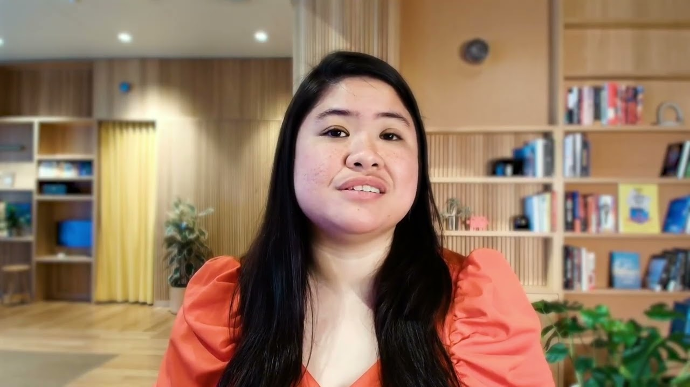

# Lesson 1: Introduction to AI Fluency | AI Fluency: Framework & Foundations Course |

This video is part of Lesson 1 of AI Fluency: Framework & Foundations, a course developed by Anthropic, Prof. Rick Dakan (Ringling College of Art and Design) and Prof. Joseph Feller (University College Cork). It introduces you to this course's focus: developing meaningful collaboration with AI rather than just learning about AI technology.

## Table of Contents
* [00:00:00] Introductions
* [00:00:22] The Focus of AI Fluency
* [00:02:27] The Course Journey and the Four Ds
* [00:03:52] What You Will Gain

## Introductions [00:00:00]

**Joe Feller:** I'm Joe Feller. I'm a professor at the Cork University Business School. [00:00:00 → 00:00:02]

**Drew Bent:** My name is Drew Bent and I'm a teacher, programmer, and a member of technical staff at Anthropic. [00:00:02 → 00:00:10]

**Rick Dakan:** My name is Rick Dakan from the Ringling College of Art and Design. [00:00:10 → 00:00:14]

**Maggie Vo:** I'm Maggie Vo and I work on the education research team at Anthropic. [00:00:14 → 00:00:18]

## The Focus of AI Fluency [00:00:22]

**Rick Dakan:** Let's begin our exploration of the AI fluency framework. [00:00:22 → 00:00:27]

The focus of this course is not really about AI as a technology. Instead, it's mostly about you and I, us humans, and how we interact and collaborate with AI systems. It's about imagining possibilities that don't treat AI as some sort of next level spell checker, but instead as a trusted partner for doing creative and innovative problem-solving work. And it's about approaching these possibilities confidently and capably. [00:00:30 → 00:00:57]

Let's face it, the AI world moves extremely quickly. And it's very hard to know where to start or how to keep up unless you have a grounding fundamental framework to guide you and get you past that next prompt engineering fad. That's why we're publishing this course. [00:01:00 → 00:01:16]

In this course, we explore AI fluency, our ability to engage with AI systems in ways that are effective, efficient, ethical, and safe. You'll learn plenty of practical skills, but it isn't just another collection of technical definitions or prompting tips that may be outdated next month. This course is about fundamentally shifting how we approach AI. [00:01:16 → 00:01:41]

We want to change how we think about AI so that we can learn how to think with AI. Over the last few years, AI has transformed from specialized technologies to interactive systems that millions use daily at school, at work, and at home. This transformation creates both opportunities and uncertainty. [00:01:41 → 00:02:04]

We see organizations adopting AI without clear strategies. We watch people growing frustrated with systems that they don't fully understand. And we're all experiencing a widening gap between what's possible and what feels comfortable and intuitive. This course exists to help us bridge this gap together. [00:02:04 → 00:02:29]

## The Course Journey and the Four Ds [00:02:27]

**Rick Dakan:** Here's the journey we'll take across this course. First, we'll give an overview of the AI fluency framework, a model for human AI interaction that we have found useful and powerful. We'll discuss the ways we interact with AI systems and four core competencies which we call the four Ds that transform those interactions into something richer and much more rewarding. [00:02:29 → 00:02:49]

Then we'll look at each competency more closely. In brief, these are delegation which asks when should humans do work and when should AI; description which asks how do we communicate clearly with AI systems? Discernment which asks how do we evaluate what AI gives us? And diligence, which asks, "How do we ensure our interaction with AI is responsible, transparent, and accountable?" [00:02:49 → 00:03:11]

Each section includes focused videos paired with exercises and materials to build practical understanding. We hope you'll spend much of your time during this course trying what you're learning. [00:03:11 → 00:03:20]

You'll also hear directly from a few of us at Anthropic about what makes today's AI different from previous technologies, the real capabilities and limitations of these systems, and practical techniques that apply the 4Ds. [00:03:20 → 00:03:34]

Most AI training focuses solely on tactical skills like specific prompts, which settings to adjust or which systems to use. While useful, these skills can quickly become outdated. We're taking a different approach and focusing on core competencies and deep understanding so that you're prepared not just for today's AI, but for the changes to come. [00:03:34 → 00:03:52]

## What You Will Gain [00:03:52]

**Rick Dakan:** By the end of our time together, you'll have a framework to guide your own interactions with AI, confidence in deciding when and how to engage AI effectively, practical skills for more thoughtful and fluid human AI collaboration, and the ability to evaluate and take responsibility for the outcomes of these collaborations. Thank you for joining us. [00:03:52 → 00:04:13]
