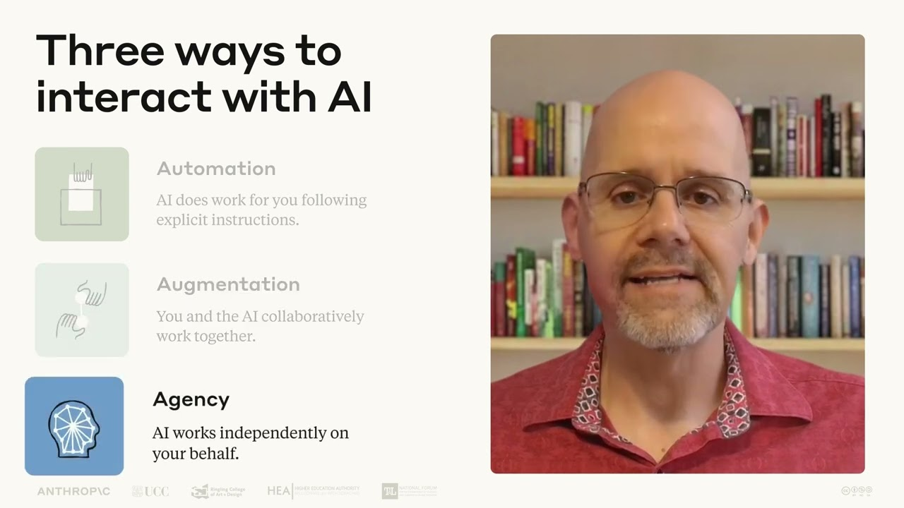

# Lesson 11: Conclusion | AI Fluency: Framework & Foundations Course

This concluding video is part of Lesson 11 of AI Fluency: Framework & Foundations, a course developed by Anthropic, Prof. Rick Dakan (Ringling College of Art and Design) and Prof. Joseph Feller (University College Cork). It revisits the AI Fluency Framework and brings together the key concepts explored throughout the course.

View the full free course, including all videos, exercises, and resources, at https://www.anthropic.com/ai-fluency

## Table of Contents
* [00:00:11] Introduction
* [00:00:40] The Four Core Competencies — The Four Ds
* [00:02:05] Three Modes of AI Interaction and Essential Insights
* [00:03:41] Developing Your AI Fluency
* [00:04:18] Closing Thoughts

## Introduction [00:00:11]

**Prof. Rick Dakan:** Hello and welcome to our final session covering the foundations of AI fluency. I'm Professor Rick Dacen from the Ringling College of Art and Design. Over a short period, we've covered quite a lot of ground together exploring the AI fluency framework and seeing how it applies to everyday collaboration with AI. Let's take a moment to reflect on what we've learned, highlight some key takeaways, and look ahead to where you might go next. [00:00:11 → 00:00:40]

## The Four Core Competencies — The Four Ds [00:00:40]

Let's begin by revisiting the four core competencies, also known as the four Ds, that make up the AI fluency framework. Delegation focuses on deciding what work should be done by and with AI versus what's best handled by humans alone. It combines your understanding of the problem, awareness of AI capabilities, and skill in distributing work effectively between you and your AI assistants. [00:00:40 → 00:01:04]

Description addresses how we communicate with AI systems. Through clear articulation of what we want, how we want it approached, and what kind of interaction is most helpful to us, also known as product, process, and performance description, we guide AI to produce the outputs we need and become more effective collaborators and assistants. [00:01:04 → 00:01:28]

Discernment involves critically evaluating AI outputs and behaviors. By developing your ability to assess outputs, processes, and interactions, also known as product, process, and performance discernment, you ensure quality and appropriateness in all your AI-driven outputs. [00:01:28 → 00:01:45]

And finally, diligence ensures our AI interactions are responsible. Through thoughtful selection of AI systems, transparency about AI's role in taking accountability for the final product, also known as creation, transparency, and deployment diligence, we can work with AI ethically and safely. [00:01:45 → 00:02:05]

## Three Modes of AI Interaction and Essential Insights [00:02:05]

Remember that these competencies apply across all three ways we interact with AI. Automation, where AI performs specific tasks following your instructions. Augmentation, where you and AI collaborate as thinking partners, and agency, where AI is configured to act independently on your behalf. [00:02:05 → 00:02:29]

As you move forward in your AI journey, keep these essential insights in mind. For delegation, your expertise and judgment remain the foundation of effective AI use. The most powerful outcomes often emerge when you can identify opportunities where you and AI can build on each other's strengths through iterative collaboration, creating outcomes neither could achieve alone. [00:02:29 → 00:02:56]

For description, clear communication bridges your intentions and AI capabilities. Sometimes the most effective instructions aren't elaborate prompts, but thoughtful conversations that provide context, examples, and feedback. [00:02:56 → 00:03:13]

For discernment, critical evaluation of AI outputs is a non-negotiable responsibility. Your discernment skills protect against AI limitations and once again enable you to achieve results neither you nor the AI could easily create alone. [00:03:13 → 00:03:30]

For diligence, you remain accountable for what you do with AI and its impact on others. Being transparent about AI's role in your work builds trust and integrity. [00:03:30 → 00:03:41]

## Developing Your AI Fluency [00:03:41]

These competencies aren't mastered overnight. They develop through practice. As you delegate work, describe your needs, discern the quality of outputs, and apply diligence to your process, your AI fluency will grow naturally. [00:03:41 → 00:03:55]

The goal isn't perfection. It's about continually developing awareness, commitment, and an intentional approach to working with AI. The fluency framework is designed to be widely applicable to the broad range of generative AI assistants and remain relevant even as AI systems continue to evolve, but it is up to us to make sure we continue to apply our learning as well. [00:03:55 → 00:04:18]

## Closing Thoughts [00:04:18]

We hope this course is just the beginning of your AI fluency journey. To close out the AI Fluency Foundations course, you'll find some follow-on activities designed to help you apply what you've learned, along with resources for continued exploration. [00:04:18 → 00:04:34]

We began this course with the goal of helping you think differently about AI and the ways we work with it. These are powerful systems, but they're not silver bullets or magical solutions to every problem. They're only as useful and safe as we enable them to be. [00:04:34 → 00:04:51]

So invest in your own expertise and stay aware of technological change so that you can delegate appropriately. Practice art of description and discernment. That thoughtful back and forth conversation that transforms AI from simple automation machines into genuine thinking partners. And above all, take responsibility for the way you work with AI and what do you create together. [00:04:51 → 00:05:14]

Be effective and efficient. Be ethical and safe. We're all learning together how to navigate this rapidly evolving landscape. Thank you for joining us on this journey toward greater AI fluency. The future of human AI collaboration is bright and you're now better equipped to shape it thoughtfully. [00:05:14 → 00:05:31]
