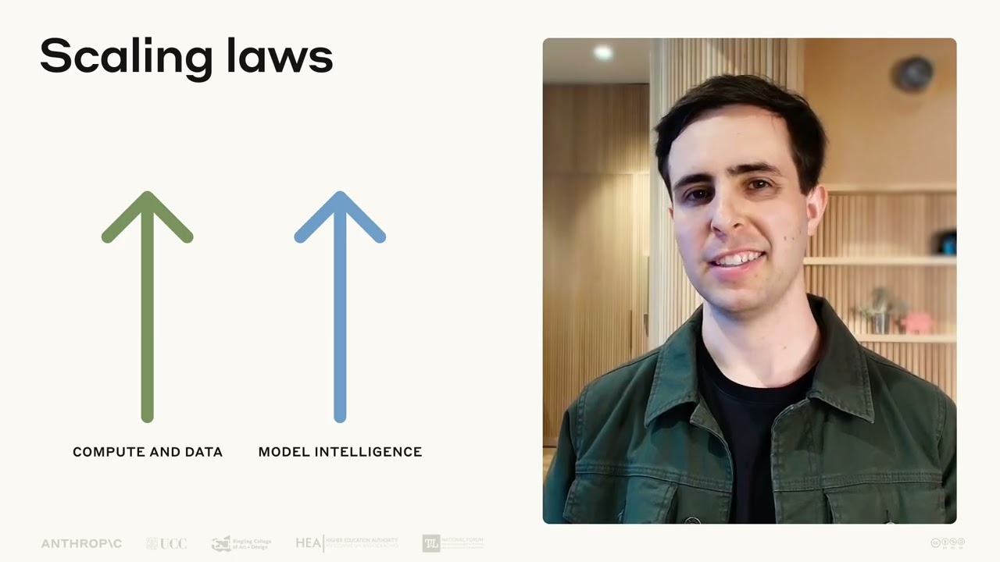

# Lesson 3A: What is generative AI? (Deep Dive) | AI Fluency: Framework & Foundations Course

This video is part of Deep Dive 1 of AI Fluency: Framework & Foundations, a course developed by Anthropic, Prof. Rick Dakan (Ringling College of Art and Design) and Prof. Joseph Feller (University College Cork). It introduces the concept of generative AI, focusing on its ability to create new content rather than just analyzing what already exists.

## Table of Contents
* [00:00:12] Introduction
* [00:00:37] What is Generative AI
* [00:01:06] Large Language Models
* [00:01:31] Three Key Developments
* [00:02:52] Scaling Laws and Emergent Capabilities
* [00:03:22] How LLMs Are Trained
* [00:04:27] How LLMs Work in Practice
* [00:05:27] Three Characteristics of Modern Generative AI

## Introduction [00:00:12]

[music] [00:00:02]

**Drew Bent:** Hi, my name is Drew Bent and I'm a teacher, programmer, and member of technical staff at Anthropic. Welcome to our exploration of generative AI. In this video, we'll dive into what generative AI actually is, how it works under the hood, and the technological breakthroughs that made these systems possible. You might interact with generative AI daily without fully understanding what's happening behind the scenes. Let's change that. [00:00:12 → 00:00:37]

## What is Generative AI [00:00:37]

**Drew Bent:** Generative AI refers to artificial intelligence systems that can create new content rather than just analyzing existing data. For example, while traditional AI might classify emails as spam or not spam based on patterns, generative AI can write a completely new email for you. [00:00:37 → 00:00:56]

The first approach analyzes and categorizes. The second creates something new that didn't exist before. This represents a fundamental shift in AI capabilities. [00:00:56 → 00:01:06]

## Large Language Models [00:01:06]

**Drew Bent:** Large language models or LLMs like Anthropic's Claude models are a prominent type of generative AI. They're called language models because they're trained to predict and generate human language, and large because they contain billions of parameters, mathematical values that determine how the model processes information, somewhat like synaptic connections in your brain. [00:01:06 → 00:01:31]

## Three Key Developments [00:01:31]

**Drew Bent:** The path to today's generative AI wasn't sudden. It involved three crucial developments coming together at the right time. [00:01:31 → 00:01:38]

First, there were algorithmic and architectural breakthroughs that fundamentally changed how AI systems learn. While neural networks have been around conceptually for decades, the development of the transformer architecture in 2017 was a gamechanger. This architecture excels at processing sequences of text while maintaining relationships between words across long passages, which is critical for understanding language in context. [00:01:38 → 00:02:05]

Second, the explosion of digital data provided the essential raw material for training. Modern LLMs like Claude learn from diverse sources such as websites, code repositories, and other text that represent human knowledge and communication. [00:02:05 → 00:02:20]

This vast tapestry of information helps models develop a broad and nuanced understanding of both language and concepts. And third, massive increases in computational power made it possible to train these complex models on all that data. Specialized hardware like GPUs or graphics processing units and TPUs or tensor processing units along with distributed computing networks often called clusters enable processing that would have been impossible just a few years earlier. [00:02:20 → 00:02:52]

## Scaling Laws and Emergent Capabilities [00:02:52]

**Drew Bent:** The combination of these three factors led to an important discovery known as the scaling laws. These empirical findings showed that as models grew larger and trained on more data with more computing power, their performance improved in predictable ways. [00:02:52 → 00:03:08]

More surprisingly, researchers found that entirely new capabilities began to emerge as these models grew larger. Abilities no one explicitly programmed, like reasoning through problems step by step or adapting to new tasks with minimal instruction. [00:03:08 → 00:03:22]

## How LLMs Are Trained [00:03:22]

**Drew Bent:** Let's peek under the hood at how these systems actually work. During initial training, also called pre-training, LLMs like Claude analyze patterns across billions of text examples. Imagine reading every website and piece of text you could find, not just to absorb information, but to understand the statistical relationships between words, phrases, and concepts. At this stage, the model essentially builds something like a complex map of language and knowledge. [00:03:22 → 00:03:48]

This pre-training process involves showing the model text and asking it to predict what comes next. Through many iterations, the model gradually refines its predictions, learning the patterns that make language coherent and meaningful. [00:03:48 → 00:04:04]

After pre-training, models undergo additional training called fine-tuning, where they learn to follow instructions, provide helpful responses, and importantly, avoid generating harmful content. This often involves human feedback to improve the model's performance, as well as reinforcement learning, which uses rewards and penalties to shape the model's behavior toward being more helpful, honest, and harmless. [00:04:04 → 00:04:27]

## How LLMs Work in Practice [00:04:27]

**Drew Bent:** In the case of Anthropic's models, once models are trained, they are then deployed for you to interact with. When you interact with Claude or another LLM, you're providing a prompt, which is text that the model reads and then continues from based on patterns it learned during training. The model isn't retrieving pre-written answers from a database. Instead, it's generating new text that statistically follows from what you've written. [00:04:27 → 00:04:51]

There's also a practical limit to how much information an LLM can consider at once, known as the context window. Think of this as the AI's working memory. The context window includes your prompts, the AI responses, and any other information you've shared in your conversation. [00:04:51 → 00:05:08]

While AI companies continue to grow the context window to allow for longer context documents and conversations, these limits remind us that these systems don't have unlimited access to information and cannot use content beyond its current context window without specialized tools like web search. [00:05:08 → 00:05:27]

## Three Characteristics of Modern Generative AI [00:05:27]

**Drew Bent:** Bringing this together, the three characteristics that make modern generative AI so powerful include, first, its ability to process vast amounts of information during training, allowing it to learn complex and nuanced patterns in language and knowledge. [00:05:27 → 00:05:41]

Second, its in-context learning ability. LLMs can adapt to new tasks based on instructions or examples in your prompt without requiring additional training. And third, emerging capabilities that arise from scale. As these models grow larger, they develop abilities that weren't explicitly designed into them, sometimes surprising even their creators. [00:05:41 → 00:06:01]

In the next video, we'll explore what these systems can and can't do well, along with their most common or valuable applications. [00:06:01 → 00:06:11]

[music] [00:06:11]
