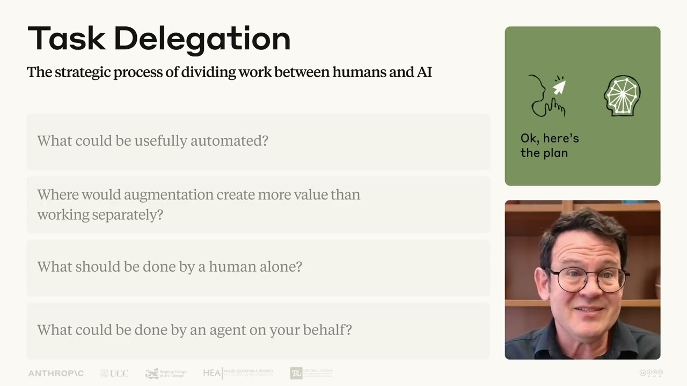

# Lesson 4: A closer look at Delegation | AI Fluency: Framework & Foundations Course

This video is part of Lesson 4 of AI Fluency: Framework & Foundations, a course developed by Anthropic, Prof. Rick Dakan (Ringling College of Art and Design) and Prof. Joseph Feller (University College Cork). It explores the core competency of Delegation: setting goals and deciding whether, when and how to engage with AI.

## Table of Contents
* [00:00:11] Introduction to Delegation
* [00:01:09] Problem Awareness
* [00:02:42] Platform Awareness
* [00:03:48] Task Delegation
* [00:05:02] Recap

## Introduction to Delegation [00:00:11]

**Narrator:** In this video, we're going to take a closer look at the delegation competency. Remember that AI fluency is about working with AI in ways that are effective, efficient, ethical, and safe. [00:00:11 → 00:00:25]

Delegation is primarily focused on the first two of these. Helping you work effectively and efficiently with AI assistance. At its core, delegation is about deciding what work is to be done, what work you should do yourself, and what work might be better suited to AI. [00:00:25 → 00:00:43]

That might sound simple, but it's surprisingly nuanced. Effective delegation requires understanding both what you're trying to accomplish and what you and AI can each realistically do. It's about breaking down complex work into manageable pieces and making strategic decisions about who handles which part, whether through automation, augmentation, or agency. [00:00:43 → 00:01:09]

## Problem Awareness [00:01:09]

**Narrator:** Here's something that might surprise you. The cornerstone of good delegation isn't actually about AI at all. It's about your own expertise and your own understanding of what you're trying to accomplish. [00:01:09 → 00:01:21]

Before involving AI in any project, take a moment to answer some important questions. What exactly are you trying to accomplish? What are you trying to create or solve? What is your vision or key project goals? What does success look like to you? [00:01:21 → 00:01:40]

And ask yourself what kind of thinking and work is needed to get there. Are there areas that are simple but time-consuming? Areas of uncertainty where you could use a trusted thinking partner? Areas of ignorance where what you need is more data or areas requiring critical judgment. [00:01:40 → 00:02:00]

Every project and every domain is different. We can't make you an expert in your problem space. But we can say that without a clear understanding of your goals and the work involved, even the most advanced AI won't get you where you need to go. [00:02:00 → 00:02:14]

You'll struggle to effectively work with AI assistants, evaluate their outputs, or know when human intervention is necessary. The most effective AI collaborators are experts in their fields first and AI delegators second. [00:02:14 → 00:02:31]

We call this first concept problem awareness. The ability to clearly define your goals and understand what work is needed before bringing AI into the picture. [00:02:31 → 00:02:45]

## Platform Awareness [00:02:42]

**Narrator:** Beyond understanding your problem, you also need a working knowledge of the AI landscape. Different AI systems offer vastly different capabilities and this field evolves almost daily. Effective delegation isn't about finding one perfect system. It's about understanding the unique strengths and limitations of the various options available to you. [00:02:42 → 00:03:06]

Have you investigated which models perform best for the kind of work you have in mind? Do you know which AI systems prioritize speed over depth or accuracy over creativity? [00:03:06 → 00:03:20]

This course includes several technical sections that will help you build this knowledge, but the landscape moves quickly. The best approach is hands-on. Experiment with different AI systems as often as you can and develop your own insights based on personal experience. [00:03:20 → 00:03:38]

We call this second concept platform awareness. A working knowledge of available AI systems and their specific capabilities and limitations. [00:03:38 → 00:03:48]

## Task Delegation [00:03:48]

**Narrator:** Once you understand both your problem and the available AI assistance, the real art of delegation emerges. Thoughtfully distributing work between human and artificial intelligence to leverage the unique strengths of each. [00:03:48 → 00:04:03]

Ask yourself which specific parts of your workflow would benefit from automation, or where would an augmentation approach create more value than either working alone or fully automating? Are there critical judgment areas that should remain exclusively human and shouldn't be delegated at all? What routine interactions can AI agents handle on your behalf? [00:04:03 → 00:04:28]

With a clear understanding of both your problem and available AI systems, you can make informed decisions about which aspects of work should be automated by AI or completed through human-AI collaboration or reserved exclusively for human execution or handled by AI agents acting on your behalf. [00:04:28 → 00:04:50]

We call this third concept task delegation. The strategic process of dividing work between humans and AI. [00:04:50 → 00:05:02]

## Recap [00:05:02]

**Narrator:** To recap, delegation involves three key elements. Problem awareness, understanding your goals and the problem to be solved. Platform awareness, understanding AI capabilities and limitations. And task delegation, strategically dividing the work. [00:05:02 → 00:05:18]

This competency highlights something important. Effective AI collaboration isn't about handing over the wheel and calling it a day. It's about making thoughtful choices and delegating work that leverages the unique strengths of both human and artificial intelligence. [00:05:18 → 00:05:39]
