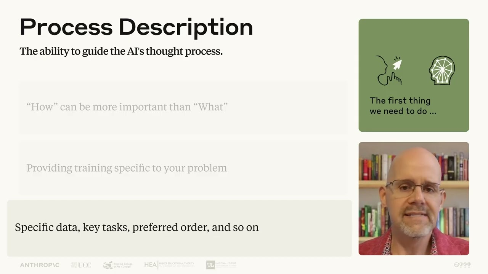

# Lesson 6: A closer look at Description | AI Fluency: Framework & Foundations Course

This video is part of Lesson 6 of AI Fluency: Framework & Foundations, a course developed by Anthropic, Prof. Rick Dakan (Ringling College of Art and Design) and Prof. Joseph Feller (University College Cork). It explores the core competency of Description: effectively describing goals to prompt useful AI behaviors and outputs.

## Table of Contents
* [00:00:11] Introduction to the Description Competency
* [00:00:54] Product Description: Defining What You Want
* [00:01:52] Process Description: Guiding How AI Works
* [00:03:05] Performance Description: Shaping AI Behavior
* [00:03:53] Bringing It All Together

## Introduction to the Description Competency [00:00:11]

**Instructor:** In this video, we'll dig deeper into the AI fluency competency of description. AI fluency means working with an AI effectively, efficiently, ethically, and safely. Description is about communicating with AI, which is the core of most human AI interaction. [00:00:11 → 00:00:29]

Description goes far beyond just writing clever prompts. It's about communicating with the AI to explain tasks, ask questions, provide context, and otherwise guide the interaction. It's about being able to steer a conversation that is going wrong. It's about guiding an AI's thought process or logical reasoning. [00:00:29 → 00:00:47]

And it's about building a kind of thinking environment where both you and the AI can each do your best work. [00:00:45 → 00:00:54]

## Product Description: Defining What You Want [00:00:54]

**Instructor:** Think of it as building a bridge between your intentions and the AI's capabilities. The quality of AI outputs often depend on how clearly you describe what you want. It's like the difference between asking someone to make dinner versus providing a detailed recipe with ingredients and cooking instructions. [00:00:54 → 00:01:13]

AI can't read your mind. Instead of assuming the AI knows what you're looking for, you need to explain every relevant detail. What is the context for this work? What exactly are you looking for the AI to do? What format should the output take? Who is the audience and what style is appropriate? [00:01:13 → 00:01:33]

Don't make AI guess what you're thinking. Set explicit requirements and give the AI the information it needs to deliver what you're actually looking for. We call this first concept product description. The ability to clearly define what you want the AI to create or provide. [00:01:33 → 00:01:52]

## Process Description: Guiding How AI Works [00:01:52]

**Instructor:** Sometimes specifying how an AI should tackle a job is as or even more important than specifying the end goal. Just as you might prefer that a colleague tackle a problem using your specific method, you can guide how an AI works through your request. You can and should give the AI helpful guidance to help it accomplish your desired goal. [00:01:52 → 00:02:13]

There are different ways to approach this. You might provide general guidance like a manual, step-by-step instructions like a cookbook, or even a demonstration through examples. Here's how I'd do it. [00:02:13 → 00:02:25]

Think about it this way. The AI already has extensive training, but you're providing additional context specific to your unique situation. Are there specific data you want the AI to draw on? Are there specific issues it should be addressing or in a particular order? [00:02:25 → 00:02:43]

Is there a particular style of analysis you need or maybe a specific workflow or technique you wanted to use? Taking time to explain these elements makes a tremendous difference. We call this second concept process description. The ability to guide how the AI assistant approaches your request. [00:02:43 → 00:03:05]

## Performance Description: Shaping AI Behavior [00:03:05]

**Instructor:** If you take one thing from this course, it should be this. AI tools are not databases or vending machines. They are interactive systems that can behave differently in different contexts much like people might. You need to explain how you want the AI to behave to get the best results. [00:03:05 → 00:03:23]

When you next sit down with AI, think first, what kind of thinking partner do you need right now? Are you narrowing down towards a specific answer or trying to explore multiple possibilities? Do you want the AI to challenge your assumptions or simply follow your lead? to provide expensive detail or keep things concise to explain why it's answering in a certain way or just give you the answer? [00:03:23 → 00:03:44]

We call this third concept performance description. The ability to define the behavioral aspects of an AI interaction. [00:03:44 → 00:03:53]

## Bringing It All Together [00:03:53]

**Instructor:** You should now have a better sense of how product description, process description, and performance description combine to form the description competency. When you develop your capacity for description, you transform AI from generic assistants into finely tuned thinking partners that can truly meet your needs. [00:03:53 → 00:04:12]
