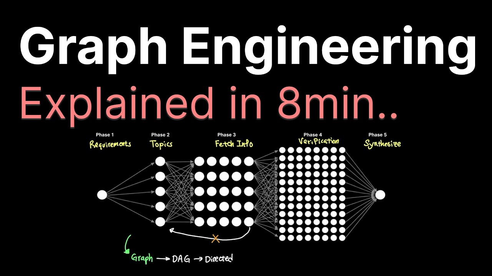

# Graph Engineering explained in 8min..

Graph Engineering, a new focus in agentic engineering as we target the external areas around what makes agents scalable. For a long time, graph was not feasible because the node itself was brittle which made graph not very useful. But with the emergence of Claude Code, Codex CLI, Antigravity and more, scaling the agent to a graph has now become feasible as AI adoption grows to bigger use cases.

## Table of Contents
* [00:00:00] Intro
* [00:01:16] Graph Theory
* [00:02:33] DAG
* [00:03:14] Dynamic Workflow
* [00:03:56] Cost of Graph
* [00:04:49] Sponsor: Zo
* [00:05:58] Multi-Agent
* [00:06:44] Coding Agent
* [00:07:42] Bottleneck
* [00:08:09] Conclusion

## Intro [00:00:00]

**Caleb:** When we ask Claudecode to do a deep research about a specific topic, behind the scenes, it's not just one agent that handles the entire research, but many agents are spawned to handle our research needs. Claudecode actually generates a dynamic workflow that looks something like this, where you have over 100 agents broken into various phases. [00:00:00 → 00:00:19]

And this entire workflow is generated on the fly by Claudecode in JavaScript code, like you can see here. That's 427 lines of code, and this very code acts as a runtime environment that will spawn over 100 agents. And every new request that I send, Claudecode will generate a fresh new workflow, and each workflow will spawn different numbers of agents. [00:00:19 → 00:00:41]

So, given our example here of JavaScript file, where Claudecode essentially converted my research plan into a workflow as a runtime, Claudecode will then start launching many agents in five different phases. And each phase of the workflow will more or less work in parallel, and each agent has its own context window and its own system prompt. [00:00:41 → 00:01:02]

Pretty neat, right? Now, building on this workflow that you can see here, the concept for graphs has been resurfacing lately, as if it's a next natural progression in our agentic engineering. So, we asked the natural question, what exactly is graph engineering? [00:01:02 → 00:01:16]

## Graph Theory [00:01:16]

**Caleb:** The idea of graphs dates all the way back to 1736, when a Swiss polymath, Leonhard Euler, was considering solving the strange question in a city called Königsberg. They have two mainlands and two islands and seven bridges connecting them. And the question was simple, is there a route through the city that crosses every single bridge, but only exactly once? [00:01:16 → 00:01:37]

Now, you might try and hypothesize a way by process of elimination. Maybe you can start here and try to cross the bridge this way, or maybe you just start on the island instead and start out and see if there's another way possible, and you'll soon realize that this is not possible. [00:01:37 → 00:01:53]

Euler agreed, but it's not just that this wasn't possible, but how Euler simplified the problem into a simple concept shown in this diagram. Circles are nodes, which in this case were land, and the black lines are edges, which are bridges in this case, and these two constitute a graph. So, this middle island here has five edges, or bridges in this case, connecting to other areas, and so on. [00:01:53 → 00:02:18]

And given this representation, Euler concluded with a proof that this kind of route in Königsberg is impossible. Now, the exact proof that Euler proposed is sort of irrelevant to this video, but Euler's graph theory is now applied to agents and graph engineering today. [00:02:18 → 00:02:33]

## DAG [00:02:33]

**Caleb:** Here's another way to visualize the workflow that Claude code generated for my deep research from earlier. This consists of five phases. One agent for scoping the requirement, five agents to gather credible websites to research for each subtopics, 25 agents to then actually fetch the information and pass it to the next, and 75 agents to verify the facts and vote on the credibility, and finally, one agent that generates the full report in the end. [00:02:33 → 00:03:01]

And this workflow you're seeing here is a form of a graph. In this case, because execution only flows from left to right, with no node going backwards, which would form a loop, this is called DAG, or directed acyclic graph. [00:03:01 → 00:03:15]

## Dynamic Workflow [00:03:14]

**Caleb:** Now, we could technically do this with a single agent instead of hundreds of agents in a graph like we just saw earlier. But this would be a bit silly because using a dynamic workflow for this kind of work is better for many reasons. The most obvious one being time. By parallelizing task into sub-agents that have their own small objective, this helps save a large amount of time by the simple fact that multiple agents are working at the same time. [00:03:15 → 00:03:41]

Another benefit is separation of concerns. The fact that each agent has its own context window helps focus its own context window towards its goal. Whereas a single agent might need to keep reusing its own context to store some of it for the goal, some of it for the current task and keep summarizing back and forth. [00:03:41 → 00:03:57]

## Cost of Graph [00:03:56]

**Caleb:** But graphs aren't without its drawbacks either. Anthropic made a post that talked about their multi-agent research system that said a single agent tends to use four times more tokens than a regular chat and a multi-agent system tends to use 15 times more tokens in comparison. [00:03:57 → 00:04:12]

So going back to our example, each agent ran on Opus 5 with their own system prompt and each agent used about 20,000 tokens by default to start. So by the time you extrapolate this to 108 agents that it eventually used, the input cost alone would be closer to $10 given Opus 5's pricing. But since we have prompt caching, realistically, this number will look closer to a dollar which helps scale our agent from a single agent to a parallel agents like you can see here. [00:04:12 → 00:04:40]

So given the benefits and the drawbacks when it comes to graphs, why are everyone talking about graph and graph engineering as if it's the next evolution when it comes to agentic engineering? [00:04:40 → 00:04:50]

## Sponsor: Zo [00:04:49]

**Caleb:** But first, a quick word from Zoe sponsoring this video. It's pretty obvious that more and more parts of our lives are being integrated with AI and often our interactions are scattered across Claude, ChatGPT, Codex and Menace. [00:04:50 → 00:05:00]

So how can we have more ownership while having a 24/7 agent? Zoe gives you a dedicated computer on the cloud that's yours, meaning your agent is on standby for anything that you give. And part of being 24/7 is the ability to message your agent through text. [00:05:00 → 00:05:13]

You can directly message Zoe to have normal conversations through iMessage or ask about files that you have stored on your computer in the cloud and better yet, build an e-commerce website for vintage watches and host directly on Zoe using their AI agent natively through text. [00:05:13 → 00:05:29]

What's cool about Zoe is that you can write code and launch sites that are actually useful because you can integrate all your contacts into Zoe and run automations. Custom domains are also included at paid plan and all your sites are hosted on your Zoe's cloud computer. Plus they got some neat tricks like the selector tool to edit exact areas to improve things or even add automations that plug into your website, like a text anytime someone fills out a form. [00:05:29 → 00:05:56]

Try Zo today. I'll have the link in the description below. [00:05:56 → 00:05:57]

## Multi-Agent [00:05:58]

**Caleb:** The concept behind agent communicating with another agent is not anything new. We can look back to open-source ideas like AutoGen in 2023 from Microsoft talking about agents communicating with another agent. [00:05:57 → 00:06:10]

Companies like LangChain also started messing with cyclic graph in 2023, which led to LangGraph, which became a framework for orchestrating agents. Anthropic also released various ways that agents can work together around the same time, like prompt chaining where LLMs are chained sequentially one after another, routing, which is similar to sub-agents, but from the perspective of the main agent, parallelization, which is similar to our deep research workflow, orchestrator, also similar to what we saw earlier, and evaluator optimizer, where two LLMs adversarially go at each other until a condition is met. [00:06:10 → 00:06:44]

## Coding Agent [00:06:44]

**Caleb:** But, none of these were materially useful back then because the problem wasn't so much in the graph itself, but what the node inside of the graph can actually do. In LangChain's blog post talking about graph engineering, they said that what changed wasn't the graph, but more in what the node can do. Back then, it was just an LLM call, nothing close to a full agent that we interact with every day like Claude Code or CodeX CLI. These agents are immensely better given their myriads of tools and harness environment. [00:06:44 → 00:07:14]

So, with the emergence of coding like Cursor, Kline, Rue, and Winster, which were one of the few early players back then when it comes to agents, they focus more on single agents in improving that very agent instead of extending them to various edges that form a graph of agents actually working together. [00:07:14 → 00:07:33]

## Bottleneck [00:07:42]

**Caleb:** And over time, these agents individually started to incorporate better methodologies, going from prompt engineering to context engineering, better harnessing, and now the bottleneck started to shift away from what the node can do, but into a graph and the edges that connect the nodes together. And now, no pun intended, we're coming full circle back to graphs. [00:07:33 → 00:07:54]

## Conclusion [00:08:09]

**Caleb:** Because the nodes are reliable and more capable, we can now scale our agents from a single agent to a workflow or a graph to target a much wider set of problems like we saw in deep research, which would have been really difficult for a single agent to solve. [00:07:54 → 00:08:06]

So, going back to Euler's case, his challenge was to determine the feasibility of crossing all seven bridges exactly once, which led to the birth of graph theory. In our case, our adaptation of graph theory into agents is determining how a task can be divided in a way that a highly capable node now should structurally be configured to solve a much more complicated task that we give our agents to solve. [00:08:06 → 00:08:36]
