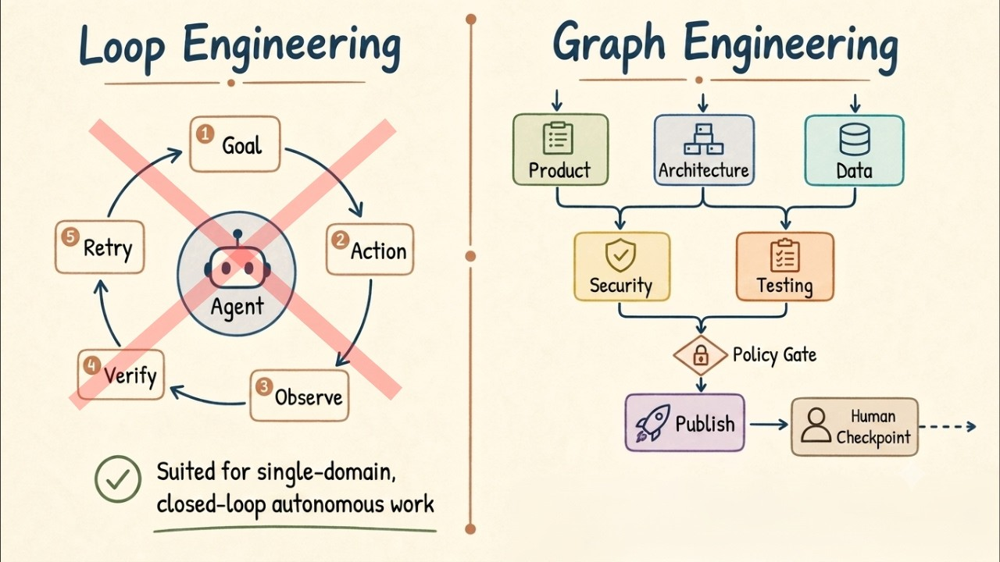

# FORGET Loop Engineering. Graph Engineering is about THIS

Graph engineering is about designing the relationships between those processes. The name is new. But most of the hard problems are not.

## Table of Contents
* [00:00:00] What Problem Graph Eng Solved
* [00:02:11] What happened after loop engineering?
* [00:03:39] Prompt Vs Loop Vs Graph: Three-Tier Engineering
* [00:06:07] What makes graph engineering Unique?
* [00:07:21] Don't graph everything.
* [00:08:14] My Impression

## What Problem Graph Eng Solved [00:00:00]

**Gao Dalie:** As AI agents become more complex, simply repeating the same process will no longer be enough to automate tasks. Real-world work involves multiple people, dependencies, approvals, conditional branching, and exception handling. The idea of designing such complex tasks, not as a simple linear process, but as a structure with interconnected relationships, is gaining attention. [00:00:00 → 00:00:27]

In July 2026, the term graph engineering began to spread rapidly around the field of AI agent development. One of the triggers was a short post by Peter Steinberger of OpenClaw that essentially asked, "Are we still talking about loops, or have we moved on to graphs?" [00:00:23 → 00:00:43]

Just a few weeks ago, the hot topic was loop engineering. This concept involves designing an iterative system where AI discovers, executes, verifies, records, and moves on to the next task, rather than humans having to input excellent prompts each time. However, after running the loop many times, new problems arose. It's not that the agents aren't smart enough, but rather that the organizational structure isn't clear enough. [00:00:43 → 00:01:13]

An agent can loop through a single task. However, when tasks span product architecture, data security, testing, release, cost, and compliance, the real challenge is no longer getting an agent to try a few more times, but rather getting multiple agents with boundaries to work together in an observable, auditable, and recoverable manner. Then, a graph appeared. [00:01:11 → 00:01:36]

So, are loops outdated? Should all AI agents be complex graphs of multiple agents? Graph engineering is about designing the relationships between those processes. The name is new, but most of the hard problems are not. [00:01:36 → 00:01:51]

In other words, graph engineering didn't invent anything new. Rather, it gave a new name to those long-standing problems in agent orchestration. These old problems include how to break down tasks, how to express dependencies, which tasks can be parallelized, how to recover from failures, and where to store state. [00:01:51 → 00:02:11]

## What happened after loop engineering? [00:02:11]

**Gao Dalie:** So, what happened after loop engineering? In loop engineering, we don't just give instructions to the AI once and then stop there. Create deliverables, evaluate them, identify problems, fix them, and evaluate again. This iteration continues until a certain quality standard is met. [00:02:11 → 00:02:28]

For example, let's consider the case where we have AI write articles. The AI creates articles and reviews their content itself. If there are any weak points, it rewrites them, evaluates them again, and continues to improve them until they meet the standards. [00:02:28 → 00:02:48]

Here, the only things humans decide are the purpose and the passing criteria. On the other hand, the specific steps to reach that point are left to the AI. This is a loop. [00:02:48 → 00:02:59]

In graphs, humans design the paths. In graph engineering, humans design not only the objectives and passing criteria, but also the entire path through which the work will proceed. [00:02:59 → 00:03:11]

If the process is the same for article creation, it would follow these steps. If the quality evaluation does not meet the standards, it will be returned to writing. If the article's direction itself is wrong, we'll go back to the structure creation and research stages. Unapproved documents cannot proceed to the publication process. [00:03:11 → 00:03:33]

In other words, in a graph, the AI doesn't wander around freely, but rather moves within a pre-designed map. [00:03:33 → 00:03:40]

## Prompt Vs Loop Vs Graph: Three-Tier Engineering [00:03:39]

**Gao Dalie:** Definitely stay tuned throughout the end of this video. If you guys haven't followed me, I highly recommend that you do so so you can stay up to date with the latest AI news. Lastly, make sure you guys subscribe, turn the notification bell, like this video, and check out previous videos because there is a lot of content that you will definitely benefit from. So, that thought, let's get right back into the video. [00:03:40 → 00:04:05]

The evolution of agent engineering can be summarized in three sentences, roughly as follows. Prompt engineering makes a single model call more reliable. Loop engineering makes an agent's behavior more reliable. Graph engineering makes the collaboration of a group of agents more reliable. [00:04:05 → 00:04:23]

The core object of prompt is an instruction. It cares about what the model sees, in what format it is output, and what it should not do. The core object of a loop is the control cycle. You are concerned with triggering conditions, tool calls, state updates, validators, retry strategies, and stopping conditions. [00:04:23 → 00:04:44]

The core object of a graph is the topology. You are interested in nodes, edges, state, artifacts, permissions, observations, evaluations, and change history. These three layers are not interchangeable. [00:04:44 → 00:04:57]

Graph is not an upgraded wrapper around loop, and loop will not disappear because of the introduction of graph. More precisely, each important node may still contain a loop. The graph determines how these loops are organized, constrained, and connected. [00:04:57 → 00:05:12]

If your task only requires a clear loop, such as scanning repository issues daily, fixing the simplest bugs, running tests, and opening PRs, then a loop is sufficient. Adding a graph too early will only increase complexity. [00:05:12 → 00:05:28]

However, if the task is inherently cross-domain, such as reconstructing a payment system while ensuring API compatibility, migrating data, updating the front end, completing tests, assessing security risks, and generating release instructions, a single loop will become a complete mess. [00:05:28 → 00:05:48]

At this point, what you really need to model is not what the agent will do next, but rather what migration evidence does the data node output? How do API nodes declare compatibility? When can front-end nodes run in parallel? What prerequisites must the release node wait for? This is already a graph problem. [00:05:48 → 00:06:07]

## What makes graph engineering Unique? [00:06:07]

**Gao Dalie:** Traditional business systems have primarily been built around tabular data. This method organizes information using rows and columns, such as customer lists, product lists, and sales lists. Tabular databases are extremely powerful for aggregation and routine processing. [00:06:07 → 00:06:24]

However, the process becomes more complex when dealing with questions like the following: Who is indirectly connected to this person? Are there any common patterns that lead to fraudulent transactions? How far will the impact of a certain failure spread? If this task fails, to what stage should we return to? [00:06:24 → 00:06:45]

These are not issues that can be addressed by looking at a single data point. This problem involves tracing multiple objects and investigating the meaning of their relationships. The importance of this relationship is increasing even further with the proliferation of AI agents. [00:06:45 → 00:07:00]

Simply feeding AI a large amount of information does not guarantee that it will be able to make correct decisions. Which information is based on which other information? Who approved it and which steps did it go through? If it fails, where do we go back to? [00:07:00 → 00:07:16]

By explicitly defining the structure, it becomes easier to control the AI's decisions. [00:07:16 → 00:07:21]

## Don't graph everything. [00:07:21]

**Gao Dalie:** Don't graph everything. When a new concept emerges, there's a natural urge to apply it to everything. However, graphs do not solve complexity for free. [00:07:21 → 00:07:31]

OpenAI's agent building guide also notes that while declarative graphs can visualize branches and loops, they can become cumbersome in dynamic workflows requiring a dedicated description method. As an alternative, the Open AI agents SDK adopts a code-centric flexible architecture. [00:07:31 → 00:07:51]

The next task can be handled with a simple loop. On the other hand, when multiple departments, multiple agents, long execution times, parallel processing, approvals, and audits are required, graphing becomes beneficial. [00:07:51 → 00:08:03]

Graph engineering isn't about creating complex diagrams. Design involves clearly indicating only the necessary relationships and discarding unnecessary automation. [00:08:03 → 00:08:15]

## My Impression [00:08:14]

**Gao Dalie:** Let me be honest about the conclusion regarding the new term itself. It's only been 3 days, so no one knows if the term graph engineering will survive. [00:08:15 → 00:08:25]

However, the underlying concepts, dividing tasks, running them in parallel, and adding decision checks have outlived the name, and I've seen their effectiveness in my own experience. Even if the term disappears in a month, [00:08:25 → 00:08:38]
