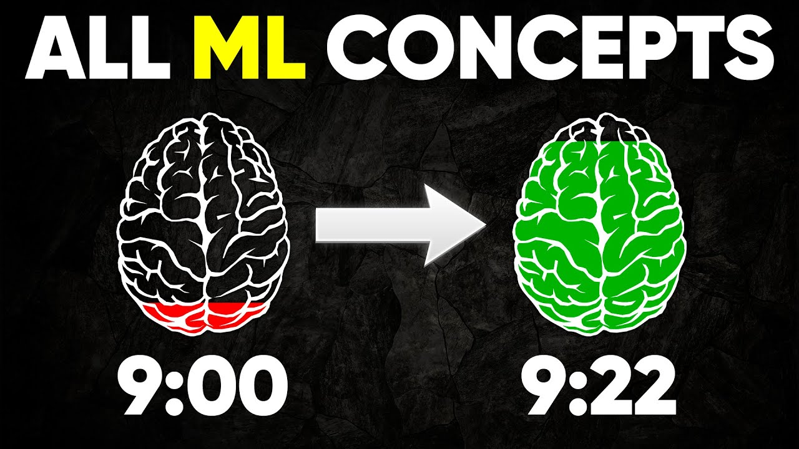

# All Machine Learning Concepts Explained in 22 Minutes

All Basic Machine Learning Terms Explained in 22 Minutes

## Table of Contents
* [00:00:00] Introduction
* [00:00:04] Artificial Intelligence (AI)
* [00:00:37] Machine Learning
* [00:01:30] Algorithm
* [00:02:06] Data
* [00:02:48] Model
* [00:03:30] Model Fitting
* [00:03:44] Training Data
* [00:04:17] Test Data
* [00:04:54] Supervised Learning
* [00:05:24] Unsupervised Learning
* [00:06:01] Reinforcement Learning
* [00:07:05] Feature (Input, Independent Variable, Predictor)
* [00:07:45] Feature Engineering
* [00:08:15] Feature Scaling (Normalization, Standardization)
* [00:08:48] Dimensionality
* [00:09:34] Target (Output, Label, Dependent Variable)
* [00:09:59] Instance (Example, Observation, Sample)
* [00:10:32] Label (Class, Target Value)
* [00:11:16] Model Complexity
* [00:12:15] Bias & Variance
* [00:13:23] Bias Variance Tradeoff
* [00:14:11] Noise
* [00:14:30] Overfitting & Underfitting
* [00:15:20] Validation & Cross Validation
* [00:16:20] Regularization
* [00:16:40] Batch, Epoch, Iteration
* [00:17:40] Parameter
* [00:18:22] Hyperparameter
* [00:18:50] Cost Function (Loss Function, Objective Function)
* [00:19:39] Gradient Descent
* [00:20:49] Learning Rate
* [00:21:28] Evaluation

## Introduction [00:00:00]

**Presenter:** Here a list of all basic machine learning terms in 22 minutes. [00:00:00 → 00:00:04]

## Artificial Intelligence (AI) [00:00:04]

**Presenter:** Artificial intelligence refers to the capability of machines to perform tasks that typically require human intelligence. This can include understanding language, recognizing images, solving problems, or making decisions. AI aims to mimic human cognitive functions through various techniques including machine learning. [00:00:04 → 00:00:19]

But not all AI is machine learning. For example, rule-based systems can use predefined logical rules to analyze medical data and provide diagnostic recommendations without needing to learn from data patterns. Typical chess playing engines would be considered AI but not machine learning because they follow specific rules in search algorithms and don't always learn from data. [00:00:19 → 00:00:37]

## Machine Learning [00:00:37]

**Presenter:** Machine learning is a branch of artificial intelligence that enables computers to learn from data and improve their performance on tasks over time without being explicitly programmed for each task. In machine learning, algorithms identify patterns and relationships within data, making predictions or decisions based on new unseen information. [00:00:37 → 00:00:55]

For example, a spam filter in an email system uses machine learning to identify and block spam emails. It is trained on thousands of examples of both spam and non-spam emails, learning which words, phrases, or patterns are typically found in spam messages. Over time it can accurately flag new emails as spam or legitimate based on these learned patterns, even if the specific content of each new email varies. [00:00:55 → 00:01:15]

In many ways this is similar to how animals and humans learn to recognize patterns over time after seeing many examples of something. For example, a human child might not be able to tell the difference between a cat and a dog, but after years of having someone point out cats and dogs, it will learn to recognize the features that determine what a cat and a dog is. [00:01:15 → 00:01:30]

## Algorithm [00:01:30]

**Presenter:** An algorithm is a set of well-defined instructions or rules that a computer follows to solve a problem or perform a task. Algorithms are used in almost every aspect of computing, from sorting lists and searching data to more complex processes like encryption and data analysis. They provide step-by-step procedures to achieve a specific goal efficiently. [00:01:30 → 00:01:47]

Think for example of a step-by-step recipe, like this sandwich making algorithm. An example is Dijkstra's algorithm, used in mapping applications to find the shortest path between two points by systematically evaluating possible paths. Dijkstra's algorithm helps determine the quickest route for navigation, which is at the base of most navigation apps like Google Maps. [00:01:47 → 00:02:06]

## Data [00:02:06]

**Presenter:** Data is information that can be collected, analyzed, and used to make decisions, predictions, or provide insights — like spreadsheets. In computing and machine learning, data typically consists of numbers, text, images, or any form of input that can be processed by algorithms. [00:02:06 → 00:02:21]

For example, customer purchase histories are a type of data that e-commerce companies analyze to recommend products likely to interest each user. Another example is weather data, which includes temperature, humidity, and wind speed measurements — this data is used to predict future weather patterns. In the case of images, data refers to a list of pixel intensities and possibly colors used by image recognition algorithms. In the case of text, data could simply be a list of words and their frequencies. Data can come in many forms. [00:02:21 → 00:02:48]

## Model [00:02:48]

**Presenter:** A model in machine learning is a mathematical representation that is trained to recognize patterns in data and make predictions or classifications based on those patterns. The most common type of model is simply a mapping function between an input and an output. In linear regression, for example, the model is simply the equation of the final regression line. [00:02:48 → 00:03:07]

In its simplest form, we might have a model that predicts a linear relationship between square footage of the house and the price of the house. For example, if we plot all house prices and their square footage against each other, we might find that on average each additional square foot adds $200 to the house price. The number 200 comes from the fitting of a line to the data, which is now our trained model. The trained model is the intersection and slope of the line, the slope being 200. [00:03:07 → 00:03:30]

## Model Fitting [00:03:30]

**Presenter:** Model fitting, also called training or learning, is the process of adjusting a model's parameters to find the best match between the model's predictions and the actual data. If you think of linear regression, model fitting would be trying out different lines until you find the line with the best fit. [00:03:30 → 00:03:44]

## Training Data [00:03:44]

**Presenter:** Training data is a carefully selected subset of data used to teach machine learning models how to make predictions. It consists of input examples paired with their correct outputs, allowing the model to learn patterns and relationships. [00:03:44 → 00:03:56]

For instance, in an email spam filter, the training data would include thousands of emails labeled as either spam or not spam, teaching the system to recognize the characteristics of unwanted messages. Similarly, for an image recognition system that identifies cats and dogs, the training data would contain numerous images labeled as either cat or dog, helping the model learn the visual patterns that define what cats and dogs look like. [00:03:56 → 00:04:17]

## Test Data [00:04:17]

**Presenter:** Test data, or test set, is a separate collection of data used to evaluate how well a machine learning model performs on examples it hasn't seen during training. Like training data, it includes both inputs and their correct answers, but these examples are kept completely separate from the training process. [00:04:17 → 00:04:33]

This testing process helps verify whether the model has truly learned to make good predictions rather than just memorizing its training examples. Importantly, the test and training data are separated randomly before beginning the modeling process so that the model can never see the test data in any way before running the final test. Any inadvertent inclusion of even parts of the test data in model training is called data leakage. [00:04:33 → 00:04:54]

## Supervised Learning [00:04:54]

**Presenter:** Supervised learning is a foundational approach in machine learning where models learn from labeled examples, meaning the true outcomes or targets are known and provided — much like a student learning from problems with their answers provided. Each example in the training data includes both the input and the correct output, allowing the model to learn the relationship between them. [00:04:54 → 00:05:13]

For instance, an image recognition system would train on images that have been pre-labeled with their contents, such as dog or cat. This is arguably the most common type of machine learning, probably making up around 70% of machine learning applications. [00:05:13 → 00:05:24]

## Unsupervised Learning [00:05:24]

**Presenter:** Unsupervised learning is a type of machine learning where models learn to find patterns and structure in data without being given labeled examples or correct answers. Rather than being taught what to look for, these algorithms discover natural groupings and relationships within the data on their own. [00:05:24 → 00:05:39]

For example, an unsupervised learning algorithm might analyze customer purchase data to identify groups of customers with similar buying habits, or examine social media posts to discover trending topics — all without being told in advance what patterns to look for. This approach is particularly valuable when we want to explore data to uncover hidden patterns but don't know exactly what we're looking for. No labels or outcomes are provided to the model during training. [00:05:39 → 00:06:01]

## Reinforcement Learning [00:06:01]

**Presenter:** Reinforcement learning is a newer branch of machine learning that has recently been accepted as a third main branch of machine learning and has gained momentum in the late 2010s, particularly with the success of DeepMind's chess engine AlphaGo in 2016. It's distinct from both supervised and unsupervised learning because it operates on a fundamentally different principle. [00:06:01 → 00:06:20]

Instead of learning from pre-labeled examples (supervised) or finding patterns in unlabeled data (unsupervised), it learns from interaction and feedback. Unlike supervised learning where examples have clear right answers, reinforcement learning is more like training a pet — the agent learns through trial and error, getting rewarded for good decisions and penalized for poor ones. [00:06:20 → 00:06:39]

For example, a reinforcement learning algorithm can learn to play chess by playing thousands of games against itself, receiving positive rewards for winning moves and negative rewards for losing ones. This approach is particularly powerful for tasks involving sequential decision-making, like game playing, robotic control, or optimizing business strategies, when there are no clear labels but an idea of what is a good or bad outcome. [00:06:39 → 00:06:58]

Many basic machine learning courses don't cover reinforcement learning as a basic machine learning branch, but as an advanced topic, since it is still fairly niche. [00:06:58 → 00:07:05]

## Feature (Input, Independent Variable, Predictor) [00:07:05]

**Presenter:** A feature, also called a predictive variable, input variable, independent variable, or attribute, is a specific piece of information or characteristic used as input for a machine learning model. Essentially, it's any measurable property that helps the model make predictions. [00:07:05 → 00:07:20]

For example, in a house price prediction model, features might include the square footage, number of bedrooms, location, and age of the house. For an email spam detector, features could include the number of capitalized words, the number of URLs in the text, or whether the sender is in your contacts. [00:07:20 → 00:07:34]

The selection and engineering of relevant features, sometimes called feature extraction or feature design, is often crucial to a model's success as they need to capture the important aspects of the data that relate to the prediction task. [00:07:34 → 00:07:45]

## Feature Engineering [00:07:45]

**Presenter:** Feature engineering is the process of creating new, more informative features from existing raw data to improve a model's performance. Feature engineering involves using domain knowledge and creativity to transform or combine original features into more meaningful ones. [00:07:45 → 00:08:00]

For example, instead of just using raw date values, you might create features like day of the week or is holiday, which will probably explain fluctuations of sales much better. Good feature engineering often makes the difference between an average model and an excellent one, as it helps the model focus on the most relevant patterns in the data. [00:08:00 → 00:08:15]

## Feature Scaling (Normalization, Standardization) [00:08:15]

**Presenter:** Feature scaling, also called normalization or standardization, is the process of transforming numeric features to a similar scale, typically to prevent features with larger ranges from dominating the learning process. For example, here the numbers for salary are much larger than those for age and dominate the model fitting. [00:08:15 → 00:08:31]

Common scaling methods include min-max normalization, thus scaling to a 0 to 1 range as seen here, or standardization, transforming to mean zero and standard deviation one. Proper scaling is particularly important for many algorithms like gradient descent and neural networks, which can perform poorly or converge slowly when features are on vastly different scales. [00:08:31 → 00:08:49]

## Dimensionality [00:08:48]

**Presenter:** Dimensionality refers to the number of features, also called dimensions, variables, or attributes, in a dataset. For example, in a house price prediction model, if each house is described by square footage, number of bedrooms, location, age, number of bathrooms, and distance from the city center, the data has six dimensions. [00:08:48 → 00:09:05]

High dimensional data, having many features, can pose unique challenges, often called the curse of dimensionality. As dimensions increase, data becomes more sparse and patterns become harder to find — much like trying to find a needle in an increasingly large haystack. This is why dimensionality reduction techniques are often crucial in machine learning, helping to compress many features into a smaller set while preserving important information. [00:09:05 → 00:09:28]

Feature engineering, feature scaling, and dimensionality reduction are all part of data pre-processing, along with other techniques. [00:09:28 → 00:09:34]

## Target (Output, Label, Dependent Variable) [00:09:34]

**Presenter:** A target, also called the dependent variable, output variable, response variable, or label, is what a machine learning model is trying to predict based on the features. For example, in a house price prediction model, the target would be the actual sale price of the house, while in an email spam detector, the target would be whether an email is spam or not spam. [00:09:34 → 00:09:52]

In supervised learning, the training data must include both features and their corresponding target values, allowing the model to learn the relationship between them. [00:09:52 → 00:09:59]

## Instance (Example, Observation, Sample) [00:09:59]

**Presenter:** An instance, also called a sample, example, record, data point, or observation, is a single complete unit of data that includes all features, and in supervised learning, its target value. In this example, it's one person with their name, age, income, and marital status. For house prediction, it might be a single house with all its characteristics like square footage and price. [00:09:59 → 00:10:20]

A typical machine learning dataset consists of many such instances, which together form the training or test data. Think of an instance as one row in a data table or spreadsheet, with the columns being the features and the target — the entire table would be called your dataset. [00:10:20 → 00:10:32]

## Label (Class, Target Value) [00:10:32]

**Presenter:** A label, also called a class, target value, ground truth, or correct answer, is the known correct output associated with an instance in supervised learning. It is the value that the target variable takes for each instance. In an image recognition system where the target variable is the type of animal in the picture, the label is the actual animal's name, like cat or dog, for each image. [00:10:32 → 00:10:55]

Labels are crucial for training supervised learning models as they provide the right answers that the model learns from. Obtaining accurate labels often requires significant human effort, such as experts manually categorizing thousands of examples. This process is called labeling, which often is a major bottleneck in supervised learning. [00:10:55 → 00:11:11]

Well-labeled data is a hot commodity and many creative ways exist to generate it, including crowdsourcing. [00:11:11 → 00:11:16]

## Model Complexity [00:11:16]

**Presenter:** Model complexity refers to how sophisticated a machine learning model is in terms of its ability to capture patterns in the data. A more complex model has more parameters and can learn more complicated relationships, like a neural network with many layers. Conversely, a simple model has fewer parameters and can only capture basic patterns, like a linear regression. [00:11:16 → 00:11:36]

Finding the right level of complexity is crucial. Too simple and the model fails to capture important patterns, which is called underfitting. Too complex and it learns to fit to noise in the training data rather than true patterns, also called overfitting. [00:11:36 → 00:11:49]

A simple way to think about model complexity is by thinking about the polynomial order of a regression line. A simple linear regression only has to estimate the intercept and the slope of the line, so two parameters. A quadratic regression has to estimate the intercept and two parameters, and so on. Each polynomial can potentially fit more complicated data. [00:11:49 → 00:12:07]

This relationship between polynomial order and complexity provides a clear example of the trade-off between a model's ability to capture complex patterns and its risk of fitting to noise. [00:12:07 → 00:12:15]

## Bias & Variance [00:12:15]

**Presenter:** Bias, in terms of model complexity, refers to how limited or inflexible a model's assumptions are about the underlying patterns in the data. A model with high bias, like a linear regression, makes strong simple assumptions — in this case, that the relationship is purely linear. As we increase the polynomial order, the bias decreases. A second order polynomial has more flexibility to fit curves. Low bias means fewer built-in assumptions about the data structure. [00:12:15 → 00:12:41]

This doesn't mean lower bias is always better. A very high order polynomial might have such low bias that it fits the training data perfectly but fails to generalize well, leading to overfitting. [00:12:41 → 00:12:53]

Variance refers to how much a model's predictions would change if it were trained on different subsets of the training data. A model with high variance is very sensitive to small changes in the training data, producing significantly different predictions when trained on slightly different datasets. Models with low variance, like linear regression, produce more consistent predictions across different training sets. High variance often indicates overfitting, where the model is learning the random noise in the training data rather than the true underlying patterns. [00:12:53 → 00:13:23]

## Bias Variance Tradeoff [00:13:23]

**Presenter:** There's typically a trade-off between bias and variance where reducing one tends to increase the other. The bias-variance trade-off is a fundamental concept in machine learning that describes the tension between a model's ability to minimize bias and variance at the same time. As model complexity increases, bias typically decreases because the model can capture more complex patterns, but variance increases because the model becomes more sensitive to changes in the training data. [00:13:23 → 00:13:48]

Conversely, as model complexity decreases, bias increases because the model makes more rigid assumptions, but variance decreases because the model becomes more stable. Finding the sweet spot in this tradeoff is crucial. The goal is to create a model that's complex enough to capture true patterns in the data but not so complex that it fits to noise. This balance typically produces the best generalization to new data. [00:13:48 → 00:14:03]

This concept is one of the most central and important concepts of machine learning. Truly understanding this concept on all levels will make you a great data scientist and machine learning engineer. [00:14:03 → 00:14:11]

## Noise [00:14:11]

**Presenter:** Noise refers to random variations or errors in data that don't represent true underlying patterns, like random fluctuations in sensor readings or errors in data collection. In machine learning, we want to find the true patterns while ignoring this noise. Noise is what's left over after perfect fitting of the data with a perfect model capturing all the signal in the data. [00:14:11 → 00:14:30]

## Overfitting & Underfitting [00:14:30]

**Presenter:** Overfitting occurs when a machine learning model learns the noise and random fluctuations in the training data rather than learning the true underlying patterns — like a student who memorizes test answers without understanding the concepts. An overfitted model performs well on training data but fails to generalize to new examples. [00:14:30 → 00:14:47]

This typically happens when a model is too complex for the task, or when it trains for too long on too little data, causing it to mistake random noise for meaningful patterns. The model has high variance. [00:14:47 → 00:15:00]

Underfitting occurs when a machine learning model is too simple to capture the important patterns in the data, resulting in poor performance on both training and test data — like using a straight line to model clearly curved data. An underfitted model makes oversimplified assumptions about the underlying patterns. This typically happens when a model has high bias, for example using a linear model to capture relationships that are clearly nonlinear. [00:15:00 → 00:15:20]

## Validation & Cross Validation [00:15:20]

**Presenter:** One way to estimate bias and variance during training, and thus avoid underfitting and overfitting before applying your model to real world data, is validation. Validation is the practice of evaluating a model's performance on data it hasn't been trained on, by setting aside a portion of the training data called the validation set, to simulate how well the model will perform on new unseen data. [00:15:20 → 00:15:41]

Cross validation extends this concept by repeatedly training and validating the model on different splits of the data. For example, in five-fold cross validation, the data is divided into five parts and the model is trained five times, each time using a different part as the validation set and the remaining parts for training. This practice provides a more robust estimate of the model's true performance and helps detect potential issues like overfitting or underfitting. [00:15:41 → 00:16:05]

While validation sets are used during the model development process to make decisions about hyperparameters and model selection, the test set is kept completely separate and used only once at the very end to evaluate the final model's performance. Using the test set repeatedly would risk overfitting to it. [00:16:05 → 00:16:20]

## Regularization [00:16:20]

**Presenter:** Regularization refers to techniques used to prevent overfitting by adding constraints or penalties that discourage a model from becoming too complex or fitting too closely to the training data. It keeps the model parameters small. You can think of it as squeezing the regression lens so it doesn't become too wild. The strength of the regularization is a hyperparameter. Too much regularization leads to underfitting. [00:16:20 → 00:16:40]

## Batch, Epoch, Iteration [00:16:40]

**Presenter:** A batch is a subset of training data that is processed together in a single step of model training, rather than processing the entire dataset at once. For example, instead of using all 10,000 training images simultaneously, a model might process batches of 32 images at a time, updating its parameters after each batch. [00:16:40 → 00:16:57]

The batch size is an important hyperparameter that affects training. Larger batches provide more stable parameter updates but require more memory, while smaller batches update more frequently and can help the model escape local optima. [00:16:57 → 00:17:10]

An iteration is a single pass through one batch of data, leading to an update of the parameters of the model. An epoch is a complete pass through the entire training dataset during model training — this means each batch and thus each training example has been seen and learned from once. [00:17:10 → 00:17:23]

Models typically need multiple epochs to learn effectively, with each pass refining its understanding. However, too many epochs can lead to overfitting, where the model starts memorizing the training data rather than learning general patterns. These things only come into play for very large datasets that need to be split into batches — small datasets are not split. [00:17:23 → 00:17:40]

## Parameter [00:17:40]

**Presenter:** A parameter, also called a model parameter or weight, is a value that the model learns during training from the data. Unlike hyperparameters, which are set before training begins, finding the parameters of a model is the goal of the training process. For example, in a linear regression model, the slope M and intercept B are parameters that the model adjusts to fit the data. [00:17:40 → 00:17:59]

In more complex models like neural networks, parameters include all the weights and biases that are automatically adjusted during training to minimize prediction errors. Weights and biases correspond to the slope and intercept of linear regression. While a typical linear regression might have just a few parameters, modern deep learning models can have millions or even billions of parameters, each being fine-tuned through the training process to capture patterns in the data. [00:17:59 → 00:18:22]

## Hyperparameter [00:18:22]

**Presenter:** A hyperparameter is a configuration setting used to control the learning process, set before training begins, unlike model parameters which are learned during training. Examples include the learning rate, batch size, number of epochs, or the number of layers in a neural network. These are like the knobs and dials that data scientists adjust to optimize how a model learns. [00:18:22 → 00:18:44]

Finding the right hyperparameter values often requires experimentation, as their optimal settings can vary significantly between different problems and datasets. [00:18:44 → 00:18:50]

## Cost Function (Loss Function, Objective Function) [00:18:50]

**Presenter:** A cost function, also called a loss function, objective function, or error function, is a measure of how wrong a model's predictions are compared to the true values. It quantifies the cost or penalty of incorrect predictions. For example, in a house price prediction model, the cost might be the average difference between predicted and actual prices. [00:18:50 → 00:19:07]

So in a linear regression model, as seen here, we often use the mean squared error function — that is, the squared vertical distances of the data points from the regression line. Here that is the sum of all the red square areas. The further the line from the actual data points, the larger the error, which we also call loss or cost. [00:19:07 → 00:19:25]

The goal of training is to minimize this cost function, like trying to achieve the lowest possible error score. The specific choice of cost function significantly influences how the model learns and what kinds of errors it prioritizes avoiding, and can be considered another hyperparameter. [00:19:25 → 00:19:39]

## Gradient Descent [00:19:39]

**Presenter:** Gradient descent is a fundamental optimization algorithm used to train machine learning models by iteratively adjusting model parameters to minimize errors. It is one of the main methods for minimizing the cost function. Like a hiker trying to find the lowest point in a valley by always stepping in the steepest downhill direction, gradient descent calculates the direction in which the model's error decreases most rapidly and updates the parameters accordingly. [00:19:39 → 00:20:02]

For each step, it computes the gradient — essentially the slope of the error with respect to each parameter — then adjusts these parameters in the opposite direction of the gradient, using the learning rate to determine step size. This process continues until the model reaches a minimum error or stops improving significantly. [00:20:02 → 00:20:17]

Interestingly, a ball rolling down a mountain will behave the same way — at each point only going in the direction of the steepest ascent. This is nature's gradient descent. But as you can imagine, the ball can also get stuck in a local minimum, like a depression on the mountainside, instead of finding its way all the way down to the valley. [00:20:17 → 00:20:34]

However, a real ball — in particular a heavy one — has momentum, which allows it to shoot over local depressions and keep going down the valley. This inspired a variant of gradient descent called momentum-based gradient descent, which is less likely to get stuck in local minima. [00:20:34 → 00:20:49]

## Learning Rate [00:20:49]

**Presenter:** The learning rate is a crucial hyperparameter that determines how much a model adjusts its parameters in response to errors during training. Like a student adjusting their understanding based on feedback, a model with a high learning rate makes large adjustments to its parameters after seeing each batch of data, potentially learning quickly but risking overshooting optimal values. [00:20:49 → 00:21:10]

Conversely, a model with a low learning rate makes smaller, more cautious adjustments. This can be more stable but might take longer to converge or get stuck in suboptimal solutions. Finding the right learning rate is often critical for successful training — too high and the model might never converge, too low and training might take unnecessarily long. [00:21:10 → 00:21:28]

## Evaluation [00:21:28]

**Presenter:** Evaluation is the process of measuring how well a machine learning model performs on data it hasn't seen during training, using various metrics appropriate to the task. For classification, model evaluation might involve measuring accuracy, precision, recall, or F1 score. For regression model, it might use mean squared error or R squared values. [00:21:28 → 00:21:46]

This process typically involves both validation, to tune the model during development, and testing using a completely separate test set to get an unbiased estimate of final performance. Evaluation helps determine whether a model has truly learned useful patterns or has just memorized the training data. [00:21:46 → 00:22:01]

Those were all basic machine learning terms in 22 minutes, although I surely missed a bunch. If I did, please complain in the comments. If you found this video helpful, share it with someone who you think might also like it, and get started on one of the tutorials in the description or on this very channel. Also consider liking the video and subscribing to be notified about similar content in the future. Thanks for watching. [00:22:01 → 00:22:23]
