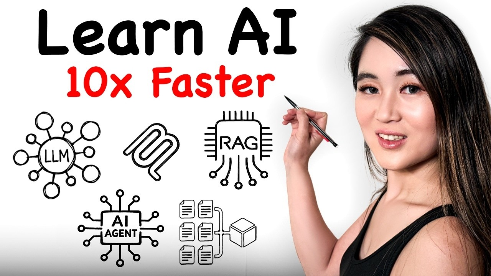

# AI was HARD until I Learned these 10 Concepts

Maddy Zhang breaks down the 10 AI concepts every software and AI engineer needs to know in 2026 — from LLMs and tokens all the way to AI agents, MCP, context engineering, reasoning models, multimodal AI, and mixture of experts.

## Table of Contents
* [00:00:00] Intro
* [00:00:52] Large Language Models (LLMs)
* [00:01:43] Tokens & Context Windows
* [00:03:36] AI Agents
* [00:04:35] Model Context Protocol (MCP)
* [00:05:26] Retrieval Augmented Generation (RAG)
* [00:06:36] Fine-Tuning
* [00:07:15] Context Engineering
* [00:07:59] Reasoning Models
* [00:08:46] Multimodal AI
* [00:09:32] Mixture of Experts (MoE)

## Intro [00:00:00]

**Maddy Zhang:** Everyone is talking about AI. But, in order to actually build with it, use it at work, become an AI engineer, or even just have an intelligent conversation about AI in an interview, you need to understand the core fundamentals of AI, not just the buzzwords. Today, I'm going to talk through the 10 AI concepts every software and AI engineer should know in 2026. [00:00:00 → 00:00:21]

Hi friends, I'm Maddie. I'm a senior software engineer who previously worked at Google and interned at other big tech companies like Amazon, IBM, and Microsoft. I work with AI systems a lot, and I spent hours breaking down the concepts that actually matter right now, so you don't have to. [00:00:21 → 00:00:34]

In this video, I'm going to walk you through 10 AI concepts, from LLMs and tokens, all the way to AI agents and context engineering. Whether you're building AI products, preparing for interviews, or just trying to keep up with the industry, this is the video to watch. Let's get into it. Thank you to HubSpot for sponsoring this video. [00:00:34 → 00:00:50]

## Large Language Models (LLMs) [00:00:52]

**Maddy Zhang:** We're starting with the foundations. Large language models, or LLMs. ChatGPT, Claude, Gemini, these are all powered by LLMs. At its core, an LLM is a neural network trained on massive amounts of text data to do one deceptively simple thing: predict the next word in a sequence. So, you type "the capital of France is" and the model predicts Paris. [00:00:50 → 00:01:10]

That may seem simple, but when you scale that idea up to billions of parameters trained on essentially the entire internet, it goes deeper than just auto-complete. The model at this point doesn't just predict words. It's developing the ability to reason, write code, summarize documents, and hold genuinely useful conversations. [00:01:10 → 00:01:28]

LLMs are the engine behind almost every AI product you'll interact with in your career. So, if you're a software engineer in 2026, and you don't understand what an LLM is, it's like being a web developer in 2010 who doesn't know what an API is. [00:01:28 → 00:01:41]

## Tokens & Context Windows [00:01:43]

**Maddy Zhang:** Let's dive deeper into tokens and context windows as our second concept. So, LLMs don't actually read words the way we do. They break text into smaller units called tokens. A token might be a whole word like hello, or maybe a piece of a word like un and believe and able being three separate tokens. [00:01:41 → 00:01:59]

Why this matters is because every LLM has a context window. That's the maximum number of tokens it can process at once. You can think of this like a model's short-term memory. Early GPT models had only a 4,000 token context window. Now, we're seeing models with over a million. [00:01:59 → 00:02:15]

A larger context window means the model can see more of your conversation, your code, or your documents all at once, which directly impacts how useful it is. If you've ever had an AI forget something you pulled up earlier in a conversation, that is the context window running out. Understanding this concept helps you design better prompts and build smarter AI applications. [00:02:15 → 00:02:34]

Now, speaking of AI concepts that actually translate into real-world impact, if you're wondering how people are actually using AI agents right now to supercharge their workflows, then this free resource from HubSpot, today's video sponsor, will help you do exactly this. HubSpot's new playbook, AI Agents Unleashed, is one of the most practical and comprehensive guides I've seen on this topic. [00:02:34 → 00:02:54]

It breaks down what AI agents can actually do today, where to start implementing them, and how to build an effective strategy for human-AI collaboration. It talks about how AI agents work in practice, the memory systems, the tool integrations, the multi-step reasoning that separates real agents from basic chatbots. [00:02:54 → 00:03:11]

One of my favorite parts is their framework for figuring out what tasks to hand off to an agent versus which one still need a human in the loop, because that's the question that everyone really needs to answer. It also covers the common pitfalls that people run into when deploying agents and how to avoid them, which honestly is the part that most guides skip entirely. [00:03:11 → 00:03:27]

The playbook is completely free. I'll put the link in the description below. Big thanks to HubSpot for creating this guide and sponsoring this video. And now, let's get back to the concepts. [00:03:27 → 00:03:36]

## AI Agents [00:03:36]

**Maddy Zhang:** Our third one is AI agents. An AI agent isn't just a chatbot that answers your questions. It's an AI system that can reason, plan, and take actions autonomously to achieve a goal. So, a chatbot says, "Here's how to book a flight." An agent actually will go and book the flight for you. [00:03:36 → 00:03:52]

It perceives the environment, reasons about the next best step, acts on that plan, and then observes the results. And it loops through that cycle until the task is done. [00:03:52 → 00:04:00]

So, for example, look at Open Claw. If you haven't heard of it yet, Open Claw is an open-source AI agent built by Peter Steinberger that went completely viral a few weeks ago. We're talking 60,000 GitHub stars in 72 hours. It runs locally on your machine and connects to the apps you already use. [00:04:00 → 00:04:17]

So, WhatsApp, Slack, Discord, your calendar, your email, and it actually does things on your behalf. People have used it to triage their inbox, debug code while they sleep, automate their smart home, even build entire apps from their phone. OpenAI actually ended up hiring Steinberger to build their next generation of personal agents, which tells you how big this space is getting. [00:04:17 → 00:04:35]

## Model Context Protocol (MCP) [00:04:35]

**Maddy Zhang:** Concept four is MCP, Model Context Protocol. If AI agents are the workers, then MCP is a universal adapter that lets them plug into your tools. Before MCP, if you wanted an LLM to connect to your database, your email, and your CRM, you need to build three separate custom integrations. MCP standardizes that. [00:04:35 → 00:04:53]

It's an open protocol that defines how AI models connect to external data sources and services. Think of it like USB for AI. Before USB, every device had its own proprietary connector. MCP fixes the same thing for AI tools. It creates a common interface so that any model can connect to any compatible service. [00:04:53 → 00:05:11]

If you're building AI applications, understanding MCP is going to be essential because it's rapidly becoming the standard for how agents interact with the outside world. MCP is open source, and Anthropic donated it to the AI Agentic AI Foundation, which is managed by the Linux Foundation last year. [00:05:11 → 00:05:27]

## Retrieval Augmented Generation (RAG) [00:05:26]

**Maddy Zhang:** And now, let's talk about concept five, RAG, Retrieval Augmented Generation. The problem that RAG solves is that LLMs are trained on data only up to a certain date. They don't know about your company's internal documents, your product specs, or last week's policy changes. [00:05:27 → 00:05:41]

So, when you ask them a question about something specific in your organization, they either make something up, which is called hallucination, or they just say that they don't know. RAG fixes this by adding a retrieval step before the model generates its response. [00:05:41 → 00:05:53]

When a user asks a question, the system first searches a database, usually a vector database, for relevant documents. It then feeds those documents into the LLM's prompt as additional context, so the model can give an accurate, grounded answer. [00:05:53 → 00:06:04]

I want to say a quick note on vector databases, since they're a key part of RAG. Instead of storing data as traditional rows and columns, a vector database stores data as mathematical representations called embeddings. These embeddings capture the meaning of text, so you can search by similarity rather than exact keywords. [00:06:04 → 00:06:21]

So, for example, you can ask, "What's our refund policy?" and the system finds relevant documents even if they use words like return or money back instead of refund. That semantic understanding is what makes RAG so powerful and so adaptable to many use cases. [00:06:21 → 00:06:36]

## Fine-Tuning [00:06:36]

**Maddy Zhang:** Concept six is fine-tuning, and this is one that people often confuse with RAG. They solve different problems. Fine-tuning is the process of taking a pre-trained model and training it further on a smaller, specialized so it behaves differently. [00:06:36 → 00:06:47]

You can think of it this way. The base model already knows how to speak and reason. Fine-tuning trains it to speak in a specific way, maybe in medical terminology or in your company's brand voice, or to format its outputs in a particular structure. [00:06:47 → 00:07:00]

A quick rule of thumb I recommend following is to use RAG when you need a model to access specific facts it wasn't trained on, and use fine-tuning when you need a model to behave differently, like changing its tone, style, or output format. And you can definitely combine both. [00:07:00 → 00:07:16]

## Context Engineering [00:07:15]

**Maddy Zhang:** Concept seven is context engineering. You've probably heard of prompt engineering, crafting the right instructions to get a good response from an AI. Context engineering goes way beyond that. It's about designing the entire information environment around the model, what documents you retrieve via RAG, what conversation history you include, what external tools are available via MCP, and how you summarize and prioritize all of that information within the model's context window. [00:07:15 → 00:07:37]

The reason why this is so critical is that the quality of an LLM's output is directly tied to the quality of the context you give it. Two people can use the same model and get wildly different results based on how well they're engineering the context. [00:07:37 → 00:07:50]

If you take one thing from this video for your career, let it be this. The engineers who master context engineering are the ones companies are really wanting to hire right now. [00:07:50 → 00:07:59]

## Reasoning Models [00:07:59]

**Maddy Zhang:** Concept eight is reasoning models. These are a newer breed of LLMs that have been specifically trained to think step-by-step before generating an answer. Regular LLMs respond immediately. They generate tokens one after the other without pausing to plan. [00:07:59 → 00:08:11]

Reasoning models, on the other hand, generate an internal chain of thought. They break problems down, consider different approaches, and work through the logic before producing a final answer. This is why you'll sometimes see an LLM say "thinking" before it responds. That is the reasoning model at work. [00:08:11 → 00:08:26]

These models are trained on problems with verifiably correct answers, like math problems or code that can be tested by a compiler, and through reinforcement learning, they learn to generate reasoning steps that lead to correct solutions. OpenAI's O series and DeepSeek are prominent examples. [00:08:26 → 00:08:39]

Reasoning models are especially important for agents because complex multi-step tasks require planning, not just pattern matching. [00:08:39 → 00:08:47]

## Multimodal AI [00:08:46]

**Maddy Zhang:** Concept nine is multimodal AI. Early LLMs could only process text. Multimodal models can handle text, images, audio, video, and more, both as inputs and outputs. This is a big deal because the real world obviously isn't just text. [00:08:46 → 00:09:00]

You might want an AI to analyze a photo of a whiteboard from a meeting, transcribe a voice memo, generate an image from a description, or understand a video. Multimodal models can do all of this. [00:09:00 → 00:09:10]

What's fascinating from a technical standpoint is that models trained on multiple data types actually develop a deeper understanding. A model that has seen both images of cats and text about cats understands the concept more richly than a text-only model. [00:09:10 → 00:09:23]

For engineers, this opens up enormous possibilities, from accessibility tools to medical systems that analyze scans alongside patient notes. [00:09:23 → 00:09:32]

## Mixture of Experts (MoE) [00:09:32]

**Maddy Zhang:** And finally, last but not least, number 10 is mixture of experts or MoE. This one's more under the hood, but I would argue it's one of the most under-appreciated breakthroughs in LLM architecture. The idea has actually been around since 1991, but it's never been more relevant than now. [00:09:32 → 00:09:47]

Instead of having one massive neural network where every parameter activates for every input, MOE divides the model into specialized sub-networks, the experts. A routing mechanism then decides which experts to activate for which input. [00:09:47 → 00:10:00]

So, you might have a model with hundreds of billions of total parameters, but for any given query, it only uses a fraction of them, whichever experts are most relevant. The result is the intelligence of a huge model with the speed and cost efficiency of a much smaller one. [00:10:00 → 00:10:15]

This is how companies are scaling AI without cost spiraling out of control, and it's a big reason why AI models have gotten so much better so fast. [00:10:15 → 00:10:23]

To sum up, the 10 AI concepts you need to know are LLMs, token and context windows, RAG, fine-tuning, AI agents, MCP, context engineering, reasoning models, multimodal AI, and mixture of experts. These are the fundamental building blocks of virtually every AI product shipping right now. [00:10:23 → 00:10:40]

And that's all I have for you in this video. If this helped you understand AI better, hit that like button, like the video, and subscribe. I make videos every week on software engineering, tech careers, and AI. Thanks for watching, and I'll see you in the next one. [00:10:40 → 00:10:54]
