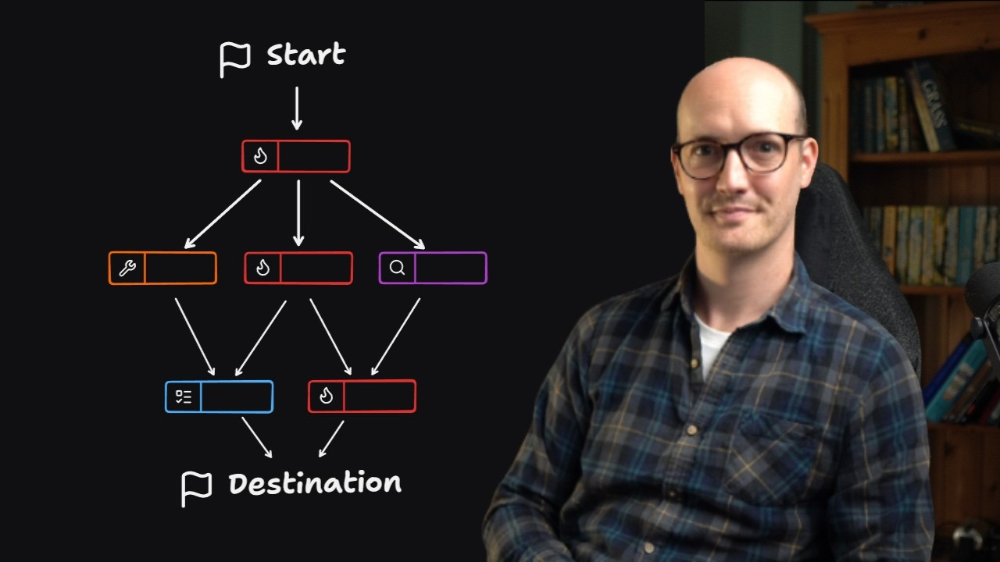

# /wayfinder: Nothing is too big to plan anymore

Wayfinder is an AI planning skill that orchestrates massive projects across multiple agent sessions. Learn how to map foggy ideas into concrete execution plans with research, prototyping, and task management built-in.

## Table of Contents
* [00:00:00] Problems with existing planning tools
* [00:02:10] How Wayfinder maps work
* [00:04:30] Tracking decisions in your issue tracker
* [00:05:39] Setting up and working through maps
* [00:07:40] Ticket types and blocking relationships
* [00:09:44] Creating specs and tickets from maps
* [00:11:38] When to use Wayfinder

## Problems with existing planning tools [00:00:00]

**Matt Pocock:** I think I figured out a way to plan any size of work with an agent. The existing planning tools that I was using and playing around with, even ones that I've created, felt too constrained, too tied to a single session. I felt like I wasn't able to be ambitious enough. And because of that, I was kind of constraining the stuff I was building to fit AI, which doesn't feel right. This new approach doesn't have that limit. You can plan enormous chunks of work and it will orchestrate the planning over multiple types of sessions. It knows that you can't make your way cleanly to the destination. You have to clear the fog of war. It understands dependent decisions and it even allows you to plan in parallel. And the best thing about this is this is based on software fundamentals. This is based on the fundamentals of planning work that I learned when I was a real developer before AI. And I've packaged this all up into a skill that's available right now on my skills repo called wayfinder. [00:00:00 → 00:00:56]

So the way that I was planning work before was really tied into a single session. It's to do with the grill me or the grill with doc skill that's in my skills repo. That's still a super important primitive, but it's really just tied into a single session. Some work is bigger than what you can fit into the context window and especially the smart zone of the context window of the agent. And you know that going in. So you'll often take time ahead of these AI agent sessions to break it down into smaller chunks. Say, "Oh, I'll just bite off this little bit. I'll just bite off this little bit." But then what you'll find is, "Okay, I'm working towards planning in this bit of grilling." And then you reach a question that you can't answer or you just find yourself lost in fog and all the time you're managing the smart zone. You're trying not to spend too many tokens. [00:00:56 → 00:01:44]

This has been out there for a while and people are freaking loving this thing. it. One shot at a prototype, it kept starting again and again for months. I really hate the phrase oneshotting, but I think what he means is it really helped him out. John here even built his own freaking harness because he liked the wayfinder approach so much. It's got this gorgeous little star map on it that kind of lets you take tasks as you go. So, it's been out there for a little while and I'm finally making the video that people want me to make. What is Wfinder? How do you best use it? [00:01:44 → 00:02:09]

## How Wayfinder maps work [00:02:10]

**Matt Pocock:** Well, let's start by looking at how big work typically gets planned. You have a start point, a point where you need to start from, a sort of vague idea, not really how to get there, and you're trying to get to some kind of destination. You know vaguely where you want to end up, but the steps between are super foggy. You've no idea how to get. This is true, by the way, in engineering, but it's also true in many walks of life where you're planning something ambitious. And so, the first thing you should probably do is have a grilling session about it. get the AI to interview you and figure out the sort of basic premise of where you're going. [00:02:09 → 00:02:45]

Now, for some work, that's sufficient and you'll be able to get straight to your destination, but for a lot of work, that will still leave you in a lot of fog. What you might find is based on that initial grilling session, you need to do more sessions. So, you might have a prototyping session or you might have another grilling session or it might need to go off and do some research as well. Conceptually, what we're looking at here is a map. We are creating a map of how we're getting to our destination. This is why it's called wayfinder. We are finding our way to the destination. [00:02:45 → 00:03:13]

And each of these things on the map, they are tickets. Each ticket requires its own individual session with the agent. So you might have a prototyping session, a grilling session, and a research session. And all of those things are created and managed by Wfinder. And just a note here, yeah, this is just a single skill doing all this. And it works with any coding agent. [00:03:13 → 00:03:36]

On its map, Wfinder gives you a frontier of tickets here. In other words, the decisions that it knows about so far. And it also keeps track of everything that's in fog. So things that are not quite able to be decided upon yet because we haven't done the research or we don't have a prototype to look at or we haven't done enough conversation, enough grilling. At some point all of the fog will be resolved and then you'll have finally made enough decisions to finally get to your destination. [00:03:36 → 00:04:02]

Wayfinder can not only manage the research but it can also do tasks here too. So, if you need to set up some configuration or you need to go out and talk to someone and actually go and run an errand, then Wayfinder can figure that out for you as well. In other words, all of the complicated stuff that you might need to do while you're planning something big, Wayfinder orchestrates it all for you. It keeps track of everything that's been done and it measures the fog of war for you. Keeps track of all the frontier of things you can decide right now. [00:04:02 → 00:04:30]

## Tracking decisions in your issue tracker [00:04:30]

**Matt Pocock:** How does it keep track of it? Well, it does it in your issue tracker in my public course video manager repo. Here are all of the Wayfinder maps that I've done recently. And you notice that if we look at this one, there are this is the big old map here. And underneath it are 12 subtasks or sub issues and these are the decision tickets. So we can zoom down here and we can understand all of the decisions that have been made. [00:04:30 → 00:04:56]

As decisions get made then obviously they get resolved inside the ticket. So in this one this is a sub issue close the clips during publish race and we resolved it with a discussion a couple of weeks ago. That resolution also gets written back up to the parent map. So if we look back up here we can see that a small version of that also gets written in the map. [00:04:56 → 00:05:20]

And so Wayfinder is keeping track of all the decisions that have been made, all the prototypes that have been created, all the tasks that have been done. And by the way, even though I'm using GitHub for this, my skills are issue tracker agnostic. So you can use it with any issue tracker you like. You just need to do a little bit of configuration via setup map skills. Use it with linear, use it with Jira, use it with literally whatever you like. [00:05:20 → 00:05:40]

## Setting up and working through maps [00:05:39]

**Matt Pocock:** The very first thing you'll need to decide when you kick off a new wayfinder session is the destination. For instance, in this one, I was adding a command pallet with a bunch of new actions into my application. And what I ended up wanting was a buildable spec. So, I wanted a specification for this command K command pallet in the CVM diagram window. So, I started it off like this. I invoked the wayfinder skill and then I gave it a description of what I wanted. I would like the ability in the CVM to add an icon picker. Not only that, I want the ability to search other diagrams. I want the ability to copy things from the diagram and save them as you know big old chunk of work. [00:05:40 → 00:06:16]

It went through and explored the uh repo and it invoked the grilling skill and it grilled me about what I wanted. It first asked me what done looks like whether I wanted a spec and it recommended a spec. That's good. And then it asked me a few initial questions before then going and creating some tickets and the first map and it created the other tickets as sub issues. So we kicked off with seven tickets immediately. However, only three of those tickets were takable right now. So figure out where icon names come from, component storage schema, and pallet information architecture and grid keyboard. I don't remember that one. [00:06:16 → 00:06:52]

And so what I did was I then worked through each of those tickets in a new session. The way I did that was I just called wayfinder on that ticket name. I did it in a slightly fancier way where I actually have a handoff skill that automatically wrote me a prompt and spawned a clawed sub agent. But what it was essentially doing is just calling the wayfinder skill on this map and on the specific ticket wherever it was. Yeah, here it is. Here's your ticket. Uh, transpar lucid SVG geometry to path builder and it just mentions the full ticket name. [00:06:52 → 00:07:24]

So, this is how you work through a wayfinder map. You do an initial wayfinder prompt just to chart the map and figure out the next ticket. And then for each ticket, you say Wfinder with the ticket URL. So, you use Wfinder for both. both for charting the map initially and then walking through each ticket. [00:07:24 → 00:07:41]

## Ticket types and blocking relationships [00:07:40]

**Matt Pocock:** As you can probably see from this diagram, tickets can have different types and there are four types and these ticket types are actually brought into the issue tracker themselves. So we actually have wayfinder research which is a ticket type. Research tickets are where the agent needs to go off and find some information and bring it back and it usually kicks it off immediately. So you don't actually need to watch it. It does it in a sub agent and then reports back. [00:07:41 → 00:08:03]

Prototype tickets, which are the next type here, create a prototype, which is so unbelievably invaluable for really seeing things come to life as you're planning. I've done a whole extra video on this on how important prototypes are, and it reuses the prototype skill from that video. Some folks look at Wayfinder and they think, "God, that's a lot of planning. Doesn't that look like waterfall?" And the prototypes are the way that you prevent it from becoming waterfall. Huge amounts of lowfidelity upfront planning. A prototype is a highfidelity way to get feedback on what you're actually building. And the fact that Wfinder encourages you to build so many prototypes means that the output is unbelievably good. [00:08:03 → 00:08:43]

So, so far we got research prototype. Obviously, there are grilling ones as well. So, grilling sessions and this is just where you need a discussion over maybe an implementation detail over a particular aspect of the plan. And the final type of tickets are tasks. These are things that need to be done in the real world, stuff that the agent can't quite do itself or possibly sometimes the stuff agent can do itself but is scheduled behind other work. [00:08:43 → 00:09:08]

One really cool thing about Wavefinder is the way that it establishes blocking relationships between tickets because some decisions can only be made once other decisions are made. And so what you end up with is here we've got 14 out of 17 done on this map. So, a lot of work done, but we've still not built the skill that this whole map is built around. And once we've built the skill, then we actually need to revisit some other stuff based on how the skill works and how it actually improves things. And so, what you're doing a lot of the time when you're working through a wayfinder map is going, okay, I've resolved that ticket. Let's see how this opens up new tickets. What has the frontier moved to? [00:09:08 → 00:09:44]

## Creating specs and tickets from maps [00:09:44]

**Matt Pocock:** So, then once the map is complete, what do you then go and do with it? Well, this one because its detonation was a speck, the wayfinder map is probably a little bit too dense to create a spec. So, what I like to do is create a spec from the map. This was the spec that I created from it. And you can see it's basically the same setup as I've had before. I literally just called to spec on the wayfinder map and it pulled in this enormous document with basically all of the decisions that have been pulled from the wayfinder map into this uh GitHub issue. [00:09:44 → 00:10:19]

The initial draft was actually too large for GitHub's character limit. So [00:10:19 → 00:10:23]

[Laughter] [00:10:23]

that kind of tells you how big it was. And from there I turned it into tickets using my usual approach which is to spec and then to tickets. In other words, Wfinder fits in just in exactly the same place that grill with docs does in my usual approach. So instead of doing grill with docs and then doing to spec and to tickets, you're spending a lot more time in wavefinder creating this enormous map and then taking that map, turning it to spec, turning it to tickets, and then implementing each ticket and then running code review at the end. [00:10:25 → 00:10:53]

The really cool thing about the Wfinder setup is that the specs that it creates are so dense and they all link back to the original decision tickets. So you can actually go and the agent can go and view the primary source if it's confused about anything. That was always a kind of uh weakness with Grill with Docs, which is that you were really relying on the spec to be the source of truth, but the spec is always just a summary of what was actually said in the meeting. Whereas now with Wfinder, you've actually got access to that primary source, which is amazing. [00:10:53 → 00:11:25]

## When to use Wayfinder [00:11:38]

**Matt Pocock:** So that is Wfinder. It's a way of mapping huge chunks of work by planning things out really in detail ahead of time. It can handle prototyping, can handle research, can handle arbitrary tasks, can handle discussions, too. Let's jump into an FAQ now of frequently asked questions that I get when people ask me about Wayfinder. [00:11:25 → 00:11:44]

The first one is this is way too much process. uh this way too heavy for the kind of work that I do when should I actually use it? Well, the answer to this is if you think the work that you're doing can be completable and plannable in a single session, then plan it in a single session. If you kind of already know the way to your destination, then there's no need to use Wfinder because you can just path your way there in a single session and just figure it out. Wayfinder is for the cases where you have the fog of war. You'll no idea quite where to go and you just need to start and then see where you get to. [00:11:44 → 00:12:17]

By the way, I've actually been using Wayfinder for non-coding tasks. So, I've been meaning to put up a garden office in my garden and uh I've been using Wayfinder for that. So, it's uh commissioning a site survey, uh figuring out all that stuff, figuring out who to contact, doing all the research, finding the different firms that could build it. It's awesome. [00:12:17 → 00:12:33]

Another response people have to Wfinder is, "This is STD. This is spec driven development, and I don't want to do spectrum development. I don't want to spend all this time putting together a spec. This seems bananas." Well, the way I think of specs is really just a destination for a multiseession piece of work. In other words, we have a huge task down here, let's say task number four that we're trying to schedule over multiple agent sessions because it's just too big. And what we want to do is we need a spec so that we can when we get to the end figure out where we were going. That's all a spec is in this context. It's just a destination document to handle this multi-session work. And then each session is done in an implementation ticket. [00:12:33 → 00:13:14]

Also, this is people get confused when they first use Wfinder because they go, "Right, it's creating some tickets. Aren't we supposed to do the tickets later? These are kind of implementation tickets versus decision tickets." So, in Wfinder, you have decision tickets. These are implementation tickets. So, the difference between my approach and most other approaches is that people when they get to the end of this, they will keep that spec around somewhere. For me, I close the issue containing the spec and the spec is gone. It's gone from my repository. I rarely if ever refer to it again. Once the spec is present in the code, then you can just delete the spec. Whereas people who do specdriven development go back to the spec and edit it and modify it. There are lots of approaches to spectrum development, so I'm probably annoying someone with that. But what I'm essentially trying to say is that these specs are non-persistent. So with that folks, I recommend you go off and you chart your own awesome foggy idea. [00:13:14 → 00:14:08]

I have found wayfinder just so liberating in that it just lets me get started and it handles all of that difficult decision for me. I've been using it to plan courses, been using it to do engineering work, been using it to build a garden office. It is just awesome. And the cool thing about it is that the destination is totally up to you. Whether you want it to create a spec that you then run through an AFK agent, which is what I do, or if you just want to it to implement the work for you in uh tasks, then it totally can. There is no more fun feeling than starting a new wayfinder session and knowing that you're going to see something awesome, but not quite knowing how you're going to get there. [00:14:08 → 00:14:44]

If you're into this stuff and if you want to keep up with my skills, then you should check out this seven lesson free course that I've put out on AI skills for real engineers, which is on my AI hero site. I'll add the link below. This lets you build up a repeatable workflow that you can ship great work and it's all built on solid software fundamentals. Thanks so much for hanging out. It is always fun filming these sessions and I'm so glad that people are enjoying Wayfinder so much. So, cheers pals. I will see you in the next [00:14:44 → 00:15:10]
