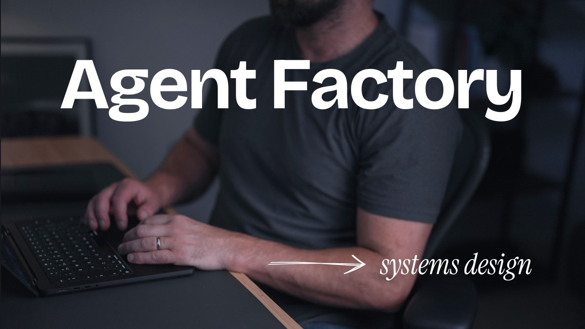

# I Built an Agentic Software Factory with Codex and Claude Code

In this video Owain Lewis walks through how he built a software factory: an automated pipeline where agents pick up tickets, refine them, implement the change, run tests and reviews, and open a pull request without sitting in the terminal. He demonstrates this on a real open source project called Factory, written in Rust, which polls GitHub issues for labels, spawns an agent in an isolated Git worktree, and moves the work through triage, implementation, and review. It solves the problem of tedious mechanical work sitting in a backlog while you babysit agents one conversation at a time.

## Table of Contents
* [00:00:00] Introduction
* [00:00:46] What Is a Software Factory?
* [00:04:22] The Task-to-PR Workflow
* [00:07:51] Factory: The Open-Source Tool
* [00:09:18] Label-Based Triggers and Live Demo
* [00:13:14] Sandboxing
* [00:14:09] Cost, Objections, and Honest Limits
* [00:16:41] Scheduled Jobs: The Bug Finder
* [00:18:01] Conclusion: The CI/CD Analogy

## Introduction [00:00:00]

**Owain Lewis:** There's a lot of hype online around AI software factories, and people are skeptical for good reason. But, what I found is applying these ideas in my own workflow has completely changed the way I think about building software with AI agents. So, this video is going to be a complete guide to building an AI software factory. We're going to look at what a software factory is, how to build one, and how to think about applying this in your own workflow, whether you're a solo developer looking to be more productive or an engineering leader in a large enterprise organization looking to raise the quality bar. [00:00:00 → 00:00:27]

This is one of the most exciting topics in AI and software engineering right now. In my opinion, software engineering has always been about systems thinking and systems design, and that's exactly what this video is going to be all about. If you stick around to the end of the video, I'll give away all of the code, the resources, the prompts, and everything you need to build your own software factory. So, let's get into it. [00:00:27 → 00:00:46]

## What Is a Software Factory? [00:00:46]

**Owain Lewis:** So, the first question is what is a software factory? And it's basically just an extension of everything we've already been doing as developers. We're just applying AI to the systems and the processes we're already following. So, if you think about the typical development process, it's pretty straightforward. And so, what happens in any software engineering team, whether you're working at Google, or Netflix, or Amazon, or just whether you're working on your own as a solo developer, it's pretty much the same thing, right? We have intent. So, we have customer issues. We have things from our PMs or stakeholders. We have, you know, things that we decide we want to build as developers. [00:00:48 → 00:01:19]

We put these into some kind of ticketing queue, and then they go into the backlog. We refine them a little bit, and then we do some kind of design phase where we'll take those ideas, we'll design them in some way, we'll figure out how we're going to build these things. What are we building? Why are we building it? How are we going to build it? Then we do some kind of planning where we break that work down into a number of smaller tasks or tickets. [00:01:19 → 00:01:40]

We give those tasks to developers who then do, obviously, the typical development cycle, right? We write the code, we do some local and manual testing, we do some code review, then we open a pull request on something like GitHub, and then we'll have like a human review the code, or we'll have some kind of automated checks to look for problems, bugs. We'll run a bunch of other checks and tests as well. Then if there are any errors, we go back through the cycle. So we're doing a loop here. So this is our first development loop. [00:01:40 → 00:02:06]

We write the code. We iterate a couple of times until we get the quality high enough. Then finally, we merge that code in and then we deploy it. And if you think about CI/CD, it's a good analogy to a software factory, right? This is an automated process. You push your change in and then the system or the process will then take that into production. Typically in the best software engineering teams, you're not manually deploying. You have the system that will deploy for you. It will take care of, you know, checking that all of the code is working, it's well tested. It will deploy it to production. If there are any errors, it will even roll back the code for you. [00:02:06 → 00:02:40]

So this is the CI/CD system. Deploy your code into production. Then we have a bunch of user feedback. We have customer feedback. We have, you know, monitoring agents that look for problems in our code and then we'll feed all of that information back into the the kind of starting point here. So this is really just a loop or a cycle. [00:02:40 → 00:02:59]

And when it comes to AI agents, we're basically following a similar process. We're just applying agents to different parts of the process. So this is the pipeline we're going to be building. It has a bunch of steps. So the first thing is we put work into the pipeline. So this is stuff we want to do. So I could add an item here like I could say improve the readme. So this is something I might want to do, right? Let's create a new issue. And let's just use a blank issue. [00:02:59 → 00:03:22]

So this is a really badly defined ticket. This is the example of something you might find in a typical engineering organization, sadly. You might have a ticket that looks like this, right? There's no way an agent can do anything with this ticket. It has no description, no acceptance criteria. If you give this to an agent, it's going to try and do the work, but it has no idea what it's actually meant to be doing. So what we want to do is refine these tickets using some kind of automated process. [00:03:22 → 00:03:47]

Once we give this to an agent, the agent will then improve the ticket. Then we have a ticket that is then ready to implement, and then we can kind of run it through the pipeline. The agent will then move it into implementing. The agent will be writing the code. We're going to spawn up an agent using a sandbox on a virtual machine or some remote location. The agent will write the code. It will run all of the tests. It'll run your pipeline. Then finally, you'll have a pull request that you can review, and then finally, we have a change that is done. So, essentially, what we're doing is just running all of our tickets or our tasks through this pipeline, and we're going to use agents every single step. [00:03:47 → 00:04:22]

## The Task-to-PR Workflow [00:04:22]

**Owain Lewis:** All right. So, what we're going to do is go into the terminal, and this is the code base we're working on. So, this is the factory code base. And what I'm going to do is spin up a coding agent. You can use any coding agent here. I'm going to use Neo, which is my own coding agent. But honestly, it doesn't really matter. You could use any coding agent. So, what I'm going to say is something like um task to PR. [00:04:22 → 00:04:43]

So, this will basically take one task or ticket, and then it will open a pull request. This is going to run the entire pipeline. I'm going to do nothing else other than pass the ticket in. [00:04:43 → 00:04:53]

So, within the Neo coding agent, you can see here that it's running what I call a workflow. So, we're not just randomly prompting the agent. We're actually just defining the entire step-by-step process up front, and letting the agent work through this. This means we can be very, very consistent in our dev process. You can see here we're resolving the ticket. We're now creating an isolated Git work tree. Then we're reading the ticket, and we're outlining the change. We're making a little plan. We're doing the work. You can see here now the agent is doing the code change. Then we're going to do the tests, the reviews. We're going to wait for any feedback. We're going to address those findings, and then finally, we're going to kind of finish this off essentially. [00:04:56 → 00:05:28]

So, this is why I really like the workflow approach to agentic coding. We're just giving the agent a task. We're defining the workflow or the steps the agent needs to run through, and then we're just letting it run. This is it. This is my entire development process right now. So, what you'll see here is this is the skill that we're using to transform our task into a pull request. This is really a workflow definition more than the skill. [00:05:29 → 00:05:49]

If you look at any company, if you go and work at Amazon or Google, or you look at any engineering team, every developer is basically following the same series of steps, right? We read the task, we make a bit of a plan, we implement the code change, we run some tests, we review the code, maybe we even use some browser testing for any UI work, then we address any findings we get on GitHub, then we publish a change using a commercial commit, we wait for any other feedback or any testing to happen, we address the feedback and then we give the results over to a human to kind of review and make a decision about merging the change. [00:05:53 → 00:06:22]

This is a really simple skill, but it's what I use for 99% of all of my development work now. I spend the time planning and designing, then when it comes to actual implementation, it's just a case of handing off those tasks to an agent. [00:06:22 → 00:06:33]

When it comes to actually planning out my work, I use a really simple skill called plan. This will take a take a spec and it will turn it into a well-defined ticket. And you can see here that it's again really really simple. We're just defining the template we want for our tickets. We have an outcome, we have some context, we have some acceptance criteria to test, and any other information that the agent might need to complete the task. So, you can see here we take a spec. So, this takes a brief or a spec and breaks it into a number of tickets or optional milestones. We're basically just planning out our work into a number of tasks. [00:06:33 → 00:07:05]

So, this would be exactly the same process whether I was using Claude Code or Codex or Pi. The agents you're using don't matter as much as everyone thinks they do. Ultimately, the workflow is what matters. All of the agents are equally capable at this point. [00:07:05 → 00:07:17]

So, if you go back into our browser, you can see now that we've finished this task and it is fully ready. You can see here we've been given a thumbs up from Codex. So, everything is good to go and then we can just literally just kind of squash merge this and we're good to go. So, that was a change that we did following a manual factory process. What I mean by that is we didn't do a single thing. We just gave the agent a task. The agent did all of the work. We could have gone away, come back 20 minutes later and have the pull request ready to go. So, the next thing we want to do is take this manual process and then figure out a way to scale this to a more automated system. [00:07:17 → 00:07:51]

## Factory: The Open-Source Tool [00:07:51]

**Owain Lewis:** All right. So, what I want to show you now is Factory. This is a project that I've been building. It's an open-source project written in Rust, but it essentially encodes all of the ideas behind building a software factory. So, we're going to use this to now build our automated software factory. This is the process we're going to be following. We're going to take an idea. This is the intake step. We're then going to run it through a an agent to write the specification and create the task. We're then going to run it through a build step. We'll do some testing, review, and then finally we'll merge. We're just going to run this as a cycle. [00:07:51 → 00:08:20]

So, if we look at the workflow, there are two stages to this. So, the first stage we're going to do is the task refinement step. And then the second step is the actual build pipeline. So, this project is just running on your local machine, but you can also deploy it to a virtual machine as well. So, you could deploy this to the cloud. And it's basically going to run on a loop looking for tickets or looking for work to do, uh updating all of your tasks, implementing all of your code for you. The only thing you need to do is kind of plan out the work and assign it to Factory. [00:08:20 → 00:08:48]

All right. So, what we're going to do is just run the project so you can type factory to list all of the commands you can run. Let's clear this out and let's just run the agent. So, this is going to run on a loop basically monitoring your ticket queue and for any automated jobs you have, you can then run this on a virtual machine. You can run it on your local computer if you want to. I'm using work tree-based isolation, which means every time we run an agent, we're going to spawn a new get work tree and run it there to keep the code isolated. But, if you were running this in production, you could also use something like a Docker sandbox if you wanted to. [00:08:48 → 00:09:18]

## Label-Based Triggers and Live Demo [00:09:18]

**Owain Lewis:** Okay. So, we're going to go ahead and create a new issue. What we're going to do is click up here to create a new issue. I'm just going to do a regular blank issue here. So, Factory demon dies overnight. So, we have a problem where I've noticed a behavior. And so, what I'm going to do is put in a rough description of what happens. Again, I'm not explaining to the agent how to solve this. I'm just describing the problem or the intent I've got. And then, we're going to go ahead and create this task. [00:09:18 → 00:09:45]

All right, so what we're going to do is add a label called factory ready for spec. And when we have this label, the agent should then pick this up. So, if we go and check this ticket now, it has the factory ready and factory ready for spec labels. And if we were to go back into the terminal, what you should see is that the agent will then actually pick up that task. [00:09:45 → 00:10:05]

Okay, so what you can see now is that factory has picked up this task. So, this demon has now found that we have a label ready for spec. It's found the task. And what it's going to do is spawn a new agent. So, you can see here that it's delegated it to codex. And it's spawned up a new git work tree. What I want to quickly show you is how this is configured. So, you can see here that we have a source, which is GitHub issues, and then we have a trigger. So, anytime we have a label factory ready for spec, we're basically going to run this particular workflow. [00:10:05 → 00:10:31]

And if you go through this triage workflow, this is essentially what the agent is now running. It says, "Your goal is to turn the GitHub issue into a clear implementation ready task for a human or the agent." And then, firstly, we understand the work. We then create the ticket specification. We're basically following a template. And then, we kind of move the ticket into ready to implement. So, essentially, this is the triage workflow. This is just a simple prompt. You could have this do anything you like. It's absolutely fine. [00:10:31 → 00:11:00]

And then, the other implement workflow that we're running is this. So, this is what we do when we want to actually implement the task. So, "Your goal is to implement the GitHub issue supplied to you. Do not merge or auto merge. Use the GitHub CLI to pull the issue." We're then going to implement the code. We're going to kind of just run through this massive prompt, essentially. Um but this could be a simple step-by-step workflow, anything you want, basically. This describes to the agent how to actually execute the work when it's given a task. [00:11:00 → 00:11:29]

So, factory will move stuff through the pipeline without us doing anything. It's working on the ticket. It's picked it up. It's moved it into this status. As it works on it, it should move it into the next status as well. So, you can see here that the agent has now updated our task. It was a very vague, ill-described problem, and the agent has now reviewed all of our code, has inspected everything, has actually found the bug, has reproduced the bug, and then it's updated our ticket with all of the information we need to hand this off to either a human or an agent to go and fix the problem. [00:11:29 → 00:11:57]

The The way this works is it's completely customizable. So, you could imagine if you are a public-facing team where users or customers are reporting bugs, you could run this automation workflow over the inputs, the customer requests, and take their vague ideas and turn them into actionable tickets that a developer could then pick up and work on. This is really useful cuz often when you get a ticket from a customer, there may be missing information, the problem may not be valid. So, you can use an agent to triage any of the work that comes into your queue. [00:11:57 → 00:12:28]

All right. So, this ticket is now ready to go. What I'm going to do is just add this factory ready to implement label. I'm happy with this ticket. I want the agent to work on it. Again, I could be working on maybe 10, 20 tickets at a time here. This is kind of just a single ticket, but the idea of the factory is that you can run lots and lots of things all at the same time. [00:12:28 → 00:12:46]

So, what you can see is that the agent has now picked this up. So, you can see it's detected we have this ready to implement label. And again, we're not doing anything. We're just moving the tasks through the task board. We're coordinating the work. But the factory system is running the entire pipeline for us. This could be running hundreds and hundreds of tickets at the same time. If you work in a team, obviously, this will be coordinating all of your team's work. And we just need to now wait for the agent to kind of run through and fix the issue for us. There's nothing else to it than this. [00:12:46 → 00:13:14]

## Sandboxing [00:13:14]

**Owain Lewis:** Another really important concept to think about is sandboxing. So, when we run these kind of systems in production, you want to be a bit careful about sandboxing the workers to make sure they're not destroying anything. So, one A to this problem is using something like Docker sandboxes. So, Docker recently released a sandboxing feature which I've been experimenting with. I'll be honest, I'm still new to sandboxing and still figuring out the right approach myself, but this is the current implementation strategy I'm using at the moment. [00:13:14 → 00:13:41]

Locally, what I will typically do is use Git worktrees. But when working on a VM or like in a team environment, you definitely want some kind of good sandboxing solution. So, Docker sandboxes are one solution, regular Docker containers, there are a whole bunch of different solutions. And I'll probably do a video on this topic because it's quite an interesting and important one for for any developer right now. [00:13:41 → 00:14:03]

## Cost, Objections, and Honest Limits [00:14:09]

**Owain Lewis:** So, whenever we talk about automated systems or things like this, there are always the same objections that come up. The first one is cost. Yes, if you're automating your system or running agents, it will cost you money. I'm not using this to do work that I wouldn't do otherwise anyway, though. This is kind of the key point. This is not necessarily something that's aimed at like solo developers necessarily. This is more of a thing you would run at scale in an engineering organization. [00:14:09 → 00:14:26]

So, if you're if you're using any kind of automated flow, it will use tokens. But the way Factory is designed is to be largely deterministic. So, when we're polling GitHub looking for work to do, we're not wasting any tokens. We're only executing agents or using tokens when there's actually work to do. So, this is actually very very token efficient. You could run this running 24/7 every single day and it's only going to use tokens when there's actual work to do. So, if there's a genuine ticket to work on, it's going to use tokens. Otherwise, it's going to sit there polling using largely deterministic code. So, it's not going to burn a load of tokens. [00:14:26 → 00:15:01]

The other objection that comes up is that AI isn't smart enough and I definitely agree with this. There are some tasks you don't want to hand off fully to an agent. You sometimes want to be in the loop on certain tasks. And then the other objection is that sometimes you want to work interactively, right? So, sometimes you still want to be in the mix. You still want to be involved in the process, but you can still do that, right? You you can use this sometimes. Sometimes you'll want to be iterating with your agents, and that's totally fine. This pipeline isn't for every single situation. [00:15:01 → 00:15:28]

So, as agents get more capable, I think these pipelines become even more important because the typical task in my development workflow, an agent will run on it for maybe 20 minutes to even up to an hour. The agents are doing extensive code review. They're doing a lot of CI checks. They're doing a lot of work. And so, it's very painful to be sitting in the terminal watching hundreds of different tasks or working on many things at once. It's very very painful. [00:15:28 → 00:15:51]

So, by offloading this process to a virtual machine or a system like this, you can just basically hand off the work. You can go do something else. You can kind of come back 2 hours later and find that all of the work is done. You can then review the code changes, obviously, make any adjustments you want, but basically, you don't have to be tied to your keyboard anymore. [00:15:51 → 00:16:10]

So, this project is currently open source, and I don't think it's suitable for everyone right now. It's still very early stages, but the main thing to think about are the principles and the ideas. It's not all that difficult to build your own version of something like this. You could use GitHub actions, for example, which allows you to run an automation. So, for example, with GitHub actions, every time a customer raises a ticket, you could run an agent to triage the ticket. And every time we add a label to a ticket, you could have an agent that will run. So, GitHub actions is another great solution for this kind of problem as well. [00:16:10 → 00:16:41]

## Scheduled Jobs: The Bug Finder [00:16:41]

**Owain Lewis:** All right. So, the next concept we're going to look at is one of my favorites, which is this concept of a scheduled job. So, we have a bug finder job here. You could add any workflows you want. These are useful for a couple of reasons. So, if you go into our config.toml, what you can see here is I've got this scheduled bug finder. Obviously, you can do this with something like Claude routines or Codex automations, but what I like about this is keeping all of these automations version controlled. If you work in a team, you can keep these version controlled, and you can also run them manually as well very very easily. [00:16:41 → 00:17:12]

Okay. So, we're going to go into the terminal. We're going to type factory. So, we're going to type factory workflows, which is going to list out the workflows we have. You can see here we have this bug finder workflow. So, let me go ahead and run that. Again, you can run this on a schedule, but you can also trigger them manually, and I find triggering things like this manually is very, very useful. [00:17:12 → 00:17:33]

So, say I want to find any bugs in my code, I can just run factory run bug finder. And then just kind of wait for that. So, you can see here it's running the workflow bug finder. It spawned a new get work tree. It's now going to go ahead and find bugs in our code base, find a bug, and then it's going to open a ticket that we can review later. So, this is a bug that the agent found. You could actually make this more automated and have the agent open the pull request at the end. It already clearly knows what the bug is, and it looks like it's well reasoned as well. [00:17:33 → 00:18:01]

## Conclusion: The CI/CD Analogy [00:18:01]

**Owain Lewis:** So, as you begin to trust these agent systems more and more, you can let them run for longer. You can allow them to open pull requests. You could even allow this to merge if it is a, you know, personal project. If you're confident in your system, you can kind of delegate more and more trust to the system over time. So, there's nothing stopping you here having this as a fully automated system. [00:18:01 → 00:18:21]

Okay, so finally our implementation agent has finished. So, this task ran for, I think it was about 35 minutes. So, this is obviously quite a big change, and one of the reasons why this ran for so long is because we're actually running a long pipeline. So, we're not just changing the code, we're writing, you know, sub agent tests, we're doing code reviews, we're waiting for feedback on CI infrastructure as well. So, this is why using something like a factory pipeline is so valuable, because I don't want to be wasting in my terminal for 34 minutes. [00:18:21 → 00:18:50]

As these agents get way more capable and powerful, you're going to be delegating much longer running work to these agents. They're doing a better job of the code implementation, but they're also just running for much, much longer. And so, this is why I pretty much prefer this factory approach. Just delegate your tasks to the system, and let them run for like 30 minutes to an hour to work on your code base, do a really good job, and then review the changes at the end. [00:18:50 → 00:19:13]

If you're a senior engineer, you've probably got many objections to this topic and I think those objections are somewhat founded. You do need to be very very careful. If you're introducing these concepts into a team, you need to have the culture such that people don't abuse these pipelines and what I mean by that is you don't want to use these kind of pipelines for every single task. You still need humans to think critically. [00:19:13 → 00:19:33]

You still need human judgment. You still need engineering thinking at every single step of the process. It's just there's a percentage of tickets that we can now just give to agents, mechanical things, security upgrades, bug fixes, really trivial tedious work that developers don't like doing anyway. All of those can largely just be handed off to agents now. Run it in a pipeline, build more consistency and a good analogy to this process is CICD. [00:19:33 → 00:19:59]

If you remember back in the day, we used to manually deploy our software. It was very error-prone, inconsistent. Deployments were stressful. They would often break or go wrong. And we would struggle to get software into production at a speed that was valuable to our customers. And then when we introduced CICD, we built systems and automation and processes around the release process and how we got software into production and what that led to was a massive increase in quality. [00:19:59 → 00:20:30]

We were able to essentially deploy software almost daily without worrying about whether things were going to be breaking because the system would be taking care of the deployment. It would be running all of the automated checks for us. And this means whether you're a junior developer or the most senior engineer, you're using the same pipeline to deploy software which just massively raises the quality bar within a team. Anyone can have the perfect deployment process no matter where you are in the company or how experienced you are. [00:20:30 → 00:20:51]
