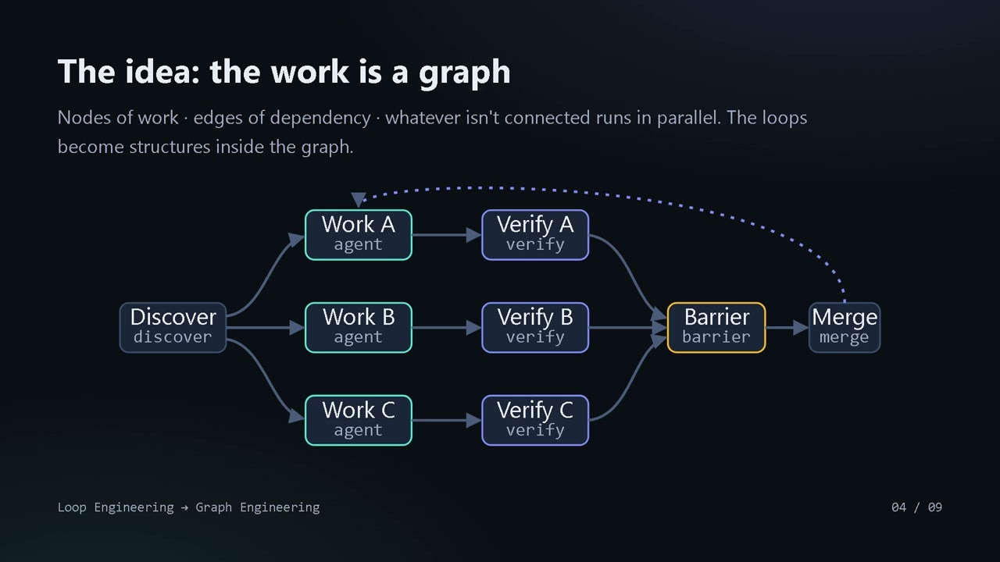

# From Loop Engineering to Graph Engineering — how to structure AI agent work

The next step after loop engineering: describe agent work as a graph — nodes of work, edges of dependency, and verification built into the topology instead of relying on discipline.

## Table of Contents
* [00:00:00] Intro
* [00:00:18] The four loops of loop engineering
* [00:00:53] Where loops hit their ceiling
* [00:01:24] The idea: the work is a graph
* [00:01:46] The six building blocks
* [00:02:23] The mapping: every loop becomes a graph structure
* [00:03:01] The migration: seven steps
* [00:03:43] The advantages
* [00:04:19] When to stay with a loop

## Intro [00:00:00]

**Narrator:** Hello and welcome. Today we take the next step in AI agent engineering, moving from loop engineering to graph engineering. [00:00:00 → 00:00:11]

We'll see how the two approaches differ, how to migrate in practice, and what you gain from the move. [00:00:11 → 00:00:19]

## The four loops of loop engineering [00:00:18]

Our starting point is the four familiar loops. [00:00:19 → 00:00:23]

The agent loop, model and tools until the task is done. [00:00:23 → 00:00:28]

The verification loop, after every change, define a check that would fail if you're wrong, and actually run it. [00:00:28 → 00:00:37]

The event-driven loop, when you're waiting on something external, arm a trigger instead of blocking. [00:00:37 → 00:00:45]

And the hill-climbing loop, generate a candidate, score it, keep the best, and repeat. [00:00:45 → 00:00:54]

## Where loops hit their ceiling [00:00:53]

But loops have a ceiling. Everything runs serially, even steps that don't depend on each other at all. [00:00:54 → 00:01:02]

The order is a writing habit, not a declaration of real dependency. When you crash midway, you start everything over. [00:01:02 → 00:01:11]

Verification depends on the operator's discipline, and under pressure, discipline erodes. [00:01:11 → 00:01:18]

And a single context simply cannot hold a truly large task. [00:01:18 → 00:01:24]

## The idea: the work is a graph [00:01:24]

The idea of graph engineering is simple. Describe the work as a graph, nodes of work and edges of dependency. [00:01:24 → 00:01:34]

Whatever is not connected by an edge, runs in parallel. [00:01:34 → 00:01:39]

And notice, the loops don't disappear. They become structures inside the graph. [00:01:39 → 00:01:47]

## The six building blocks [00:01:46]

Six building blocks. [00:01:47 → 00:01:49]

A node, a focused agent with an input-output contract. [00:01:49 → 00:01:54]

An edge, a declaration of real dependency. [00:01:54 → 00:01:59]

Fan out, independent items running as parallel nodes. [00:01:59 → 00:02:03]

Pipeline, the default. Each item flows at its own pace with no needless waiting. [00:02:03 → 00:02:10]

A barrier, a deliberate sync point. Only when you need all the results together. [00:02:10 → 00:02:16]

And a cycle, a loop kept on purpose because there is real feedback between rounds. [00:02:16 → 00:02:23]

## The mapping: every loop becomes a graph structure [00:02:23]

And here is the mapping. [00:02:23 → 00:02:25]

The agent loop becomes a node. The verification loop becomes verification nodes sitting on the edges, including an adversarial panel, several independent checkers, and a majority vote. [00:02:25 → 00:02:40]

The event-driven loop becomes an event edge waking the branch when something happens outside. [00:02:40 → 00:02:47]

And the hill climbing loop becomes a cycle with a judge panel. A whole generation of candidates every round. [00:02:47 → 00:02:55]

The recurring principle, what used to be discipline becomes structure. [00:02:55 → 00:03:02]

## The migration: seven steps [00:03:01]

The migration itself, seven steps. [00:03:02 → 00:03:05]

One, break the loop body into nodes with clear contracts. [00:03:05 → 00:03:11]

Two, draw only edges of real dependency. Three, turn per item iteration into fan out. [00:03:11 → 00:03:19]

Four, default to pipeline. Add a barrier only with justification. Five, keep cycles only where there is real feedback. [00:03:19 → 00:03:29]

Six, make verification structural with adversarial panels for critical claims. [00:03:29 → 00:03:36]

And seven, keep a journal of every node's output so you can resume exactly where you stopped. [00:03:36 → 00:03:44]

## The advantages [00:03:43]

And what do you gain? [00:03:44 → 00:03:45]

Wall clock time. Branches run in parallel and the run takes as long as the slowest branch, not the sum of all of them. [00:03:45 → 00:03:54]

Structural reliability. No artifact moves on without verification. [00:03:54 → 00:04:00]

Resumability. Fix one node and rerun only what is downstream of it. [00:04:00 → 00:04:07]

Scale beyond a single context. Full observability of progress. [00:04:07 → 00:04:13]

And budget as a lever. The same graph, wide or narrow, as needed. [00:04:13 → 00:04:19]

## When to stay with a loop [00:04:19]

Finally, the graph is not a religion. [00:04:19 → 00:04:23]

A deep dependency chain? Stay with a loop. Tight shared state? Isolate or stay serial. A small task? Just do it. [00:04:23 → 00:04:33]

The rule of thumb, ask what truly depends on what. If the answer draws a wide tree, it's a graph. If it draws a straight line, it's a loop. [00:04:33 → 00:04:44]

And either way, no artifact is done without a green check. [00:04:44 → 00:04:50]

Thanks for watching, and good luck with the migration. [00:04:50 → 00:04:54]
