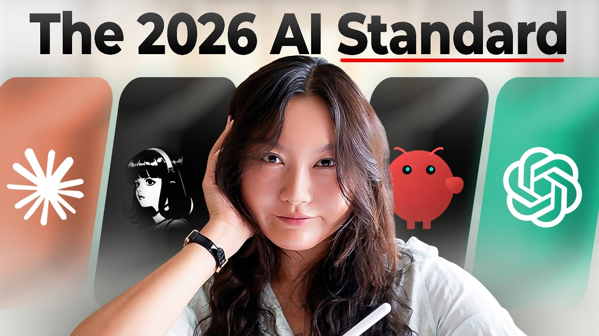

# Updated Essential AI Skills For 2026

Start building AI apps with Bolt 👉 https://bolt.new/?utm_medium=social&utm_source=influencer&utm_campaign=V2&utm_content=tinahuang

## Table of Contents
* [00:00:00] Basic (Investing, Prompting, Core AI Tools)
* [00:04:18] Intermediate (AI Agents, Local AI Agents)
* [00:08:30] Advanced (Building AI Agents, AI Coding)
* [00:13:35] Quiz

## Basic (Investing, Prompting, Core AI Tools) [00:00:00]

**Tina Huang:** So, it's only been 5 months since I gave you my 2026 essential AI skills roadmap. But, oh my goodness, things have changed so much since the beginning of this year. So, I feel like I got to give you an updated version. So, this video is it, the updated essential AI skills roadmap. [00:00:00 → 00:00:14]

And I'm going to structure it like a progression from the most basic skills to intermediate to advanced. And pay attention cuz at the end of this video there will be a little quiz to make sure that you retain all of this information. Now, without further ado, let's go. A portion of this video is sponsored by Bolt. [00:00:14 → 00:00:29]

Level one is securing the basics. I think these are skills that every single modern person that like participates in society should have about AI. And the first of these might actually surprise you cuz this is a tech AI learning channel. But, the first skill I'm going to mention is investing. [00:00:32 → 00:00:48]

Yes, because in my opinion, in 2026, if you are investing your money, I think you really need to have an AI thesis. You see, the age-old wisdom of just investing into the S&P 500 uh or whatever index it is that you're investing in does not count for the fact that you are having massive exposure to AI. Whether you know that or not. Because many of those companies in these funds are either AI companies or heavily integrated and invested in AI. [00:00:48 → 00:01:09]

So, I think it's really important for you to make a decision of how much AI exposure you want to have with your investments in relation to your current like career and your life in general. For me, for example, I am massively exposed to AI through my career. Plus, I have like a very unstable career because I'm a YouTuber and entrepreneur. So, my investment philosophy reflects this. [00:01:09 → 00:01:27]

I try to use my knowledge about AI to invest in things that I believe in, but I also hedge against AI to an appropriate amount. Anyways, I'm not going to go into more detail about this because this is not a personal finance investment channel and this is hashtag not financial advice. I just think it's really important for you, for everybody these days, to think about AI when you are investing. [00:01:27 → 00:01:43]

I'll also leave a little prompt in description. At a very meta level, you can put it into an AI chatbot to help you figure out what your investment thesis should be based upon your specific life situation. Now, let's move on to the next AI skill that I think everybody should know in 2026, which is prompting. [00:01:44 → 00:01:58]

Prompting is the way that you interact with AI, like any type of AI. So, knowing how to prompt well lays the foundation for everything that you do with AI. It is so important. I've talked about prompting a lot on this channel. So, I'm going to put on screen out two basic frameworks that you should definitely know if you don't already. And you can check out this video over here where I go through the basics of prompting in much more detail. [00:01:58 → 00:02:16]

Now, let's move on to the last skill of the basics category that I think everybody should know in 2026. And that is mastering a core set of tools. [00:02:16 → 00:02:25]

You see, in the AI world, there's like tools popping up all over the place. Like there's like 10 releases per day, probably more at this point. This can get really overwhelming if you're just trying to chase the hype of tools. Now, what I find to be much more productive and sustainable is to master a core set of tools and just master them really, really well. [00:02:25 → 00:02:41]

If you want to be an AI minimalist and you only want to have like one AI tool in your arsenal, then I would recommend that you pick from the category of a general AI chatbot. This is like your Claude, ChatGPT, Gemini, Rasa, Poe, etc., etc. I'm going to put on screen examples of chatbots that you can choose from. Honestly, even these like are so powerful these days. [00:02:41 → 00:02:58]

So, you can ask them questions like plan on my itinerary to go to France in 2 weeks, generate images, audios, videos, animations, even like prototype entire apps. So, if you master the skill of prompting, just using one of these chatbots well will get you very far. [00:02:58 → 00:03:10]

Now, if you do want to be a little bit more fancy, you can also check out a little bit more specialized AI tools. Like most people will probably benefit from having a specialized news and research AI tool, like Perplexity for example. You can look at the news that you're interested in and be able to do more extensive research. And for learning new things, which I think everybody should be learning new things, you can also check out a product like NotebookLM. [00:03:10 → 00:03:29]

Now, if you want to harness the power of AI even more, then I would also recommend checking out one or two AI tools that is also specific to your job. For example, if you're a software engineer, then you probably also want to master an AI coding tool. And if you're a marketing person, maybe you can also check out a tool that's specialized for say content and SEO, like Jasper or Surfer SEO for example. [00:03:29 → 00:03:47]

I'm going to put a prompt in a description, which you can copy paste to your favorite AI chatbot, and it will ask you some questions and it will help you figure out what are some tools that you can check out in for your specific job, if you wish. All right, so those are the basic skills I think everybody needs to know in 2026 just to like survive and keep up with society. [00:03:47 → 00:04:02]

But, if you're someone who's interested in harnessing the power of AI more and integrating that into your own life and workflows more, then you want to move on to the intermediate skills. And this is the transition into thinking about what are called AI agents. [00:04:02 → 00:04:16]

## Intermediate (AI Agents, Local AI Agents) [00:04:18]

**Tina Huang:** AI agents are software systems that use AI to pursue goals and complete task on behalf of users. You see, previously, you're just using AI tools for to like do something very specific or to give you suggestions for things. Like, "Hey, like ChatGPT, can you like write me a paragraph about cars? Or like, can you plan my itinerary?" This is like one request and you get one response back. [00:04:20 → 00:04:38]

But, with an AI agent, you can give it like an overarching goal. Like, "Hey, I got this new office." I show some pictures of your new office. Help me decorate this office. By the way, I literally did this with an AI agent called Manas. It brainstormed different aesthetics with me, ended up going with the light academia vibes. Then it was able to take our exact office and decorate it so it has this aesthetic, and even link those specific products. Like the rug, the lamp, the curtains. [00:04:38 → 00:04:59]

You see, that's the power of agents, agentive workflows. You can give it an overarching goal, and it can break down the steps that it needs to do, and then go and execute these steps. I hope you can see how this is much more powerful than just like chatting with a tool. [00:04:59 → 00:05:11]

So, Manas is an example of an agent, a web-based agent that can do stuff for you. And it's a really great entry point into learning about how to prompt and work with agents. But, what puts you at the next level and is very popular these days is what are called local AI agents. [00:05:11 → 00:05:24]

A local AI agent is firstly an AI agent that takes action and completes task on its own, and is also local, which means it's an agent that lives and runs on your specific machine, like your computer. And this is very, very powerful. It allows you to build out custom automations and workflows just for you. [00:05:24 → 00:05:38]

For example, I have an agentive workflow that pulls from my calendars, my Gmail, my investments, Slack, and Notion to put together a personal daily digest to me straight to my Apple notes. I also have AI workflow that updates AI news and tracks AI topics, deep dives into them, and helps me draft up scripts for my YouTube videos. [00:05:38 → 00:05:55]

Of course, I still spend a lot of time researching more into these scripts and perfecting them, and I still have to like film them myself. Hello, I'm Tina. I'm still real. But overall, it saved me so much time and I'm able to increase the quality of my videos so much by this. [00:05:55 → 00:06:08]

Uh another example, just to make it three, I also have an investment dashboard that pulls in like custom news and curated suggestions for my specific investments, too. There are, of course, so many other workflows that you can do. I'm going to put on screen now some other examples. [00:06:08 → 00:06:19]

All you have to do is learn how to use a local AI agent, like Cohere, Open Clova, Hermes, for example. I'm sure as the weeks and the months go on, there's going to be a lot more products in this local AI agent category, as well. But all you got to do is start off by choosing one of them, depending on two factors. [00:06:19 → 00:06:32]

The first one is how technical you are. Some products are geared towards people who are non-technical and don't know how to code, and others are more towards people who do know how to code. And the second factor is if you want to go with open-source or close-source AI. [00:06:32 → 00:06:43]

Clova, ChatGPT, Gemini are considered close-source AI. While models like Kimmy, MiniMax, Llama are considered open-source. I am not going to go into too much more details about what open-source is because I made an entire video about this, which you can check out over here. But basically, it boils down to capability, cost, and privacy. [00:06:43 → 00:06:58]

Close-source models tend to be more capable and more powerful, although that gap is closing. While open-source models are much lower cost or free to run, and private if you choose to run them yourself. So you don't have to be like sending your entire bank account information to Anthropic or OpenAI, for example. [00:06:58 → 00:07:11]

Anyways, I'm going to put a prompt in the description, as well, to help you figure out which local AI agent that you should start with, giving your specific skill set and your needs. You can just stick that into your favorite AI chatbot, and it should help you out. [00:07:11 → 00:07:22]

And that leads us to the next level, the advanced level. Bolt is my go-to for creating really fast AI-powered functional web apps. You can go from idea to a deployed production-ready app just by describing what you want in plain English. And now it has a connector layer that lets your project pull in capabilities like shaders, Notion, GitHub, and more through MCPs. [00:07:22 → 00:07:41]

I'm building a new landing page for my Lonely Octopus AI agents bootcamp and I wanted to look actually good, not just functional like it is now. So, I use Bolt to build out the full landing page and it pulls in shaders directly. Here's an animated purple hero background and there's no manual setup, no going to shaders and copying embed codes. It's just there. [00:07:41 → 00:07:58]

I can tweak it conversationally if I want the animation slower or a different shade of purple. I just describe it and Bolt can adjust it. That prompt tweak loop is what makes this so powerful compared to just grabbing a static shader somewhere else. You're building and refining in one place. [00:07:58 → 00:08:12]

To set it up, you just go to personal settings, find the connectors panel, and toggle shaders on for your project. That's it. You can now build in Bolt for free. The link is in the description. Thank you so much Bolt for sponsoring this portion of the video. Now, back to the video. [00:08:12 → 00:08:24]

## Advanced (Building AI Agents, AI Coding) [00:08:30]

**Tina Huang:** The difference between intermediate and advanced skills is that for intermediate, you're kind of like doing things on your own, right? Like for your personal workflows or maybe for some business workflows, but they're still more or less for yourself. But for people who are interested in AI from a commercial perspective or even as a career, then it's important to learn the advanced skills. [00:08:28 → 00:08:45]

And I got to say these advanced AI skills unlock so many opportunities. These are skills are in such high demand and knowing these gives you such an unfair advantage. And that is when you might transition to the next skill, which is actually building your own AI agents. [00:08:45 → 00:08:59]

So, if you're considering building commercial pipelines where other people are going to be using it, potentially you might even have clients who are going to be using it, you need these to be stable, reliable, and lower in cost. For example, us as a company Lonely Octopus, we also have B2B clients and for them we build a different types of agentic workflows and products. [00:08:59 → 00:09:15]

For example, for a private equity company, we built a custom reporting pipeline. It pulls data from their tools like CRM, analytics, spreadsheets, and also from their custom database on a schedule and then assembles it into a formatted report. Private equity companies seem to have to do a lot of reporting, so this has saved them so much time. They're able just to send off these automated reports with their KPIs, client updates, and board summaries. [00:09:15 → 00:09:37]

We've also helped companies build onboarding agents where they can onboard new hires and clients that go through a series of steps that is custom for their company. It tracks their progress and they can customize it to however they like. These are just a couple examples. We have so many requests from people to help them build these different AI agents. [00:09:37 → 00:09:53]

So, if you're someone interested in like freelancing or even like working in the AI field, just know that learning how to build your own AI agents is a very very in-demand skill set. Kind of related to this, building MCPs, which allow AI agents to plug into third-party apps and different data sources, is also really really in demand as a skill. By the way, I just want to say I called this like months ago when I made my MCP video. So, you know. [00:09:53 → 00:10:16]

Anyways, if you learn how to do this, this is also a skill set that's very in high demand. Not going to go into way too much detail about this. I have so many different videos covering how to build AI agents, about MCP, and we actually run an entire four-week boot camp where we teach people how to build AI agents. So, I'm going to link all of these resources into the description of the video, which you can check out if you want to dive deeper into it. [00:10:16 → 00:10:37]

And just to end off this section, I'm going to show some different tools, both non-technical and technical coding tools, that you can learn in order to build AI agents. Moving on to the final AI skill, and that is AI coding. [00:10:37 → 00:10:49]

AI coding, otherwise known as agentic engineering, is using an AI agent in order to write code and build software. Some of the examples of things that me and my team have built include this internal tool that helps us create slides, documents, resources using our style and our branding. And we're also creating a learning app, which I hope I can share more details with you about soon, this generator, and accounting software. [00:10:49 → 00:11:12]

Now, there are pros and cons to AI coding. The pro is that if you learn AI coding, this is like boss level unlock. Not only are you able to build like big, complex, production-grade products, you'll be able to do this at like a fraction of the cost and time. Like, we're talking about like more than 10 times cost and time savings. [00:11:12 → 00:11:28]

I honestly cannot even explain like how big of of deal this is. If there is one domain that AI has already like completely transformed, then that would be coding. Like the difference between someone who knows how to do like AI coding and doesn't know AI coding, it is just so vast. [00:11:28 → 00:11:41]

If you want to truly unlock AI and the power of AI, you really got to know how to do AI coding. Now, the con of this is that you low-key do already need to know how to code. I will use this by explaining it's kind of like putting lipstick on a pig, you know? Like if your coding sucks and you don't know how to code, it's like putting lipstick on a pig. It doesn't actually matter how good the AI coding tool it is that you're using and like how fancy your setup is, it's just not it's not it's not going to work. You're not going to get far. [00:11:41 → 00:12:08]

Like you're going to run into a lot of issues along the way. And coding is one of those things that does take some effort in order to learn. Like all the other skills that we talked about earlier, these are things that you can master in the span of days to weeks. But to actually properly learn coding and then AI coding, you do need to be spending at least like a couple months, maybe like two to three months to properly master things. [00:12:08 → 00:12:26]

I actually made a video about how to learn to code in the age of AI if you want to check it out, which I'll link over here. But yes, it does take some effort and commitment to actually learn how to code and be able to harness the power of AI coding. [00:12:26 → 00:12:35]

Now, I don't think everybody has to do this. I think you can get like really far along in AI without learning how to code and doing like AI coding, right? That's why this is like the most advanced last skill. You would be totally fine like building simpler workflows, prototypes, and things like that without knowing how to code. [00:12:35 → 00:12:49]

I would only recommend making a commitment to learn how to code if you don't know how to already and then learning AI coding if you're someone who's genuinely interested in really digging deep into AI and harnessing its powers. Plus, you can also reduce your own costs a lot more because you can stop paying for like subscriptions for different products and you can just like AI code your own clones of them, which is what I do. Stuff like note-taking and accounting or budgeting softwares, for example. [00:12:49 → 00:13:12]

So, I have not yet made a full video on AI coding. It is in the pipeline. I have heard your requests. I promise it is coming. Give me a little bit more time. And when it is out, I will link it over here so you can check out. [00:13:12 → 00:13:23]

## Quiz [00:13:35]

**Tina Huang:** And that's it. We're at the end of this video. Wow. These are the essential AI skills from the most basic, intermediate, to advanced. Now, as promised, I will show on screen a little quiz. [00:13:23 → 00:13:33]

Please answer these questions and put them into the comments to help you retain the information we have just covered because science says this is the best way for learning. And thank you so much. Have fun learning AI and I will see you guys in the next video or live stream. [00:13:33 → 00:13:45]
