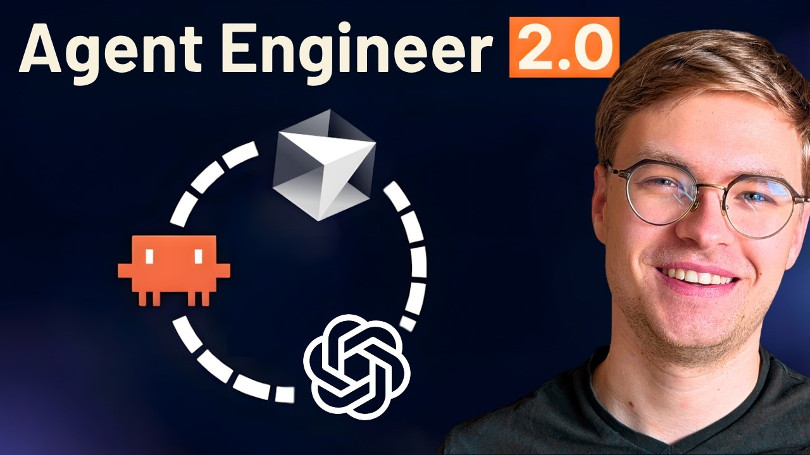

# The Agentic Engineer Workflow You Need In 2026

Get my FREE Agentic Engineer config: https://zenvanriel.com/ai-coding. Become a high-earning AI engineer: https://aiengineer.community/join

I've shipped AI-generated code on real engineering teams at enterprises and startups, with full code reviews, production users, and accountability for every merge. This video walks through the actual workflow: four parallel Claude Code windows tuned to different effort levels, context window management, git worktrees, MCP versus Bash decisions, and the engineering patterns that keep AI code from breaking your team.

## Table of Contents
* [00:00:00] The Agentic Engineer Mindset
* [00:00:30] My 4 Parallel Claude Code Window Setup
* [00:02:30] Managing Context Window Drift
* [00:03:22] Why I Avoid Focusing On Spec-Driven Development and BMAD
* [00:05:04] The Smell Command for Clean Code Quality
* [00:07:28] Connecting Claude Code to GitHub CLI
* [00:08:01] MCP Servers vs Bash Tools
* [00:10:32] AI Coding at Freelance, Startup, and Enterprise Scale
* [00:12:58] Git Worktrees for Parallel AI Coding Streams
* [00:15:56] The Real AI Productivity Gains
* [00:17:01] Becoming an AI Native Engineer

## The Agentic Engineer Mindset [00:00:00]

**Zen van Riel:** I've shaped AI code on real engineering teams across enterprises and startups with code reviews, production users, and full accountability for everything that I merge. Today, I'm going to show you what my agentic engineering coding workflow looks like, which relies on real engineering practices. [00:00:00 → 00:00:17]

I will show you my parallel setup for any coding agents while sharing stories from our real engineering experience that will teach you how to speed up programming work while preventing AI code from hurting you in the future. [00:00:17 → 00:00:31]

## My 4 Parallel Claude Code Window Setup [00:00:30]

**Zen van Riel:** First, I want to show you how I work with coding terminals. In my case, I'm going to show you a shortcut that I have here that launches four Claude Code windows by just typing T. [00:00:31 → 00:00:41]

And the reason why I create four Claude Code windows is because very often there's an opportunity to parallelize some work with AI code, but not too much. I'm not going to pretend like I'm running 50 agents at the same time. My mental capacity is pretty much at four parallel work streams. This is just what I've discovered after working on multiple bigger projects together with real teams. [00:00:41 → 00:01:06]

And in my case, to understand my workflow, let's imagine that we're working on this application together. This is a bit of an auctioning demo app that's developed in both Python as well as Java. [00:01:06 → 00:01:15]

Now, these four terminals are not the same. If you've got a keen eye, you can already see that here in the top left we have Claude Code with high effort. Here on the top right is high effort as well, but on the bottom left and bottom right it's medium and low effort respectively. [00:01:15 → 00:01:31]

And I'm doing this for a good reason. Some work that you need to delegate to an AI agent will take a long time to complete because it's a big batch of work. For example, I can start a new plan session in here and say, "Scope out five potential features we can work on." I'm just giving it the opportunity to explore, be creative. [00:01:31 → 00:01:55]

Now, on the bottom right, I can now ask a much simpler question. Explore the code base to tell me which languages are used. And because this one is using low effort, it will be done much faster with the agentic loop. [00:01:55 → 00:02:13]

So, now you can see that the top left is still going, whereas on the bottom right, we already have an answer to our question. It's using Java, Python, HTML, and a little bit of SQL. So, based on this, I know where certain tasks need to go in my work stream. [00:02:13 → 00:02:29]

## Managing Context Window Drift [00:02:30]

**Zen van Riel:** As we work in a chat, you will see that eventually the current context window is printed here on the bottom right. And this is very important because as your context window fills up, not only will the AI take longer to respond, but also it will eventually start to drift away from the intended context of the conversation. [00:02:29 → 00:02:47]

So, you might be super familiar with this, but of course, you can just run something like compact or of course clear to start your conversation from a fresh context window. And here too, as you work with these AI tools, you'll get a feeling for when you need to reset the context window. [00:02:47 → 00:03:01]

There is not one magic answer to this. It depends on the complexity of your project, the complexity of your current piece of work. This is the whole point of being an agentic engineer. You need to just get a feeling for when to compress your context window. [00:03:01 → 00:03:15]

If you want to get access to my workflow, including all of the scripts to launch these windows, check out the link in the description down below. [00:03:15 → 00:03:22]

## Why I Avoid Focusing On Spec-Driven Development and BMAD [00:03:22]

**Zen van Riel:** You might be wondering why I'm not talking about specific planning techniques like spectrum development or the B map method, or why I'm not talking about the difference between being a context engineer, a prompt engineer, and an agentic engineer. And to be honest, it's because I think that a lot of these things are just gimmicks that don't really stand the test of time. [00:03:22 → 00:03:41]

Just think about all of the different AI projects that have become so popular over the past 3 years. How many of those projects are still relevant today? I'm not saying that things like spectrum development are a fad, but I do think that anything that does work will just be rolled up into something like Claude Code as time goes by. [00:03:41 → 00:04:02]

Like how Claude Code now has a good way to just keep track of to-do's. You don't really have to screw around anymore and do that yourself with markdown files. [00:04:02 → 00:04:10]

And this is honestly just the thing that I've learned. I'm just awaiting the hype and anything that survives three to four months is probably really good pattern to apply. And you're not going to see anything in this video that won't be relevant anymore in six months. I'm only going to show you principles that will stand the test of time. [00:04:10 → 00:04:29]

So, another aspect that's really important to understand is how do you get your code to a high quality? If you are an indie hacker or even in some cases a freelancer, code quality might not be the most important thing because you are not necessarily accountable for code quality. Of course, if you're creating your own business software, eventually your customers will get into trouble if you're the one creating the bugs. But at that point, you could just vibe code to fix, right? [00:04:29 → 00:04:54]

Well, in the professional world, this doesn't really work because you've got a team that you need to work together with. If you create 10,000 lines of code in an hour time, how you ever going to get that code into production? [00:04:54 → 00:05:05]

## The Smell Command for Clean Code Quality [00:05:04]

**Zen van Riel:** Are some commands that I use that really help me out. One example of this is this smell command. And this command is based on a couple of engineering patterns that I found super helpful from books that I read many, many years ago including clean code as well as architectural design patterns, specifically design patterns for good software development. [00:05:05 → 00:05:26]

So, the smell command, for example, refers to the clean code book. And clean code is a book that I'll definitely recommend you to buy, but of course, the concepts are already part of the language model, but it can help to kind of push it into that direction by reminding it of a couple of concepts like this. And this way, you can actually make sure that it follows the patterns from those engineering books. [00:05:26 → 00:05:49]

And to be completely honest, you can choose to ignore my advice and go out there and look at a prompt repository that has 60,000 stars on GitHub and just copy-paste all of that and use prompts that say, "You are a senior engineer, code and do not make any mistakes." It's completely up to you. [00:05:49 → 00:06:07]

But if you want to get serious with agentic engineering, why don't you just apply the patterns from really good engineering books that have already been used to create some of the best software in the world. In any case, if you want to make a start with that, check out the link in the description below. [00:06:07 → 00:06:23]

Now, how about AI code reviews? What do I do there? Well, I actually do often connect GitHub to all kinds of AI code review platforms, whether it's a specific host of platform like the newer Cloud Code Reviews or just some self-created loop where I create some kind of pipeline that just automatically checks for my code using something like the headless mode of Codex. [00:06:23 → 00:06:44]

It doesn't really matter what you do here, but I do think it's important to have at least some kind of AI review in your pull requests. The most important thing though is that you don't just rely on that, but you still combine it with human review. [00:06:44 → 00:07:00]

And in fact, I also have a couple of commands that I often run to do some of the AI code reviews before I create a pull request out of it. Now, I'm not going to share those commands with you. Why not? Well, because there is not one command that fits all. The right review command depends so much on what you're building. [00:07:00 → 00:07:14]

It depends on the programming language, the complexity of the work, how many human reviewers are even on your project and what their preferences are, what the code style is that your team agreed on. There is not one size fits all. [00:07:14 → 00:07:25]

## Connecting Claude Code to GitHub CLI [00:07:28]

**Zen van Riel:** Speaking of creating a pull request, how do I connect to external services using my coding agent? For example, it's super simple for me to just take this GitHub URL, go to Cloud Code, even the low-effort one, and say, "Create a test issue in this URL." [00:07:25 → 00:07:42]

It just already knows how to call the GitHub CLI and I'm already authenticated to it. So, there's no authentication mechanism that Cloud Code is aware of directly. The credentials are already injected as part of my authentication workflow that I went through when I set up the GitHub CLI. And you can click on it to go to it directly and there you go. [00:07:42 → 00:08:02]

## MCP Servers vs Bash Tools [00:08:01]

**Zen van Riel:** Nowadays, there's a big discussion on whether MCP servers are really useful for this, whether you should use a skill that defines how an API should be called, or whether you should just use a CLI as is. [00:08:02 → 00:08:12]

You can, of course, just use the bash tool. And with bash, you can basically execute any kind of arbitrary script. So, you can use bash to execute, say, a simple Python script that calls a web API. Maybe if the API is simple enough, you can, for example, use curl to make a direct web request. Or you could use some kind of special CLI. For example, GitHub has a CLI that you can use to create issues, create pull requests, etc. So, you can simply create and use a bash tool. [00:08:12 → 00:08:46]

What you can also do, of course, is you can rely on an MCP server. And MCP servers were really popular 1 1/2 years ago. I think they're still very relevant, but you need to understand when to use each service. [00:08:46 → 00:09:00]

Personally, if you're using a very common platform like GitHub or, let's say, Jira, then there already a lot of bash tools that you can use that even the LLMs might not already know about. When it comes to MCP servers, this is really where it can connect with unknown internal services much better. For example, you have a coding agent that you want to connect to some internal diagnostic system, then an MCP server can be quite useful. [00:09:00 → 00:09:28]

But even here, I think the nuance of using an MCP server or not really comes down to how simple of an operation you need. If you just need to execute a single command, then bash makes a lot of sense, but there are still MCP servers that I really like. I really like Coptic 7, for example, because with Coptic 7, you can pull in the latest documentation for your programming language or your framework of choice. [00:09:28 → 00:09:50]

And of course, you can do this with the web search skill as well in Cloud Code, but it's much less specialized. It will just do a generic web search, and then it might return something relevant, whereas with Coptic 7, there's a very specific back end that will search the web, but it will also cut up the documentation and present it to the language model in the most efficient format. [00:09:50 → 00:10:12]

Similarly, with Serena, you can connect any coding agent to a language server of choice, which will often make search operations much more efficient. So, here too, there is not a definitive answer whether you need bash or MCP servers. It just depends on intuition. Intuition you can only develop when you create interesting systems with these AI agents. [00:10:12 → 00:10:33]

## AI Coding at Freelance, Startup, and Enterprise Scale [00:10:32]

**Zen van Riel:** Now, I wanted to talk a little bit about my experience using AI coding at a freelancing gig, at a smaller startup scale, and even at the enterprise level, because I've done AI coding at all three now, and I will say that my experience has been wildly different. [00:10:33 → 00:10:49]

Let me start by explaining how I felt when I was a freelancer at a couple of side gigs that I did next to my regular job. Well, these gigs were creating proof of concepts, MVPs, and when you're starting off on your project, well, that's when you can really feel like you are some kind of god developer, because you're able to just be so productive in the beginning and just push out so many lines of code. [00:10:49 → 00:11:12]

And when you're creating proof of concept, there's not really a lot of people that you need to give accountability to. You're not having to show your code to a development team every single day. Sure, at the end of the project period, you might need to improve the code base a bit, add tests, etc., but it's really not the same as working inside of a software development team every single day. [00:11:12 → 00:11:34]

Regardless of whether you're working at a startup or an enterprise, when you're creating code with AI, the code needs to be reviewed. Now, depending on what kind of company you're working for, their reviewing process is partially manual, partially AI augmented, but in any case, if you come to other developers with 10,000 lines of code every single day, I can guarantee you that things aren't going to end very well. [00:11:34 → 00:12:00]

Either they're going to send you back to create smaller scale pull requests, or you're all going to suffer from longer-term bugs caused by AI code that was generated too quickly. [00:12:00 → 00:12:11]

## Git Worktrees for Parallel AI Coding Streams [00:12:58]

**Zen van Riel:** Now, here's where I have to face the reality of things. I feel like the people who are doing the best with the agentic coding aren't screaming from the rooftops that they're five times more productive. They might see 30 to 60% performance gains, and to be fair, they might be really fast on certain cases, like creating one-off scripts to test something in production. [00:12:11 → 00:12:33]

But in general, these people are benefiting from real production gains without all of the hype that is unsustainable. Because again, if you're working on real projects, you will find that the coding portion of the engineering job is actually not that much anymore. This is not saying that you don't have a job anymore. Engineering is much more than just coding, but it is a shift in how you need to distribute your daily work time. [00:12:33 → 00:12:57]

Oh, now, one more thing about my Claude status line that I really want to share. I also have the name of the current working branch. You can see here that I'm on the main branch, and if I, for example, ask Claude Code to check out to a random branch, you will see that whatever Claude Code chooses will also show up here on the status line. So, it's going to do check out to a completely random branch name, totally fine by me. [00:12:57 → 00:13:20]

And once it runs this command, you can see that this branch shows up here. The only problem with this approach is that the Git context is shared between these four different Cloud Code windows. So, if I for example say hi here, you will see that my branch name will update to the current branch. There you go. [00:13:20 → 00:13:38]

This can work. You can still do parallel work in the same branch, but eventually it will get messy quickly. And this is where you can create a Git work tree. With a Git work tree, you basically create a temporary copy of your code of sorts that allows you to work in completely independent work streams. [00:13:38 → 00:13:55]

So, even if Cloud Code might be iterating on the same files, for example, if you ask Cloud Code to generate three different approaches to the same problem, you can still achieve that without any conflicts by using Git work trees. And you can of course ask Cloud Code to create a work tree for you. In this case, let's for example create a work tree called branch work tree test. [00:13:55 → 00:14:22]

You can see here that it switches the branch name to work tree branch work tree test. And I even have a bit of an indicator here that shows that this is a proper work tree. Oh, and now I'm actually lacking the room here to show my context, but this isn't a problem because these windows are actually resizable. So, I can resize the window like so to get the full context again. [00:14:22 → 00:14:42]

And just to show you what this work tree looks like in my file explorer, I'm going to open Visual Studio Code. And that what I can do is in my Cloud folder, you have this work trees folder. And you can see that branch work tree test is kind of just a copy of the entire repository. [00:14:42 → 00:14:58]

And of course, once you're done with this work tree, you can fully delete it because you don't want your disk to be full of copies of your code, right? So, for example, you can just say exit and delete the WT. It'll understand that I'm talking about a work tree just fine. So, now it's cleaning up the work tree. Go back to Visual Studio Code. And the work tree is gone. [00:14:58 → 00:15:17]

Just knowing how to use a work tree is a big power move. Just remember that when you create a new work tree, you might have to reinstall the project dependencies again, depending on what programming language you use. Here too, it all depends on your project. There's not one trick that will work. [00:15:17 → 00:15:33]

But if you do find yourself having to install dependencies every time a work tree is created, well, that's exactly when you should create a reusable skill or command that will be called every time a work tree gets created. Maybe you can even customize my scripts to create a work tree whenever you start Cloud Code. If that's your preferred workflow, you should really get creative and customize it to your own needs. [00:15:33 → 00:15:56]

## The Real AI Productivity Gains [00:15:56]

**Zen van Riel:** I also remember working in a much more complex repository where I was able to create a brand new feature in just two days. So, I thought I'm going to create the pull request, get it merged in by the end of the week, and we'll be all set. [00:15:56 → 00:16:06]

The thing is though, I got quite a lot of pushback from more experienced engineer in the pull request because while my code was functional, it lacked a lot of long-term architectural thinking. And I have to admit, when I actually read the code because I only skimmed it because I wanted to create AI code faster, I realized that this engineer was totally right. It missed the bigger picture and it was going to cause a lot of bugs in longer term. [00:16:06 → 00:16:31]

So, when you're thinking about the agentic engineering, it's not so much just about the tools that you choose to use, it's also about mindset. [00:16:31 → 00:17:01]

## Becoming an AI Native Engineer [00:17:01]

**Zen van Riel:** What kind of engineer do you want to be? Do you want to be a vibe coder who pushes thousands of lines of AI code to production every single day? Or do you want to be an AI native engineer, someone who benefits from the productivity gains of AI, but also knows when to fix systems when they really go down, and can actually master the full stack? [00:17:01 → 00:17:01]

Of course, I'm a little bit biased. You probably know which type of engineer I prefer to be, but it's up to you, and it's definitely good to think about it. If you want to get started with agentic engineering, you can check out the resources in the description down below, or check out, of course, more of my videos where I cover many more topics like this. [00:16:55 → 00:17:12]
