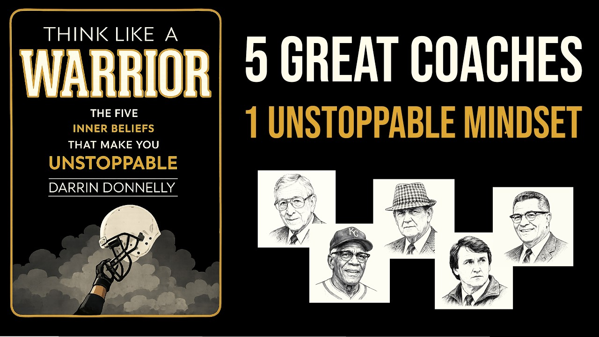

# 5 Coaches' Secrets to Success: THINK LIKE A WARRIOR by Darrin Donnelly Core Message

Animated core message from Darrin Donnelly's book 'Think Like a Warrior,' featuring five legendary coaches — John Wooden, Buck O'Neil, Herb Brooks, Bear Bryant, and Vince Lombardi — whose philosophies carry a struggling entrepreneur from hopeless to unstoppable.

## Table of Contents
* [00:00:00] Introduction
* [00:01:07] Coach 1 — John Wooden: Control Your Effort and Attitude
* [00:02:46] Coach 2 — Buck O'Neil: It's Your Duty to Be Joyful
* [00:03:50] Coach 3 — Herb Brooks: Set Unrealistic Goals
* [00:04:36] Coach 4 — Bear Bryant: Choose to Be Relentless
* [00:06:00] Coach 5 — Vince Lombardi: Choose Faith Over Fear
* [00:06:39] The Five Philosophies
* [00:07:13] Closing

## Introduction [00:00:00]

**Narrator:** I recently read Think Like a Warrior by Daren Donnelly. [00:00:00 → 00:00:04]

At some point in your career, you'll hit a wall. Your results will decline, and you'll need advice from someone you trust. But instead of talking to a friend or a mentor, you get the opportunity to talk to five of the greatest coaches in sports history. What works in sport works at work. So these are five people worth listening to. [00:00:04 → 00:00:23]

Each one built a core philosophy that carried them to championship after championship. Adopt even a few of their philosophies, and you can make the shift from continuous struggle to unstoppable success. [00:00:23 → 00:00:36]

To help you see these five powerful success philosophies in action, I created a character named Eli. He quit a steady job to work for himself. Every time he hits a rough patch, a world-renowned coach shows up to help him through it. [00:00:36 → 00:00:50]

We start the story 6 months into Eli's decision to quit his job and work for himself. His two initial clients decide to leave in the same month. And when he tells his wife the bad news, he finds out she's pregnant. That night, he's sitting at his computer when he looks up to see an older man in the corner of the room. [00:00:50 → 00:01:07]

## Coach 1 — John Wooden: Control Your Effort and Attitude [00:01:07]

**Narrator:** "Whoa, you're Coach Wooden," he says. [00:01:07 → 00:01:10]

John Wooden is the most successful and most humble coach in college basketball history. 10 national titles in 12 years at UCLA and a historic 88-game win streak. But it took him 28 seasons before he won his first national title. Wooden distills the core philosophy developed over those 28 years into two sentences. [00:01:10 → 00:01:30]

There are only two things in your control. Your effort and your attitude right now. Focus on those two things, and let the results take care of themselves. [00:01:30 → 00:01:40]

Those two sentences hit Eli hard. He knows that he's wasting effort reliving the past or worrying about the future. He also knows that he has an attitude of entitlement, believing he should already be further along than he is. So he vows to stay humble and starts a daily practice to take his mind off everything he can't control. [00:01:40 → 00:01:59]

Every night he asked himself two questions. Did I give my fullest attention to my work today? And did I bring the best possible attitude while doing it? [00:01:59 → 00:02:08]

He can't fix a bad result, and he can't control future results. But each day he can score a 10 out of 10 on the two things that are his to control. [00:02:08 → 00:02:17]

Eli spends the next month building a new portfolio and pitching it to businesses. Then he receives an email from a big national brand to complete a trial project. He puts his best effort into it. But the day before the deadline, he loses all his work and can't deliver on time. [00:02:17 → 00:02:33]

He gets incredibly angry and snaps at his junior editor for letting it happen. Later that week, he's sitting in a diner feeling bitter and hopeless. He looks up to see an older man in a suit sitting across from him. [00:02:33 → 00:02:46]

## Coach 2 — Buck O'Neil: It's Your Duty to Be Joyful [00:02:46]

**Narrator:** It's Buck O'Neil. [00:02:46 → 00:02:48]

Buck O'Neil was a baseball star who was forced to play in the Negro Leagues, but went on to become the first black coach in Major League Baseball history. O'Neil had every reason to be bitter about his lot in life and how people treated him. [00:02:48 → 00:03:00]

His grandfather was enslaved, he grew up in extreme poverty, and he was barred from the Major Leagues his whole playing career. But he always believed it was his duty to love life and attack each day with enthusiasm. [00:03:00 → 00:03:12]

After talking with O'Neil for an hour, Eli realizes that if O'Neil could stay joyful through endless rejection and hardship, why couldn't he? Eli goes back to work the next day with a renewed sense of gratitude for simply being alive and having the opportunity to build a business. [00:03:12 → 00:03:28]

He apologizes to the junior editor and starts loving his work again. [00:03:28 → 00:03:33]

A few more weeks pass and Eli has several promising leads. But the pressure to make more money is intense and worried friends are telling him to go get a steady paycheck at a big company. Just when he's about to give up on his big dream and go work for someone else, he sees a man in a windbreaker walk into his office. [00:03:33 → 00:03:50]

## Coach 3 — Herb Brooks: Set Unrealistic Goals [00:03:50]

**Narrator:** It's Herb Brooks. [00:03:50 → 00:03:52]

Herb Brooks coached the 1980 US Olympic hockey team, a group of college kids that nobody gave a chance, and who went on to beat the greatest Soviet team ever assembled and win the gold medal. [00:03:52 → 00:04:03]

Brooks tells Eli that the real failure in life isn't falling short of a goal. It's setting so-called realistic goals that are too small and never finding out what you were actually capable of. [00:04:03 → 00:04:15]

The next day, Eli turns down the safe job. He listens to his own voice over the naysayers because he knows his big goal is still the best opportunity in front of him, and he won't let other people's fear cost him a shot at it. [00:04:15 → 00:04:27]

A few more projects come Eli's way, but fail to lead to long-term contracts. Just when Eli doesn't know if he can take any more failure, he gets a tap on his shoulder. [00:04:27 → 00:04:36]

## Coach 4 — Bear Bryant: Choose to Be Relentless [00:04:36]

**Narrator:** It's Bear Bryant. [00:04:36 → 00:04:38]

Before David Goggins, Bear Bryant was the epitome of mental toughness. At age 13, he wrestled a muzzled carnival bear for $5 and earned his nickname. He once played a full game on a broken leg. [00:04:38 → 00:04:51]

As a coach, he took an entitled roster of 115 college football players to a training camp in the brutal Texas summer heat to see who would quit. About 30 made it through, and those 30 became the foundation of a team that went undefeated 2 years later. [00:04:51 → 00:05:07]

Bear Bryant tells Eli that mental toughness is a daily decision, not a gift. You develop it by never allowing yourself to think of excuses or blame others. Then reminding yourself that tough times never last. Struggle always has an end, so be willing to go just a little bit longer. [00:05:07 → 00:05:25]

He warns Eli about developing a quitting habit, explaining that the first quit may be hard, but the second is easier, and the third is automatic. Soon, quitting becomes a way of life. [00:05:25 → 00:05:37]

Eli listens to Bryant and embraces the grind, knowing that if he sticks with it, his business endeavor will pay off. A A months of hard work go by, and he starts seeing a steady influx of new clients. He's now making more money than he was in his old job, and the future is looking bright. [00:05:37 → 00:05:54]

At a small dinner celebrating his success, he notices a man across the table raising a glass in his direction. [00:05:54 → 00:06:00]

## Coach 5 — Vince Lombardi: Choose Faith Over Fear [00:06:00]

**Narrator:** It's Coach Lombardi. [00:06:00 → 00:06:02]

Lombardi won five championships with the Green Bay Packers over a 7-year stretch. He tells Eli not to waste this moment. [00:06:02 → 00:06:10]

Confidence isn't something you win once and keep forever. It's something you have to protect and keep building, especially right when things are finally going well, because that's exactly when fear creeps back in. [00:06:10 → 00:06:21]

Choose faith over fear every single day by reminding yourself of the amazing things you've done and seeing it as evidence that you're capable of doing a little bit more. [00:06:21 → 00:06:31]

Keep collecting evidence. Keep visualizing the next win and surround yourself with people who never stop believing in you. [00:06:31 → 00:06:39]

## The Five Philosophies [00:06:39]

**Narrator:** 3 weeks after that dinner, Eli's wife gives birth to their son. It's 9 months after losing those initial two clients, and he's gone from feeling hopeless to unstoppable. [00:06:39 → 00:06:49]

That's because he reads and internalizes the five life philosophies he learned from those great coaches every day. [00:06:49 → 00:06:56]

I control my effort and attitude. It's my duty to be joyful. My goals should feel slightly unrealistic. I choose to be relentless, and I choose faith over fear. [00:06:56 → 00:07:07]

He lives those philosophies every day to get the most out of life, and you can, too. [00:07:07 → 00:07:13]

## Closing [00:07:13]

**Narrator:** That was the core message I gathered from Think Like a Warrior by Daren Donnelly. [00:07:13 → 00:07:19]

This book is packed with timeless lessons, and it reads like a novel. If you enjoy sports, I highly recommend it. [00:07:19 → 00:07:26]

If you would like a one-page PDF summary of the insights I gathered from this book, just click the link in the description below, and I'll email it to you. If you're already signed up for the free productivity game newsletter, this PDF is in your inbox. [00:07:26 → 00:07:40]
