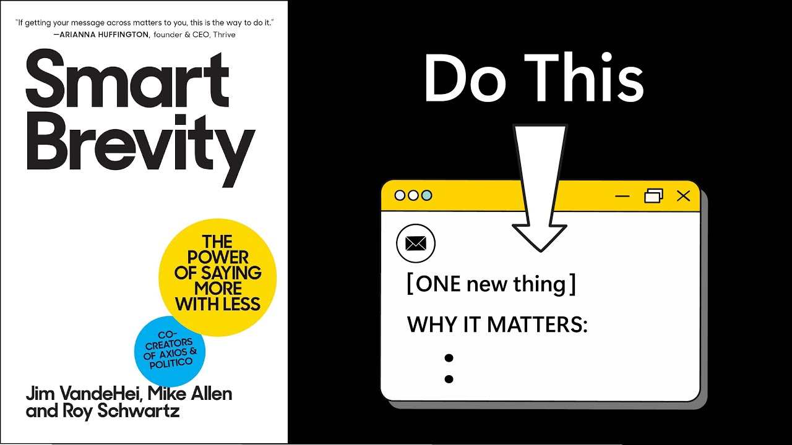

# Do more in 100 words than people do in 10,000 | SMART BREVITY by VandeHei, Allen, & Schwartz

Animated core message from J. VandeHei, M. Allen & R. Schwartz's book 'Smart Brevity' — a Lozeron Academy LLC / Productivity Game production.

## Table of Contents
* [00:00:06] Introduction
* [00:00:13] The Core Principle: Lead With Value
* [00:01:36] The Smart Brevity Template
* [00:02:49] Craft Irresistible Subject Lines
* [00:04:06] Maximize Your First Sentence
* [00:05:08] Four Attention Magnets
* [00:07:11] Conclusion

## Introduction [00:00:06]

[Music] [00:00:05]

**Narrator:** I recently read Smart Brevity by Jim Vanderhigh, Mike Allen, and Roy Schwarz. [00:00:06 → 00:00:13]

## The Core Principle: Lead With Value [00:00:13]

**Narrator:** This is what people see when they open your emails. If you don't give them something valuable in the first dozen words, you'll lose them. The average worker receives 75 more emails per day than they did a decade ago and skims online content incredibly fast. [00:00:13 → 00:00:29]

We've hit peak information overload and people's patience with new messages is at an all-time low. Therefore, if you're going to remember one thing from this summary, it's this. Give people the one new thing they need to know in a strong first sentence and say it in as few words as possible. [00:00:29 → 00:00:47]

Instead of starting with, I hope you're having a good day, or just writing to let you know that the team has finished the first draft and we're ready for your review. Write first draft is ready for your review. [00:00:47 → 00:00:58]

And rather than posing questions like, "Have you ever wondered why some companies succeed while others struggle to keep customers?" Provide the big finding up front. Successful companies retain customers by delivering surprise gifts on day 30. [00:00:58 → 00:01:13]

Start your messages as though the reader is walking out of the elevator and the door is closing behind them. Tell them what they need to know before the door closes. When you allow people to save time by giving them what they need to know upfront in as few words as possible, they are more likely to keep reading. As the authors put it, the dopamine blast of a great idea or word buys you a few more seconds of someone's time. [00:01:13 → 00:01:36]

## The Smart Brevity Template [00:01:36]

**Narrator:** After you deliver your one surprising sentence about the one thing you want them to know, immediately tell them why they need to know it and then give them the option to learn more. Here's a simple template to follow. This happened. This is why it matters. And here are the details. [00:01:36 → 00:01:53]

If you're telling people about a change of plans to a New Year's party, forget the backstory and just write, "New Year's party will now be at the Grand View Event Hall." This venue is further away for most people, so make sure to allow extra travel time. Here are the details. Address 123 Main Street. Doors open at 7:00 p.m. Open bar. Formal attire. [00:01:53 → 00:02:16]

In that simple example, you can see that since the first sentence is surprising news and the second sentence gets them to see why it matters, they really want to read whatever details you share. Follow this simple structure and both you and your messages will stand out in everyone's inbox. [00:02:16 → 00:02:31]

That's it. That's the big idea you need to know and why it matters. But now you can choose to go deeper and learn. How to craft subject lines people can't ignore. How to maximize the impact of your first sentence. And how to ensure people get to the end of your messages with four simple upgrades. [00:02:31 → 00:02:49]

## Craft Irresistible Subject Lines [00:02:49]

**Narrator:** First, how to craft subject lines people can't ignore. Whatever time you're spending on subject lines, double it. 80% of your writing success comes down to your subject line. If your subject line doesn't spark curiosity, your entire message will go unread. [00:02:49 → 00:03:07]

To paraphrase the authors, you would never cook a gourmet meal and serve it in a dog bowl. That's basically what you're doing with a lazy subject line. Here's how to write a great subject line. Be provocative and specific in six words or less. Six words is short enough to display fully in mobile inboxes, but long enough to provide detail. [00:03:07 → 00:03:28]

Make your subject seven time-saving templates instead of work templates. Write three critical updates instead of meeting follow-up. And write meet the Da Vinci of programming instead of meet the new programming lead. That last subject line leverages a powerful tip from the book. When possible, reference a popular figure or current event. For example, our Lionyl Messi sales quarter or a SpaceX level product launch. [00:03:28 → 00:03:57]

Whatever subject line you choose, make sure it sparks curiosity in six words or less and gets people thinking, "I need to know more." [00:03:57 → 00:04:06]

## Maximize Your First Sentence [00:04:06]

**Narrator:** Now, let's maximize the impact of your first sentence by using an active voice and as many one- syllable words as possible. An active sentence starts with a who did what format. The wildfire destroyed 200 homes is active and easy to read. 200 homes were destroyed by the wildfire is not. [00:04:06 → 00:04:25]

After writing your active statement, produce the shortest possible version using as many one-cllable words as possible. Instead of saying the department introduced an innovative technology to streamline operations, say the team has a new tool to cut work time, instead of saying Dave has adopted an ambitious fitness routine to improve his health, say Dave's been hitting the gym hard. [00:04:25 → 00:04:49]

Short sentences and short words pack more punch. [00:04:49 → 00:04:53]

After you've written your subject and first sentence, say them out loud as if you're telling someone in person. Try to imagine their facial expressions. Continue polishing your subject and first sentence until you imagine their face showing intense interest. [00:04:53 → 00:05:08]

## Four Attention Magnets [00:05:08]

**Narrator:** Now, let's finish by making four upgrades that ensure people will get to the end of your message. [00:05:08 → 00:05:14]

Most people skim your emails in a state of partial attention, but if you include the following four attention magnets in your message, you'll guide them down the page and help them take away important details. Magnet number one, axiom header with bullets. [00:05:14 → 00:05:29]

After your opening sentence, add a header that screams, "This is worth your time." Common Axiom headers include why it matters, the impact, and by the numbers. [00:05:29 → 00:05:40]

Make your axiom header big and bold. Then follow it with two to three bullet points explaining why your reader should care. Magnet number two, paragraph breaks and bold text. Break up any large paragraphs in the section that follows your axium bullet points and bold key phrases in each paragraph. This lets skimmers receive value quickly and get curious enough to slow down and start reading every word. [00:05:40 → 00:06:05]

Magnet number three, strategic emojis. Emojis used to be just for teenagers, but now they are becoming powerful communication tools for everyone. When you use an emoji as a bullet for a key point, it instantly conveys information and provides a nice visual break. The authors put a simple bar chart emoji next to important data and the reader instantly knows what the item is going to be about. So, start using emojis, but use them strategically. [00:06:05 → 00:06:33]

Magnet number four, simple visuals. Add an image to break up a string of paragraphs. This can include a chart screenshot or a simple AI generated image to illustrate a point you just made. Remember, the mind loves visuals. [00:06:33 → 00:06:50]

Now, if we use all four magnets, an email that used to look like this, a dense four paragraph email now looks like this. A short opening sentence followed by a why it matters section with bullets. Then two short paragraphs with bolded key phrases. a simple chart and finally a what's next section with an emoji. [00:06:50 → 00:07:11]

## Conclusion [00:07:11]

**Narrator:** In the end, seductive subject lines, sentences with one syllable words, and axiom headers followed by bolded phrases, emojis, and simple visuals are important if you want to get your message read. But if you remember just one thing, ensure it's this. Give people the one new thing they need to know in a strong first sentence and say it in as few words as possible. [00:07:11 → 00:07:34]

That was the core message that I gathered from Smart Brevity. This book will sharpen your messages and help you stand out. I highly recommend it. If you would like a one-page PDF summary of the insights I gathered from this book, just click the link in the description below and I'll email it to you. If you already received the free productivity game newsletter, this PDF is sitting in your inbox. [00:07:34 → 00:07:58]
