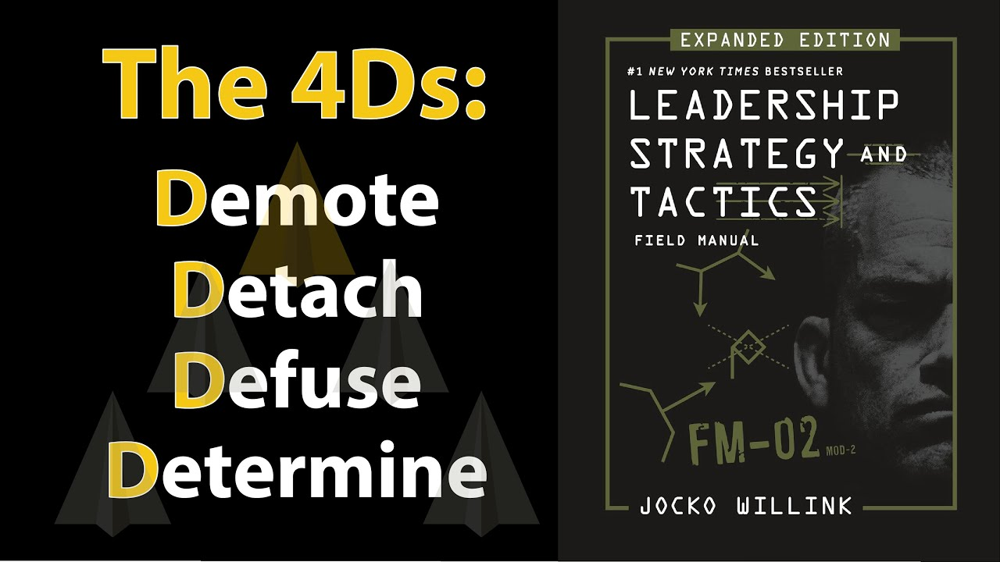

# LEADERSHIP STRATEGY and TACTICS by Jocko Willink | Core Message

Animated core message from Jocko Willink's book "Leadership Strategy and Tactics," distilled into the 4D Leadership Model: Demote, Detach, Diffuse, and Determine.

## Table of Contents
* [00:00:01] Introduction
* [00:00:42] Demote Your Ego
* [00:02:38] Detach to Decide
* [00:04:00] Diffuse Tension with Extreme Ownership
* [00:05:39] Determine the Optimal Balance
* [00:07:09] Conclusion

## Introduction [00:00:01]

**Narrator:** I recently read Leadership Strategy and Tactics by Jocko Willink. Jocko Willink, a retired Navy SEAL Commander, uses the leadership strategies and tactics he learned in the military to help Business Leaders and run his own businesses. After learning more about these strategies and tactics, I'm confident that you and I can use them to be more effective leaders at home, at the office, and in any team environment. [00:00:01 → 00:00:28]

I've distilled what I believe to be Jocko's most impactful lessons into what I call Jocko's 4D Leadership Model: demote, detach, defuse, and determine. [00:00:28 → 00:00:42]

## Demote Your Ego [00:00:42]

**Narrator:** When Jocko Willink joined his second SEAL Team, he had a commander from another Navy unit who lacked SEAL training and combat experience. So he tried to overcompensate — he refused to listen to advice from experienced team members of lower rank and insisted that he knew the best way to execute team missions. [00:00:42 → 00:01:02]

When the missions went wrong, he blamed others, never admitting his plans were flawed. His ego was so big that when one of his plans got challenged by a subordinate, he took a swing at him. [00:01:02 → 00:01:16]

Jocko and his team thought that the only way to be free of this Commander was to start a mutiny and petition to remove the commander. This was a risk because the Navy states that mutinies are punishable by death. [00:01:16 → 00:01:29]

Thankfully, senior Navy leadership recognized the problem and replaced the commander with a highly experienced Navy SEAL named Delta Charlie. Delta Charlie was a stark contrast to his predecessor. For starters, he established a decentralized command by clearly stating his intent for a mission — like saving a hostage located in a building — and then empowered his men to devise the plans. [00:01:29 → 00:01:52]

All he asked was to review their plans, at which time he would provide a few suggestions based on years of experience, but still make the plan feel like it was his team's plan. If the plan went sideways, Delta Charlie owned it and dealt with the fallout — more on that later. [00:01:52 → 00:02:07]

As a leader, your ego will urge you to have all the answers and make all the decisions. To trust and give control to your team, as Delta Charlie did, you must demote your ego the instant you get promoted to a leadership position. [00:02:07 → 00:02:23]

Empowering others to make decisions is the fastest way to build a cohesive team. When you consistently trust your team, they will be more likely to trust and commit to your decisions, even if they disagree with them. [00:02:23 → 00:02:38]

## Detach to Decide [00:02:38]

**Narrator:** The second D in Jocko's 4D Leadership Model is detach to decide. When Jocko was a junior Navy SEAL, he was in a tense combat situation on an oil rig. His platoon seemed overwhelmed by the complex environment and was paralyzed. Jocko waited for his leader to make a decision, but it never came. [00:02:38 → 00:02:56]

Knowing a decision had to be made, Jocko did something powerful — he detached. He stepped back both physically and mentally and gained a clear view of the situation, almost like he was flying a drone above the battlefield to assess the entire situation and seeing himself and his teammates from a new perspective. [00:02:56 → 00:03:14]

While in this detached state, he made the call: "Hold left, move right." His team repeated, "Hold left, move right," and cleared the deck, allowing the mission to continue on smoothly. Later, Jocko was praised for this call, and it taught him a vital leadership lesson: when your team is overwhelmed, don't get caught in the chaos. [00:03:14 → 00:03:38]

Instead, detach from your emotions by taking a deep inhale and performing a long exhale. As you exhale, imagine stepping outside of your body and the torrent of emotions you're experiencing to become the decider. Expand your field of vision and try to take in the whole situation, then make what you know to be the right call, regardless of how uncomfortable or unpopular it may be in the short term. [00:03:38 → 00:04:00]

## Diffuse Tension with Extreme Ownership [00:04:00]

**Narrator:** Now the third D in Jocko's 4D Leadership Model is diffuse tension with extreme ownership. Arguably the most counterintuitive leadership lesson Jocko learned on his path to becoming a Navy SEAL Commander is completely owning and taking blame for every bad thing that happened on his teams. [00:04:00 → 00:04:18]

Most people's instinct as a leader is to teach people lessons by making them feel guilty for doing something wrong — like a parent yelling at a child, saying, "What were you thinking?" But the fastest way to get people you're leading to do the right thing and do it long term is, as a leader, to immediately accept fault for a negative result by saying a version of, "I let this happen — now, what can we do to make sure this doesn't happen again?" [00:04:18 → 00:04:45]

So, for example, when someone fails to complete a task on time, say, "I didn't explain the task well enough. What can we do to ensure that you better understand the requirements next time?" [00:04:45 → 00:04:57]

This extreme ownership approach has three powerful effects. First, it immediately lowers the tension between you and the person you're leading, since they have no need to fight back. Second, if they know deep down that they are more at fault than you, they will feel guilty that you took the blame and work twice as hard to fix it. And three, it will make people respect you more as a leader and want to screw up less in the future, so that you don't have to carry the burden. [00:04:57 → 00:05:23]

When you take extreme ownership, you're saying the blame game is over — now let's work together to solve this. The result is less time arguing over who is at fault and more time coming up with good solutions. [00:05:23 → 00:05:39]

## Determine the Optimal Balance [00:05:39]

**Narrator:** Now the last D in Jocko's 4D Leadership Model is determine the optimal balance. Jocko says leaders must talk, but if they talk too much, they overwhelm their subordinates with information. On the other hand, if they talk too little, the troops aren't properly informed. [00:05:39 → 00:05:56]

Likewise, a leader must be aggressive, but if they are too aggressive, they might expose themselves to unnecessary risk. Contrarily, if they're not aggressive enough, they will never make progress. [00:05:56 → 00:06:08]

The list of dichotomies — opposing forces that pull leaders in contradictory directions — is vast. However, there are three critical dichotomies that demand your attention as a leader. One: take ownership and responsibility, but avoid doing the work for your team or micromanaging them. Two: maintain incredibly high standards, but remain easygoing enough so you don't push people too hard. And three: love your people, but also be willing to put them in harm's way by giving them uncomfortable challenges that force them to struggle and stretch their abilities. [00:06:08 → 00:06:51]

Poor leaders tend to flip-flop between two extremes of a dichotomy, but great leaders consciously maintain a perfect balance — like a surfer riding the wave, staying as close to the desirable extreme as possible without letting themselves or their team go too far. [00:06:51 → 00:07:09]

## Conclusion [00:07:09]

**Narrator:** In the end, when you're put in a leadership position or feel that you must step up and assume a leadership position, practice Jocko's 4D leadership philosophy: demote your ego, detach to decide, diffuse tension with extreme ownership, and determine the optimal balance. Execute these 4 Ds, and remember, as Jocko says, it's all on you, but it's not about you. The team is more important than you, and the moment you put your interest above the team and the mission is the moment you fail as a leader. [00:07:09 → 00:07:42]

That was the core message that I gathered from Leadership Strategy and Tactics by Jocko Willink. This book was a great collection of lessons from Jocko's life. I highly recommend it for every leader. If you would like a one-page PDF summary of insights that I gather from this book, just click the link below and I'd be happy to email it to you. [00:07:42 → 00:08:00]

If you already subscribed to the free Productivity Game email newsletter, this PDF is sitting in your inbox. If you liked this video, please share it, and as always, thanks for watching and have yourself a productive week. [00:08:00 → 00:08:17]
