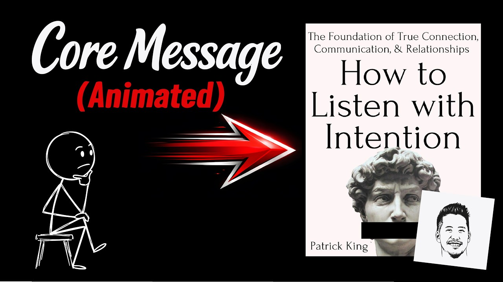

# Make people feel heard (build better relationships): HOW TO LISTEN WITH INTENTION by Patrick King

Animated core message from Patrick King's book "How to Listen with Intention."

## Table of Contents
* [00:00:00] Introduction — The Urge to Talk
* [00:01:09] Attentive vs. Empathic Listening
* [00:02:32] Step 1: Ratchet Up Your Interest in Others
* [00:03:12] Game 1: The Late-Night Host
* [00:03:55] Game 2: The Transformation Game
* [00:04:44] Emotional Intelligence and Self-Awareness
* [00:06:03] Unconditional Positive Regard and Conclusion

## Introduction — The Urge to Talk [00:00:00]

**Narrator:** I recently read How to Listen with Intention by Patrick King. [00:00:00 → 00:00:05]

Talking about yourself triggers the same feel-good response in your brain as eating your favorite food or receiving a cash prize. What's crazier? The 2012 Harvard study that discovered the link between talking, eating, and making money also found that participants were willing to give up 25% of the money they just earned for the opportunity to keep talking about themselves. [00:00:05 → 00:00:27]

It's no wonder people are inclined to talk more than they listen. But if we're not careful, that biological reward for talking will turn us into conversational narcissists. [00:00:27 → 00:00:36]

A conversational narcissist uses every opportunity to share their thoughts and talk about themselves. As author Patrick King puts it, when two conversational narcissists talk, it's less of a conversation and more like two people delivering monologues in close proximity to one another. [00:00:36 → 00:00:52]

People typically don't call out a conversational narcissist. They just quietly pull away. They stop including them. They stop reaching out. Eventually, the conversational narcissist doesn't have a friend to call when they need one because everyone already learned to tune them out. [00:00:52 → 00:01:09]

## Attentive vs. Empathic Listening [00:01:09]

**Narrator:** Now, you might be thinking, "That's not me. I listen well." You may maintain eye contact, ask questions, and nod along. But if you're filtering everything through your own perspective, you're merely an attentive listener. [00:01:09 → 00:01:22]

Attentive listeners fail to connect with their conversation partners because they're judging them as they talk, and that judgment creates a low-grade tension that prevents connection. [00:01:22 → 00:01:32]

As King explains in the book, while the other person speaks, an attentive listener compares statements to their own point of view, deciding whether they're in agreement with them or not, like someone on a debate team. If you want to establish a deep connection with the person you're talking to, you must move from attentive listening to empathetic listening. [00:01:32 → 00:01:51]

Emphatic listening requires temporarily setting aside your perspective, judgments, and beliefs to feel what the other person is feeling. The highest form of listening means embodying what they're experiencing and reflecting it back. [00:01:51 → 00:02:04]

King writes, "Empathic listening can be just as satisfying, if not more, than talking." The work involved doesn't have to be as boring as sitting quietly and nodding your head. It can be quite active and almost like unraveling a riddle. [00:02:04 → 00:02:18]

When you can embody what someone is experiencing, show them that you get it and keep the focus on them without hijacking the conversation. You start discovering fascinating details beneath the surface and get the thrill of genuine connection. [00:02:18 → 00:02:32]

## Step 1: Ratchet Up Your Interest in Others [00:02:32]

**Narrator:** The first step is to ratchet up your interest in others. You'll be far more willing to take the time to see the world through someone's perspective if you find them fascinating. [00:02:32 → 00:02:42]

The problem is most people aren't overly interesting at first glance or after a 3-minute chat. Therefore, before talking to someone, imagine a trusted friend has just told you the person you're about to talk to is one of the most fascinating people they've met and has a life experience you'll love to know more about. [00:02:42 → 00:02:59]

Your job is to dig past the surface level traits, like what they do or where they're from, and inch closer to what moves them. To make your conversation job more fun, play these two conversation games. [00:02:59 → 00:03:12]

## Game 1: The Late-Night Host [00:03:12]

**Narrator:** Game number one, the late-night host. Picture yourself replacing your favorite late-night host, like Conan O'Brien or Jimmy Fallon. [00:03:12 → 00:03:21]

Your job isn't to impress. It's to make the person across from you feel like the most interesting person in the room. Ask open-ended questions in a playful manner and treat every answer like it's the start of a great story. [00:03:21 → 00:03:33]

Use short prompts like, "Hmm, tell me more about that." Or, "What was that like for you?" You want to nudge them into storytelling mode using as few words as possible. [00:03:33 → 00:03:43]

When you hear an emotional word, gently pull on it. If they say, "I was pretty anxious about it." just ask, "Where did that anxiety come from?" Then let them go deeper into the story. [00:03:43 → 00:03:55]

## Game 2: The Transformation Game [00:03:55]

**Narrator:** Game number two, the transformation game. Think of yourself as Ethan Hunt in Mission Impossible. [00:03:55 → 00:04:02]

To complete an upcoming mission, you'll need to wear a mask of the person you're talking to and convince everyone you encounter that you are that person. The best way to act like they act is to feel what they feel. As they're talking, try to simulate their emotional experience in real time. [00:04:02 → 00:04:20]

Process what you hear on a felt level. Then reflect it back to them for confirmation. [00:04:20 → 00:04:26]

Use phrases like, "That must have felt" or "So, you were feeling" Every time they confirm your guess with an "Exactly" or "That's right" you get one step closer to finalizing the transformation. [00:04:26 → 00:04:39]

The game isn't over until you've collected at least five verified emotions. [00:04:39 → 00:04:44]

## Emotional Intelligence and Self-Awareness [00:04:44]

**Narrator:** If you want to get good at either of these games and make people feel like you're truly listening to them, you must increase your emotional intelligence. The essence of emotional intelligence is being self-aware enough to recognize and manage your own emotions so they don't cloud your ability to interpret someone else's. [00:04:44 → 00:05:01]

If you can't recognize and manage your emotional state, you'll just project your emotions onto others and completely miss what they are feeling. If you're anxious, you'll be inclined to think the other person is anxious talking to you and wants to get out of the conversation. If you're frustrated, you'll think the other person is frustrated with you. [00:05:01 → 00:05:19]

Therefore, take one critical step before listening to someone with intention. Perform an emotional audit. Before walking into a conversation, ask yourself "How am I feeling? And what's happened in the last hour or two that might be making me feel this way?" Got an annoying email, or glanced at a big loss in your stock portfolio. When you notice your emotions and can explain them, you can easily set them aside and actually be present. [00:05:19 → 00:05:48]

King says, "High emotional intelligence is a superpower, but it's not ultra complex. It simply requires us to resist the temptation to focus only on ourselves and assume that our perspective and motive understanding is the only one there is." [00:05:48 → 00:06:03]

## Unconditional Positive Regard and Conclusion [00:06:03]

**Narrator:** In the end, psychologist Carl Rogers believed that unconditional positive regard, along with active listening, empathy, and reflection, was the key to truly transformative conversations. [00:06:03 → 00:06:15]

Adopt unconditional positive regard by approaching every person as though they have a remarkable life experience to share with you. Your job is to help bring it out of them. [00:06:15 → 00:06:25]

Adopt the late-night host role by asking open-ended questions in a playful manner and encouraging them to expand on their stories. [00:06:25 → 00:06:33]

Then, try to embody their experiences as they talk and guess what it feels like to be them. Pretend as though you will soon need to convince people that you are them. [00:06:33 → 00:06:43]

If you can demonstrate that you understand what someone is feeling, they will feel heard. And when it's your turn to speak, they'll listen intently because you showed them what that looks like. [00:06:43 → 00:06:54]

That was the core message that I gathered from how to listen with intention by Patrick King. This short how-to guide helped me spot the gaps in my listening skills and strengthen my most important relationships. I highly recommend it. [00:06:54 → 00:07:09]

If you would like a one-page PDF summary of the insights I gathered from this book, just click the link in the description below and I'll email it to you. If you're already signed up for the free productivity game newsletter, this PDF is in your inbox. [00:07:09 → 00:07:23]
