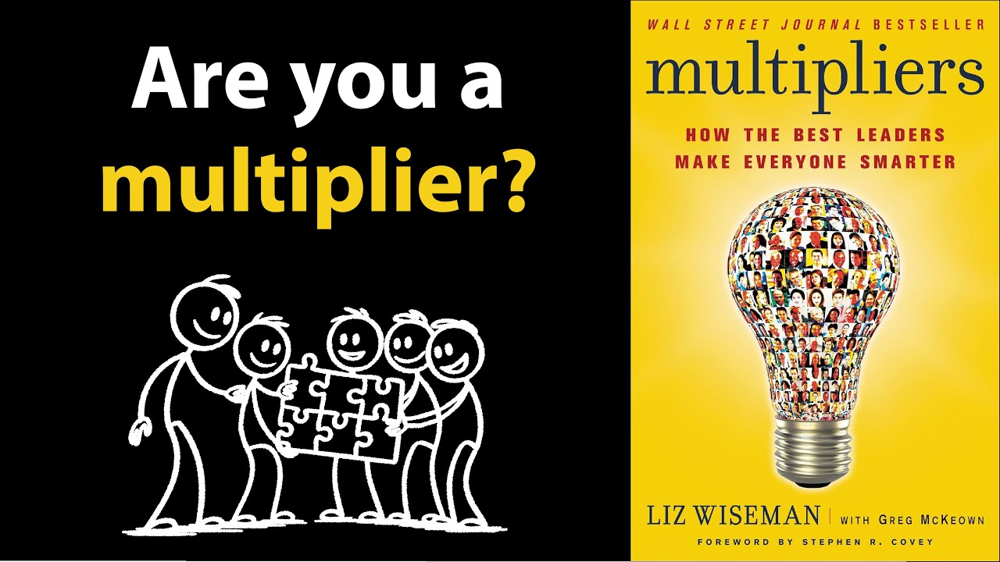

# MULTIPLIERS by Liz Wiseman | Core Message

Animated core message from Liz Wiseman's book 'Multipliers,' covering the two types of leaders, the multiplier mindset, and the five disciplines that bring out people's best work.

## Table of Contents
* [00:00:07] Introduction: Multipliers vs. Diminishers
* [00:01:08] Derek's Story: The Power of Multiplier Leadership
* [00:02:10] Step 1 — The Multiplier Mindset
* [00:02:44] Step 2 — The Five Multiplier Disciplines
* [00:02:59] Discipline 1 — Spot People's Genius
* [00:03:45] Discipline 2 — Set Bigger Challenges
* [00:04:36] Discipline 3 — Stage Debates
* [00:05:30] Discipline 4 — Stop Solving People's Problems
* [00:06:00] Discipline 5 — Shift Ownership Back to Your Team
* [00:06:45] Conclusion

## Introduction: Multipliers vs. Diminishers [00:00:07]

[Music] [00:00:05]

**Narrator:** I recently read Multipliers by Liz Wiseman. There are two types of leaders in this world. Multipliers and diminishers. [00:00:07 → 00:00:16]

Multipliers make you feel smarter. They issue challenges that stretch your abilities, ask hard questions to get you thinking, and give you space to do your best work. Diminishers make you feel stupid. [00:00:16 → 00:00:28]

Diminishers believe they're the smartest people in the room, so they tell people what to do and constantly correct their team's work. They try to be helpful, but end up being black holes, sucking the energy out of everyone on the team. [00:00:28 → 00:00:41]

Author Liz Wiseman set out to better understand why some leaders were multipliers and others were diminishers. So, she traveled around the world asking professionals to identify multiplier or diminisher leaders they had worked for. [00:00:41 → 00:00:54]

She found 150 multipliers and diminishers, then conducted 360° interviews with their teams. In the process, she saw firsthand what impact multipliers and diminishers had on people's careers. [00:00:54 → 00:01:08]

## Derek's Story: The Power of Multiplier Leadership [00:01:08]

**Narrator:** One man named Derek was a talented Navy sailor who graduated at the top of his electronics class. In his first role, his boss was a classic diminisher and stood inches away during critical missile exercises where he barked commands and never trusted him to do the right thing. [00:01:08 → 00:01:23]

Derek performed so poorly that he was removed from his post. But then 3 months later, a new commander arrived. This commander immediately believed in his team and gave Derek a second chance. The commander got Derek back on the controls and said, "I'm counting on you." [00:01:23 → 00:01:41]

Derek began setting new missile exercise records and rocketed up the ranks to Lieutenant Commander. Same guy, different leader, totally different outcome. People flourish or flounder based on whether a leader multiplies or diminishes their potential. [00:01:41 → 00:01:57]

So the question at the heart of this summary is as we move into leadership positions, how can we have a multiplier effect on the people around us and bring out people's best work like Derek's second commander did? [00:01:57 → 00:02:10]

## Step 1 — The Multiplier Mindset [00:02:10]

**Narrator:** Well, it involves two steps. Step one, start every day with the multiplier mindset. [00:02:10 → 00:02:16]

Have a recurring email to yourself that lands in your inbox every morning with the following statement. My team is packed with talent, great ideas, and knowledge. If I give them ownership and room to think, they'll learn to make great decisions without me. [00:02:16 → 00:02:32]

When you read that statement, remind yourself of the ways your team has stepped up in the past. Maybe you manage a junior coder who came up with an incredible user interface design that was far better than what you were envisioning. [00:02:32 → 00:02:44]

## Step 2 — The Five Multiplier Disciplines [00:02:44]

**Narrator:** Step two, begin each week by considering how you can execute the five multiplier disciplines, which I've simplified down to five S's. Spot, set, stage, stop, and shift. [00:02:44 → 00:02:59]

## Discipline 1 — Spot People's Genius [00:02:59]

**Narrator:** Discipline number one, spot people's genius. [00:02:59 → 00:03:05]

The best multipliers are talent scouts. They are always scanning their team for effortless brilliance, even if it's not part of someone's official job description. For example, a multiplier will notice when a customer support rep has a knack for calming down angry customers and turning complaints into compliments. [00:03:05 → 00:03:22]

They will publicly celebrate the rep's skill in team meetings and move them to handle the toughest cases. By leveraging their brilliance, the rep becomes more engaged and by publicly praising their talent, it tends to expand and inspire others. [00:03:22 → 00:03:36]

If you're not noticing effortless brilliance on your team, simply ask, if you could design your ideal role here, what would it look like? [00:03:36 → 00:03:45]

## Discipline 2 — Set Bigger Challenges [00:03:45]

**Narrator:** Discipline number two, set bigger challenges. [00:03:45 → 00:03:49]

The English poet William Blake once said, "Great things are done when men and mountains meet." When you challenge your team with harder problems, you draw the brilliance out of them. [00:03:49 → 00:04:00]

Matt Macaulay, the president of a floundering 9,500 person retail business, turned the company around by asking every team leader, "What's your mission impossible?" A crazy aspiration that would require 100% of your team's capabilities. [00:04:00 → 00:04:15]

Every person in the company set and pursued their impossible missions with the complete backing of their CEO. The next year, the company's stock price increased by 72%. [00:04:15 → 00:04:26]

Be like a pole vaulting coach who continually raises the bar to uncomfortable heights and has an unwavering belief in your team's ability to clear it. [00:04:26 → 00:04:36]

## Discipline 3 — Stage Debates [00:04:36]

**Narrator:** Discipline number three, stage debates. [00:04:36 → 00:04:40]

For big high stakes decisions, become the debate maker rather than the sole decision maker. Pull at least two people into a conversation who know the topic well. Start by asking each person, "If you were sitting in my chair right now, what decision would you make and why?" [00:04:40 → 00:04:57]

Turn up the heat by highlighting any disagreements and getting each person to defend their position. Interject with challenging questions like, "What are you assuming that might be wrong?" And what evidence would actually change your mind on this? [00:04:57 → 00:05:11]

After gathering the wisdom of your best thinkers, through rigorous debate, make your call. [00:05:11 → 00:05:17]

If you decide to go against someone's recommendation, pull them aside and say, "Can we disagree and commit to this path for now?" People will embrace your decision and execute it immediately because they helped shape it. [00:05:17 → 00:05:30]

## Discipline 4 — Stop Solving People's Problems [00:05:30]

**Narrator:** Discipline number four, stop solving people's problems. [00:05:30 → 00:05:35]

Teams must be trained to think for themselves. So, when a team member asks you how to solve a problem, always start by turning it back on the asker. Master the phrase, "I don't know. What do you think?" [00:05:35 → 00:05:47]

When you're discussing a problem in a team meeting, ask questions and talk as little as possible. When leaders reduce their airtime, team members increase theirs and tend to come up with good solutions to problems. [00:05:47 → 00:06:00]

## Discipline 5 — Shift Ownership Back to Your Team [00:06:00]

**Narrator:** Discipline number five, shift ownership back to your team. [00:06:00 → 00:06:06]

When you absolutely must step in to give direction on a task or project, provide your input and then immediately give the reins back to them. You want to be like a coach calling a timeout in the middle of a game. You give direction, then send them back onto the field and give them all the credit when they win the game. [00:06:06 → 00:06:24]

Every time you take control and don't give it back, you demoralize your people and stunt their development. That's why Wiseman says, "Offer help, but have an exit plan." Use statements like, "I'm happy to help you think this through, but you are still the lead on this." Or, "Those are thoughts to consider. You can take it from here." [00:06:24 → 00:06:45]

## Conclusion [00:06:45]

**Narrator:** In the end, diminishers rely on their own intelligence to succeed, but multipliers rely on the intelligence of their entire team to succeed. Become a multiplier by mastering the five disciplines that draw out people's brilliance and capabilities. [00:06:45 → 00:07:03]

That was the core message that I gathered from Multipliers. It was a great book that helped me see leadership in a new light. I highly recommend it. [00:07:03 → 00:07:11]

If you would like a one-page PDF summary of the insights I gathered from this book, just click the link in the description below and I'll email it to you. If you already subscribed to the free Productivity Game newsletter, this PDF summary is in your inbox. [00:07:11 → 00:07:27]
