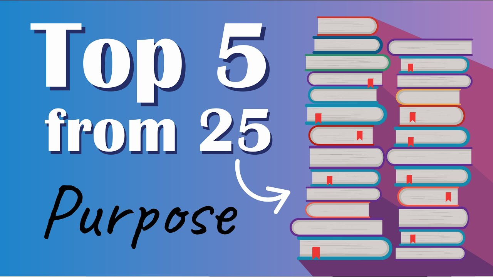

# Top 5 Insights from 25 Books on How to Find Purpose

1-Page Summary: https://lozeron-academy-llc.kit.com/top-5-purpose The Academy: https://bit.ly/pgameacademy

## Table of Contents
* [00:00:01] Introduction
* [00:00:53] Purpose Insight #1: Face the Resistance
* [00:03:16] Purpose Insight #2: Pursue Your Uniqueness
* [00:06:21] Purpose Insight #3: Choose a Worthwhile Struggle
* [00:08:13] Purpose Insight #4: Carry On the Impact
* [00:10:08] Purpose Insight #5: Love
* [00:11:21] Conclusion

## Introduction [00:00:01]

**Narrator:** Without a clear purpose, life will pull you in a hundred different directions. You'll feel aimless, lost at sea, and void of meaning. But when you define and live with purpose, everything changes. The feeling of overwhelm fades away as your mental energy concentrates like a laser in one direction, generating enormous levels of self-discipline and grit. [00:00:01 → 00:00:23]

Your purpose-fueled grit produces creative insights and new skills. Living with purpose brings forth your best self, your best work, and your greatest impact. Here are five powerful ways to cultivate a sense of purpose from more than 25 books on purpose. [00:00:23 → 00:00:41]

Think of these five big purpose insights as a choose your own adventure. Your mission is to decide which of these five approaches to purpose resonates with you most, and then use that approach to live with more purpose this year. [00:00:41 → 00:00:56]

## Purpose Insight #1: Face the Resistance [00:00:53]

**Narrator:** Purpose insight number one: face the resistance. You can instantly find your purpose by asking, what work am I most resisting right now? Is there a project you've been putting off, a workout you don't feel like doing, or a difficult conversation you're avoiding? [00:00:53 → 00:01:11]

Facing the resistance that sits between you and work you know is important is your gateway to personal growth and a great way to discover your calling in life. In *The War of Art*, author Steven Pressfield talks about how we should think about the resistance to creative pursuits. [00:01:11 → 00:01:26]

In the book, he says: "If you're feeling massive resistance, the good news is it means there's tremendous love there. If you don't love the project that is terrifying you, you wouldn't feel anything. The opposite of love isn't hate, it's indifference. The more resistance you experience, the more important your unmanifested art project or enterprise is to you, and the more gratification you will feel when you finally do it." [00:01:26 → 00:01:48]

When you feel lost and overwhelmed, your resistance is your guiding compass, your true north. If you're unsure which project you should commit to for the next 12 weeks, write down five possible projects and pick the project that scares you the most. [00:01:48 → 00:02:04]

Once you recognize that your resistance is illuminating the way forward, you must work up the courage to face it every day. Navy SEAL Commander Mark Dine tells new Navy SEAL recruits that they're all walking around with two invisible wolves: a fear wolf and a courage wolf. We can either avoid our calling, give in to resistance's demands, and feed the fear wolf, or face resistance and feed our courage wolf. [00:02:04 → 00:02:29]

Author Steven Pressfield feeds his courage wolf by sitting down to write at his desk at precisely 10:30 a.m. every day, regardless of how he feels. He starts writing at 10:30 a.m. and doesn't stop until he's exhausted, which is typically 3 to 4 hours. [00:02:29 → 00:02:44]

Pressfield doesn't care how many pages he's produced or if his writing is any good. All that matters is, quote, "I put in my time and hit it with all I've got. All that counts is that for this day, for this session, I've overcome resistance." [00:02:44 → 00:02:59]

You get one step closer to producing something remarkable and making a meaningful impact when you seek out resistance, sit with it, and take consistent action in the very direction it doesn't want you to go. Therefore, your daily purpose is to feed your courage wolf and defeat resistance. [00:02:59 → 00:03:13]

## Purpose Insight #2: Pursue Your Uniqueness [00:03:16]

**Narrator:** Purpose insight number two: pursue your uniqueness. You came into this world with DNA that has never been seen before and will never be seen again. You have a brain that is not quite like anyone else's, and you lived experiences no one else will ever replicate. [00:03:16 → 00:03:31]

This combination means you have the potential to contribute something unique. Your purpose is to define and refine that thing. In *Mastery*, Robert Greene offers two key decisions to guide you: decision number one, stay connected to your primal curiosities; decision number two, relentlessly learn skills linked to those primal curiosities. [00:03:31 → 00:03:54]

When Albert Einstein was five, his father gave him a compass. As he examined it, he was completely mesmerized by the invisible force that moved the needle. It made him wonder what other undiscovered or less understood forces might exist in the world. This early childhood experience hinted at a primal curiosity that would fuel his drive for mastery in the decades to follow. [00:03:54 → 00:04:13]

Author Robert Greene observed that all masters seem to maintain a connection to their primal curiosity throughout their careers. However, most people lose touch with their innate curiosity as they age. Schools and universities often stifle curiosity, while social pressure to follow conventional paths makes us forget what once captivated us. [00:04:13 → 00:04:35]

If you and I want to attain mastery and contribute something unique to the world, we must reconnect with our primal curiosity. We need to return to our origins and rediscover what fascinated us before social pressure urged us to conform. [00:04:35 → 00:04:50]

Robert Greene recommends spending a few weeks journaling 20 minutes a day to better understand and reconnect with this curiosity. Remove distractions, write fast and freely for 20 minutes, and keep asking yourself: what did I naturally gravitate to before I felt social pressure? Write down whatever comes to mind and aim to dig deeper each time. [00:04:50 → 00:05:10]

When I did this exercise, I remembered being completely drawn to encyclopedias at age 10, taking detailed notes on topics like how a plane lifts. It wasn't a homework assignment, just something I felt compelled to do. After reflecting, I realized it wasn't about planes or encyclopedias — it was the extracting and simplifying of complex information that fascinated me. A strange habit for a 10-year-old, and certainly not a popular activity. [00:05:10 → 00:05:35]

So what is your primal curiosity? What did you naturally gravitate toward before you worried about being cool or fitting in? Once you reconnect with your primal curiosity, you must commit to learning skills related to it, and value learning above all else. [00:05:35 → 00:05:51]

Sometimes the best opportunities to learn come with lower pay, zero recognition, harsh criticism, or long hours of tedious work. A standup comic will endure $5 open mic nights, repeated heckling, and sleeping on a friend's couch for months if that's their best opportunity to master the craft. Every master makes trade-offs for prime learning opportunities. You too must make deliberate sacrifices to excel at a handful of skills that, when combined, will make you one of a kind. [00:05:51 → 00:06:21]

## Purpose Insight #3: Choose a Worthwhile Struggle [00:06:21]

**Narrator:** Purpose insight number three: choose a worthwhile struggle. Obligation plus struggle equals suffering, but choice plus struggle equals purpose. [00:06:21 → 00:06:30]

In *Man's Search for Meaning*, Viktor Frankl chose to see a struggle in the Nazi concentration camp as a worthwhile struggle — one that would help him understand the human condition and guide others out of suffering. His willful struggle led to one of the greatest books ever written and a new field of psychology called logotherapy, which has improved millions of lives. [00:06:30 → 00:06:51]

Frankl wrote: "What man actually needs is not a tension-free state, but rather the striving and struggling for a worthwhile goal, a freely chosen task." Friedrich Nietzsche said: "He who has a why to live can bear almost any how." [00:06:51 → 00:07:05]

It's a powerful truth, but reverse the order and it becomes even more profound: determine how much pain you're willing to bear for something and you'll uncover your why. [00:07:05 → 00:07:16]

The following takeaway from *The Subtle Art of Not Giving a F*** has helped me choose what is worth struggling for. All emotional and psychological pain results from a value being violated. If seeing your child struggling to read is painful, it's because you value your child's happiness and you value education. [00:07:16 → 00:07:33]

If seeing your neighbor drive a Tesla makes you angry because their Tesla is a nicer car than yours, you value material success and are measuring your worth accordingly. You could endure 100-hour work weeks to get a nicer car, but you must ask yourself: is it really worth it? [00:07:33 → 00:07:51]

You get to decide which values are worth fighting for and which are not. Be aware of superficial, outdated values that you are needlessly suffering to uphold, and replace them with more meaningful values — values you are willing to struggle for. Life is full of struggle, but choose values that are worth struggling for and you will find meaning and purpose. [00:07:51 → 00:08:13]

## Purpose Insight #4: Carry On the Impact [00:08:13]

**Narrator:** Purpose insight number four: carry on the impact. If you take time to reflect, you'll realize that a critical few people have had a profound impact on your life. Your purpose is to determine who those people are, recall their positive impact, and find a way to have a similar impact on others. [00:08:13 → 00:08:31]

I stumbled upon this insight when reading *Find Your Why* by Simon Sinek. Create a list of people who have helped you become the person you are today. Was there a relative — maybe a grandma or a grandpa — who gave you the confidence to be yourself when everyone else thought you were weird? Was there a middle school teacher who changed the way you see the world and your role in it? Was there a sports coach who helped you set a higher standard for yourself? [00:08:31 → 00:08:54]

When you come up with a list of people who have played a pivotal role in helping you become the person you are today, share stories about the people who've impacted you with a partner. Your partner's role is to ask you specific questions about how those people impacted you, and notice when you come alive. The goal is to discover an impact that was so profound, so life-changing, that you feel it's your mission to have that impact on others. [00:08:54 → 00:09:19]

When I did this exercise, I told my partner about a story from high school when I stuttered so badly during a class presentation that the teacher had to stop me halfway through. I felt pathetic, and whatever confidence I had vanished. But later that night, I saw an infomercial for Tony Robbins' Personal Power audio tapes. It looked cheesy, but I was desperate. [00:09:19 → 00:09:39]

I bought the audio tapes and listened to them on repeat. The more I listened to them, the more empowered I felt. It was his work that helped me see that I was capable of more than I thought. He taught me powerful mindsets and habits that ultimately helped me become the person I am today. [00:09:39 → 00:09:54]

After recalling the impact that Tony had on my life, I made it my mission to have a similar impact on other people's lives. That's why my why is to empower others so that they can do more than they thought was possible. [00:09:54 → 00:10:08]

## Purpose Insight #5: Love [00:10:08]

**Narrator:** Purpose insight number five: love. In *Man's Search for Meaning*, Viktor Frankl defines love as seeing the potential in others which is not yet actualized, and helping them actualize it. [00:10:08 → 00:10:17]

Love is creating opportunities for your child. Love is mentoring a junior member of your team. Love is introducing your friend to someone who can help them find a new and more rewarding job. Love is meeting a friend for coffee to help them brainstorm ideas for their latest business venture. And love is comforting a sick parent so they find the strength to live another day. [00:10:17 → 00:10:38]

As an entrepreneur, you can love your customers by developing a product that will free up their time and help them realize their potential. When you lack meaning, decide who you can elevate. Aim to make someone's life a little bit better. Get so busy helping others, you forget yourself in the process. [00:10:38 → 00:10:55]

Viktor Frankl says: "The more one forgets himself by giving himself to another person to love, the more human he is and the more he actualizes himself." In his book *How Will You Measure Your Life?*, world-renowned business professor Clayton Christensen realized late in his career that the only metric that truly mattered to him was the number of people he helped become better at what they do. [00:10:55 → 00:11:21]

## Conclusion [00:11:21]

**Narrator:** So what purpose strategy resonated with you the most, and which one do you think will generate a powerful sense of purpose for you? Face the resistance, pursue your uniqueness, choose a worthwhile struggle, carry on the impact, or love? [00:11:21 → 00:11:34]

If you would like a one-page PDF summary of these five insights, click the link in the description below and I'll email it to you. If you've already signed up for the free Productivity Game newsletter, this PDF is sitting in your inbox. [00:11:34 → 00:11:50]

I'm doing a deep-dive video on one powerful purpose insight inside my Academy membership, along with a two-week drive for more purpose with other Academy members. There's a link to the Academy membership in the description below. [00:11:50 → 00:12:02]
