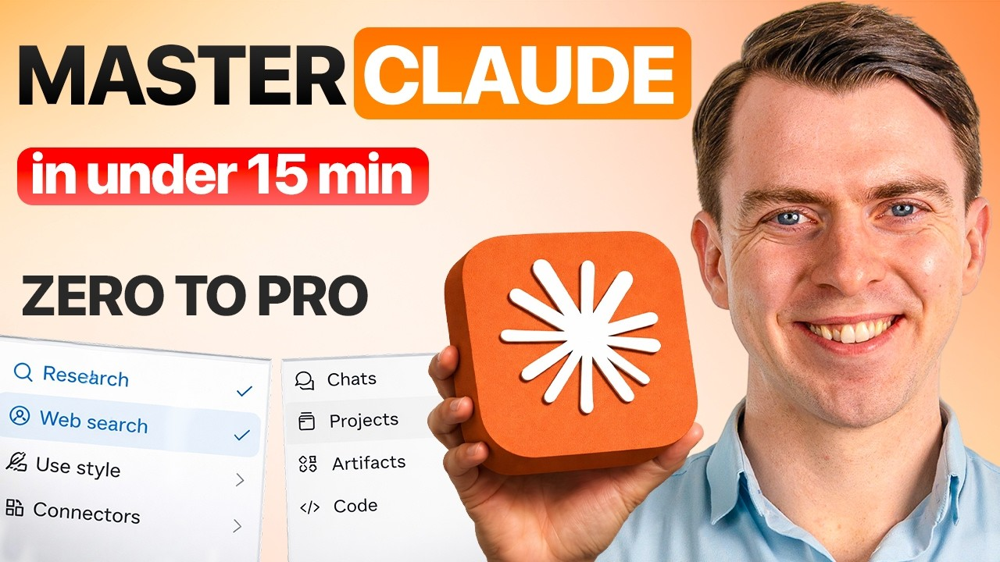

# Claude AI Full Tutorial: From Basics to Agentic AI (2026)

The complete Claude AI tutorial for 2026 — covering every major feature from the free basics to the agentic tools most people never reach. If you want to know how to use Claude AI properly, this is the full picture. Most tutorials stop at the chat window. This one covers all three tiers: free featur

## Table of Contents
* [00:00:00] Intro
* [00:00:54] What Is Claude?
* [00:02:10] Level 1: Beginner Features - Claude Chat and Web Search
* [00:02:58] Artifacts Explained
* [00:03:34] Memory
* [00:04:50] Claude Projects
* [00:06:05] Custom Style
* [00:06:46] Level 2: Extended Capabilities Features
* [00:06:57] Connectors
* [00:07:47] Claude Skills
* [00:08:57] Extended Thinking
* [00:09:40] Research Mode
* [00:10:23] Level 3: Agentic Tools
* [00:10:37] Claude Cowork
* [00:11:19] Claude Code
* [00:12:23] Computer Use
* [00:12:50] Pricing Breakdown

## Intro [00:00:00]

**Kian:** Most Claude tutorials just show you the chat interface and call it a day. Claude isn't just a chat tool. It's a multi-layered ecosystem that you can use whatever your ability is. There's a beginner layer with memory, project workspaces, and visual outputs, a power user layer with live tool integrations, extended reasoning, and autonomous research, and finally an agentic layer that can work through files on your computer, write and run code, and control your interface directly. [00:00:00 → 00:00:28]

Most people only ever experience the first tier. But in this video, I'm going to cover all the tiers and all the main features within them in the order from basic all the way up to the agentic features. So, you know exactly where you are and where you want to go next. [00:00:28 → 00:00:39]

For those of you new to the channel, my name is Kian and I am the AI productivity coach. And I've taught thousands of people how to use AI to make their work and life way easier. So, if that sounds like you, please make sure to join me on this journey and subscribe to the channel. [00:00:39 → 00:00:54]

## What Is Claude? [00:00:54]

**Kian:** But for now, let's jump into what is Claude? Claude is essentially Anthropic's AI assistant. So, it's Anthropic's version of ChatGPT, Gemini, Copilot, Perplexity, any of those AI assistant tools. [00:00:54 → 00:01:07]

Anthropic is an AI safety company and that distinction matters in practice. Claude is built to be honest about what it doesn't actually know as well as what it does know. It's less likely to give you a confident wrong answer than some of the other tools. For work you're actually relying on, that difference is quite significant. [00:01:07 → 00:01:23]

Claude runs on three different models and it's worth knowing what each is for and how you can use them. The first model is Haiku. This is basically like the sprint runner model. It's fast, lightweight, and good for really quick tasks that don't need deep thinking. You can think simple questions, fast edits, or short drafts. [00:01:23 → 00:01:38]

The next model, Sonnet, is the everyday workhorse. You get a good balance of speed and intelligence. This is likely what you'll use 80% of the time and it's capable enough for almost everything. [00:01:38 → 00:01:48]

The final model, Opus, is the specialist. It's slower but significantly better at hard problems, complex analysis, long documents, or nuanced reasoning. Basically, anywhere where the thinking matters more than the speed of the answer. [00:01:48 → 00:02:01]

Which model you can access depends on which plan you have and I'll go into more details on that later. But just note, the smarter the model, the more usage it will take up. So, you'll likely have less prompts with that model as you hit certain limits. [00:02:01 → 00:02:13]

## Level 1: Beginner Features - Claude Chat and Web Search [00:02:10]

**Kian:** So, let's move on to level one and some of the features that you can use if you're starting off with Claude. The main feature that most people are probably used to is Claude chat. You'll likely have come across the chat interface. It works like most AI tools. [00:02:13 → 00:02:25]

The first feature to call out is web search. Claude's training data has a cutoff date. If you ask about something recent without enabling this, you'll get an outdated answer. The toggle is right in the bottom left of the chat window in the plus icon. Once you toggle it on, Claude can pull live information from the internet before responding. [00:02:25 → 00:02:44]

If you turn it off, it just works from the training data and there'll be a certain cutoff date. So, you can use it for anything time-sensitive. For example, if you need current pricing, recent news, or what changed last month. You can leave it off when you want the model to rely on its own knowledge. [00:02:44 → 00:02:58]

## Artifacts Explained [00:02:58]

**Kian:** The second feature to flag is artifacts. When you ask Claude to create something structured, for example, a table, a mini chart, or a QR code, it can output it as an artifact. And this is basically a separate panel that comes out from the right-hand side of the screen. [00:02:58 → 00:03:13]

It's not just text, it's interactive. You can edit it directly, download it, use it as is. And the conversation keeps going in the main window without the output getting buried. For example, you could ask Claude to build a decision matrix, a landing page draft, a financial tracker. It builds it live, you tweak it, and you're done. A really great feature if you want to see visual outputs depending on what you're doing. [00:03:13 → 00:03:34]

## Memory [00:03:34]

**Kian:** The third feature to flag is memory. This is one people tend to miss. Claude has a global memory system. Across all your conversation, Claude learns about you, what your goals are, and what you're trying to achieve. It saves important context and understands how you like to be responded to. Ultimately, this makes your responses way better as they're more personalized to you. [00:03:34 → 00:03:54]

So, you can find it in settings, capabilities, and then you'll see memory here. There are certain options. You can search and reference chats to bring in memory. You can generate memory from your chat history. And if you want to edit your memory, you can open it up here. [00:03:54 → 00:04:08]

Um you can also see your memory here and edit it if you want. Or you can ask Claude in the chat interface to edit memories from there. One thing worth knowing, if you're switching from another AI tool, you don't have to start from scratch. Claude lets you manually import context into memory directly. [00:04:08 → 00:04:24]

So, if you've been building up preferences and workflows elsewhere, you could bring the most important parts across and hit the ground running. Basically, just go to import memory to Claude, copy the prompt that it gives you, run that in your other AI tool, for example, ChatGPT, and then you can paste the results in here, hit add to memory, and then you'll have all your memories imported from the other tool. This is a really quick win and it will significantly improve your results. [00:04:24 → 00:04:51]

## Claude Projects [00:04:50]

**Kian:** The next feature to flag is projects. A project is a dedicated workspace for a specific part of your work. This could be a client, this could be a project you're working on, or it could be a piece of content that you're preparing. Inside the project or the workspace, you can set specific instructions that are focused on that work alone. And then whenever you open that project, Claude reads those instructions and only answers in the way that you want it to. [00:04:51 → 00:05:13]

So, you can see it in the left rail in projects. You can see I have one for AI productivity coach. Basically, this project is to help me build out my business and grow the YouTube channel. It has all my previous conversations down there related to the AI productivity coach. And the project will keep context across all these conversations and make sure the answers are focused on what I'm trying to achieve here. [00:05:13 → 00:05:35]

As you can see, you can add instructions on the right rail and you can add project-specific memory as well. You can also add files. So, for example, I've got a business summary doc here and this can give the project quick context on what you're doing or what the project is. [00:05:35 → 00:05:49]

Projects are available on the free plan. The limitation is usage. On the free plan, you'll hit message limits very quickly, which can make sustained project work frustrating. You may have to upgrade to Pro to get proper use out of it. But definitely worth trying it on the free plan first to see if you actually like the feature. [00:05:49 → 00:06:05]

## Custom Style [00:06:05]

**Kian:** The final feature to flag in tier one is custom style. So, you can tell Claude exactly how you want it to write. So, it could be formal or casual, concise or detailed, technical or plain English. You can also paste a sample of your writing and Claude can match that style. [00:06:05 → 00:06:22]

You can see here it has some standard ones that it already has for everyone. But then you can also create and edit styles. So, if you want to create a custom style, you can do it here. Very simply, you can add a writing example or describe the style instead. And then once you input that, Claude will write as you want it to. [00:06:22 → 00:06:38]

You can set it once and it applies to all conversations. If writing is a big part of your job, make sure to do this and it will save you a lot of hassle in the future. [00:06:38 → 00:06:46]

## Level 2: Extended Capabilities Features [00:06:46]

**Kian:** Moving on to level two of features with Claude. This is where Claude's capabilities expand significantly. For some of these features, you may have to start paying for them. Something to flag as we go through them and you're considering whether you should use them. [00:06:45 → 00:06:57]

## Connectors [00:06:57]

**Kian:** And the first one is connectors. Connectors are like bridges that connect Claude to other tools that you use. So, it could be a Gmail, Google Drive, Google Docs, Slack, Notion, and there are many, many more. Once you connect an app, Claude can read from it and write in it directly. This isn't copy and paste, this is a live connection. [00:06:57 → 00:07:17]

So, for example, you could ask it to summarize a bunch of emails that you have in your Gmail. You could pull a document in from your drive without having to pull it manually and import it in. Or you could plan your week by connecting it to your calendar. [00:07:17 → 00:07:30]

The full list is available at claude.ai/directory. It's definitely worth browsing. These integrations that save the most time are the ones connecting to wherever your actual work lives. The free plan gives you a small subset of connectors, but then when you start paying for Claude, it unlocks a much broader access and higher usage. [00:07:30 → 00:07:48]

## Claude Skills [00:07:47]

**Kian:** Another cool feature is skills. Skills are reusable capability modules you can install into Claude to give it a specific expertise or workflow. You can think of it this way. Skill teaches Claude how to do something in a specific way and do it the same way every time. [00:07:47 → 00:08:03]

For example, I've built a YouTube metadata skill. So, every time I finish a script, I run it through the metadata skill and Claude automatically generates all the details I need to publish a video on YouTube. It knows the exact style and format that I like for posting the video. I built it once and I reuse it every week. [00:08:03 → 00:08:21]

You can build skills yourself or you can use ones that Claude has created in its repository. One simple hack that I like to tell people, you can ask Claude, based on all your memory, what skills would be relevant for you based on the work that you do on a repeated time frame. Claude will go through all your memory and see what tasks you're doing on a repeatable basis and then it will recommend what skills you might need and create it for you. [00:08:21 → 00:08:43]

This will save you having to prompt it every time the specific instructions you want for that task. Skills definitely separate casual Claude users from Claude power users. So, I really recommend using this if you want to up level your Claude game. [00:08:43 → 00:08:57]

## Extended Thinking [00:08:57]

**Kian:** The next feature is extended thinking. Standard AI models answer the question immediately. They oftentimes don't stop to reason through a problem to get you a better answer. Extended thinking works differently. You enable it, ask it a complex question, and Claude reasons through it step by step to give you a really good answer. [00:08:57 → 00:09:14]

You can enable it by going to the models and clicking extended thinking and then you can also choose which model you want it to do. And then you can see it thinking as it goes through and it goes through how it's reasoning through it. [00:09:14 → 00:09:26]

The output is noticeably better for anything that involves a bit more complexity. Strategic decisions, financial analysis, or anything that has like a multi-step problem-solving element to it. Use it when you want really strong reasoning, not just a simple result. [00:09:26 → 00:09:40]

## Research Mode [00:09:40]

**Kian:** In a similar vein, the next feature is research mode. Research mode differs from web search. Web search gives Claude access to the internet for one answer. Research mode is more for an autonomous research task. You give it a question or topic, it goes off, searches multiple sources across the web, cross-references them, and comes back with a very detailed report on the answer. [00:09:40 → 00:10:01]

Most of these often take between 5 and 15 minutes. Complex ones can run up to 45 minutes. Thus, the output is significantly more thorough than a standard answer. You should use this when you need something properly researched instead of a quick answer. [00:10:01 → 00:10:17]

So, could be things like a competitive analysis, a market research, or maybe it's a big life decision that you're trying to make. [00:10:17 → 00:10:24]

## Level 3: Agentic Tools [00:10:23]

**Kian:** Finally, moving on to level three, the agentic suite. Now, this is where Claude moves on from answering questions to doing work for you. I'm going to give a high-level overview on each of these features, but there's a lot more to unpack in some of them. [00:10:24 → 00:10:38]

## Claude Cowork [00:10:37]

**Kian:** So, let's start off with Claude co-work. Co-work exists in the Claude desktop app. It's not just a chat tool. You can point it to a folder on your computer, give it a task, and it can work through that task autonomously, accessing your files, editing them, or creating new ones. [00:10:38 → 00:10:54]

This can be really helpful if you need to take information from some of your files and create something new. For example, maybe you want Claude to go into certain folders on your computer, read through all of the files there, and create a PowerPoint that you can present to your team. You can simply set an instruction, and it will go off and do that for you. You can go for a coffee and come back, and your whole PowerPoint is ready. [00:10:54 → 00:11:13]

I actually created a full video on Claude co-work, and you can check it out using the link in the description or right up here. [00:11:13 → 00:11:19]

## Claude Code [00:11:19]

**Kian:** Next big feature to flag is Claude code. Claude code is like having a software engineer on your computer. Claude code lives in your terminal or your code editor, and not on the web. You can point it to a project folder, and it can read your entire code base, the file structure, the dependencies, how everything connects, before it touches anything. It has become a critical tool for coders all around the world in the past few months. [00:11:19 → 00:11:42]

In Claude code, you can describe what you want in plain English. For example, fix this bug or add this feature. It can work out how to do that, apply the changes, and if something breaks, it catches the error and tries again, all without you having to copy and paste back and forth. [00:11:42 → 00:11:56]

This isn't just practical for full-time developers. If you write scripts or build internal tools or automate anything with code, this is where Claude gets seriously useful. You don't need to be an expert. You describe the outcome, and Claude can figure out the path. [00:11:56 → 00:12:11]

There is a preview version of Claude code on the web right now, but the primary area that you can use it in is on your desktop. I'm thinking of doing a full walk-through on Claude code, so let me know in the comments if this is something that you would be interested in. [00:12:11 → 00:12:23]

## Computer Use [00:12:23]

**Kian:** The final feature is computer use. Computer use is the most hands-off of the agentic features. Claude can see your screen, move the cursor, click, type, and complete tasks directly in your apps. You basically describe a repetitive task, pulling data from a website, updating records in a tool, filling in a form, and Claude executes it step-by-step without you having to touch it. [00:12:23 → 00:12:41]

It's most reliable for structured, predictable tasks with clear steps and a defined outcome. It's definitely still evolving, but for the right workflows, it's already saving real time. [00:12:41 → 00:12:51]

## Pricing Breakdown [00:12:50]

**Kian:** Okay, so they are all the features that I think are really crucial to anyone considering using Claude. But, let's jump into the pricing. Most features in level one are covered in the free plan. So, for example, chat, web search, artifacts, memory, style, and projects with certain usage limits. It's really good for getting started on trying these features. [00:12:51 → 00:13:10]

Pro at $20 a month unlocks the level two and level three features. So, for example, connectors, extended thinking, research mode, co-work, Claude code, computer use. With Pro, you get higher usage limits across the board. And if you're using Claude seriously for work, this is the plan. [00:13:10 → 00:13:28]

The Max plan starts at $100 per month. This is for heavy users. If you're doing all-day sessions, large-scale agentic work, and you need maximum priority access, you can also go up to $200 a month, which gives you even more usage. [00:13:28 → 00:13:39]

If you're not sure whether you need it, you probably don't. My take is start with free, and then see if you start hitting those limits. Then you can consider going to Pro at $20 per month. And if you start hitting the Pro limits, and it's really holding you back in work, then consider going on the Max plan. [00:13:39 → 00:13:54]

I've done a full video breaking down each of the pricing tiers for Claude, and you can check it out using the link up here. So, that's the full Claude ecosystem from beginner all the way up to agentic use. I'd love to know which features do you find the most useful out of all the ones that are listed. Let me know in the comments, I'll read them all. If you enjoyed this video, please make sure to subscribe and join me on this journey. I also have a weekly newsletter, and you can subscribe to that using the link in the description. Thank you so much for watching, and I'll see you in the next video. [00:13:54 → 00:14:22]
